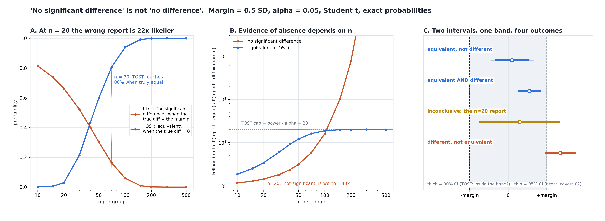

# "No Significant Difference" Is Not "No Difference"

[](https://colab.research.google.com/github/phoebefu6/phoebe-the-builder/blob/main/data-science-cookbook/equivalence-test/demo.ipynb)
[](https://mybinder.org/v2/gh/phoebefu6/phoebe-the-builder/main?labpath=data-science-cookbook/equivalence-test/demo.ipynb)

> The test found no significant difference and everyone read it as "the two are the same" - but a small study says that about a difference that matters two times in three.



## The short version

A new pricing engine is compared with the old one on 20 baskets each. Basket value has an SD of
$20, and the business says a $10 change would matter. The true difference is exactly $10.

| report | result |
|---|---|
| t-test | observed +$6.51, p = 0.3449 -> "no significant difference" |
| TOST, margin +-$10 | p = 0.3052, 90% CI (-$4.96, +$17.97) -> **inconclusive** |

The honest sentence is not "no difference". It is *the study could not tell the two apart, and at
this size it was never going to*. The interval still allows an $18 lift.

Every number below is **exact**, not simulated. With normal data the mean difference and the
pooled SD are independent, so for a given SD every decision is an interval in the mean difference.
One integral over the SD's chi-square distribution gives each outcome's probability. Monte Carlo
is used only to check that integral. Margin = 0.5 SD, alpha = 0.05, Student t, equal n.

## What each report is worth

**How often the t-test says "no significant difference":**

| n per group | true diff = 0 | = 0.5 x margin | = margin | = 1.5 x margin |
|---:|---:|---:|---:|---:|
| 10 | 0.950 | 0.917 | **0.815** | 0.645 |
| 20 | 0.950 | 0.880 | **0.662** | 0.363 |
| 50 | 0.950 | 0.764 | 0.303 | 0.040 |
| 100 | 0.950 | 0.580 | 0.060 | 0.001 |

**How often TOST says "equivalent":**

| n per group | true diff = 0 | = 0.5 x margin | = margin (the error rate) |
|---:|---:|---:|---:|
| 10 | 0.001 | 0.001 | 0.0005 |
| 20 | 0.030 | 0.022 | 0.0089 |
| 50 | 0.598 | 0.324 | 0.0496 |
| 100 | 0.940 | 0.546 | 0.0500 |

The findings:

1. **At n = 20 a group, a difference exactly as big as the one that matters is reported as "no
   significant difference" 66% of the time.** At 1.5 times the margin, it still happens 36% of the time.
   Meanwhile TOST declares two truly *identical* engines equivalent only 3% of the time. At this
   size, the wrong report is 22 times likelier than the right one.
2. **TOST never lies in the other direction, and at small n it is very conservative.** Its
   false-equivalence rate never exceeds 0.05, and it is 0.0005 at n = 10. A small study cannot show
   sameness at this margin, and TOST says so rather than pretending it can.
3. **The n at which absence of evidence becomes evidence of absence is computable.** To have an 80%
   chance of showing equivalence you need **70 per group** if the two are truly identical, 82 if
   the true difference is 0.2 x margin, and 199 if it is 0.5 x margin. The normal-curve shortcut
   undershoots by 1-5 per group.
4. **There are four outcomes, not two.** At a real but immaterial difference (0.2 x margin), a small study
   is almost always *inconclusive* (91% at n = 20), which the t-test alone would report as "no difference". At
   n = 500, 35% of studies come out *equivalent AND different*: the difference is real and too small to
   matter, and the t-test alone would report it as a finding.

**Negative result, which cuts against the slogan.** "Non-significance is not evidence" is wrong
at large n. The likelihood ratio P(report | equal) / P(report | diff = margin) for "not
significant" is 1.43 at n = 20 but **103 at n = 150**, which beats TOST's ratio. TOST's ratio is
capped at power / alpha = 20. The error is not in reading non-significance. It is in reading it
without the n. TOST's value is that it makes the n explicit, and a study too small to support the
claim cannot issue it.

**Recommendation:** never write "no difference" from a t-test. Name the margin before the study,
run TOST, and size the study for it (about 70 per group at 0.5 SD). Report one of the four outcomes.

## Calibration

- Decisions vs `scipy.stats.ttest_ind` (one- and two-sided) on raw data: **0 mismatches in 2,400**
- TOST verdict vs "90% CI inside the margin": 0 mismatches in 300
- Integral P(not significant) vs the noncentral-t closed form: max gap 1.0e-13. The four outcomes sum to 1 within 1.0e-13
- Raw-data Monte Carlo, 20,000 reps on each of 7 designs: every outcome falls inside its 99% Wilson interval
- One harness bug was caught on the first run. At 0 hits the Wilson lower bound came out as 2.7e-20, not 0, so an
  outcome whose exact probability IS 0 was flagged OUTSIDE. The bound is now clamped. A test also shows
  the check *can* fail: replicates drawn at the wrong delta must land outside

## Business Impact
- **Before:** "no significant difference" in a migration or A/A-style readout is taken as sign-off
  that nothing changed. At typical pilot sizes, a material change gets that sign-off about 2 times in 3.
- **After:** paste the two groups and a margin. You get the t-test, TOST, the 90% CI, one of four
  verdicts, and the chance a study of *your* size could ever have shown equivalence.
- **Estimated ROI:** one wrongly signed-off migration can quietly cost a margin-sized hit to every
  basket. The check takes seconds.

## Tech Stack
Python, NumPy, SciPy (`integrate.quad`, `nct`, `ttest_ind`), Matplotlib, Streamlit, pytest

## Demo

**[Run the interactive demo notebook →](demo.ipynb)**. It is pre-rendered with outputs, or use the
Colab/Binder badges above to run it live. The study numbers are exact, so the notebook reproduces
them to the digit. Only its Monte Carlo cross-check runs at 4,000 reps.

```bash
pip install -r requirements.txt
python evidence.py      # ~20 seconds, writes evidence.txt + results.json
python make_chart.py    # the audit figure; fails if any label overlaps another or leaves its panel
streamlit run app.py    # paste your own two groups and a margin
pytest -q               # 23 tests
```

## Learning Connection
Built while studying equivalence testing (Schuirmann's TOST, Lakens' equivalence-testing tutorial).
Applies: two one-sided tests, the TOST = 90% CI identity, exact power by conditioning on the variance,
likelihood ratios as a measure of what a report is worth.

## Impact Note
- **Who benefits:** analysts signing off migrations, model swaps, and "did the redesign hurt anything"
  readouts, plus the people who read those sign-offs
- **Potential risks:** the margin is a business decision. If it is chosen after seeing the data,
  or set wide enough to pass, TOST means nothing. The study assumes normal data and equal variance
  (Student t). With very unequal variances use a Welch-based TOST, which this build does not implement.
