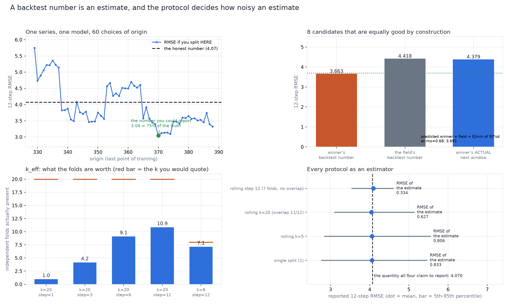

# A Backtest Number Is an Estimate, and the Protocol Decides How Noisy an Estimate

[](https://colab.research.google.com/github/phoebefu6/phoebe-the-builder/blob/main/data-science-cookbook/forecast-backtest/demo.ipynb)
[](https://mybinder.org/v2/gh/phoebefu6/phoebe-the-builder/main?labpath=data-science-cookbook/forecast-backtest/demo.ipynb)

> "The forecast was excellent in-sample" - a single train/test split reports one draw of an origin, and the model that won it was chosen by it.

Hold out the last twelve points, score the model, publish the number. That is the protocol
almost every forecast ships with, and it is not a measurement - it is one draw of an
**estimator** whose bias and variance belong to the protocol rather than to the model.

This build makes the comparison possible by making the truth computable: the process is
synthetic, so the quantity a backtest is trying to estimate - the expected 12-step RMSE of
this model, trained on this many points, from this process - can be evaluated to Monte Carlo
precision by drawing 600 independent futures. Then every protocol is scored against it: single
split, rolling origin (expanding and sliding, overlapping and not), random k-fold on a lag
table, blocked k-fold with an embargo.

**This is not a forecasting model.** [`ts-forecaster`](../ts-forecaster) already built one.
The object under test here is the evaluation protocol.



## What it found

**One series, one model, 60 choices of origin: RMSE 3.04 to 5.75 against a truth of 4.02.**
The best origin available to report is 75% of the honest number, the worst is 141%, and
nothing in the output says which one was picked.

**The split does not merely add noise to a model comparison, it TILTS it - and this is derived
here rather than cited.** The split's mean sits below the truth, and the shortfall grows with
the model's own error spread: 0.5% for `mean` (relative sd 0.081) rising to 10.8% for the
degree-6 polynomial (relative sd 0.365), correlation **0.972** across the six models. So the
protocol's bias points in the same direction as overfitting. The consequence is not a weak
test but a wrong one: `seasonal naive` (true 5.895) vs `flexible deg 6` (true 6.978) is ranked
**backwards 0.527 of the time** - worse than a coin flip. The two closest models in truth are
ranked backwards 0.317 of the time, at a split spread 13.5x their gap.

**Best-of-M on one split is a minimum operator, and the winner's curse is predictable before
any data exists.** Eight candidates built to be equally good by construction (same base fit,
offsets of equal norm; true RMSE 1.6% apart) report a winner at **3.663** and deliver **4.379**
on the next window - **+19.6% optimism** - while picking one at random delivers 4.439, i.e. the
selection is worth **-1.4%**. Every point of apparent improvement was the minimum.
The prediction: candidates that wrap the same base fit are **correlated** (measured rho 0.681),
an equicorrelated field is `sqrt(1-rho)` times an independent one plus a mean-zero common
shock, so `E[min of M]` shrinks by exactly `sqrt(1-rho)`. Predicted winner **3.691** against a
measured **3.663**; the independent-candidate version everybody would write down predicts
3.131, which is far too pessimistic.

**NEGATIVE RESULT - the most repeated warning in this area names the wrong culprit.** "Never
shuffle a time series" is not measurable on a lag table: shuffled k-fold vs an honest future
evaluation gives **+0.0% to +0.8% optimism at every autocorrelation from rho=0 to rho=0.9**,
because **the row already contains its neighbours** - a lag table's features ARE the values the
shuffle is accused of leaking, so a six-parameter model has nothing extra to do with them. The
leak is real, but it is a property of model CAPACITY: hold rho at 0.6 and the optimism runs
+0.9% (p=3), +1.7% (p=12), +5.9% (p=40), **+28.3% (p=80)**. Blocking with an embargo costs
nothing and buys nothing at p=6.

**Folds that overlap are not folds.** A 12-step window stepped by 1 shares 11 of its 12 test
points with its neighbour, so the standard error people publish (`sd across folds / sqrt(k)`)
is not one. Measured against the true sampling sd of the backtest mean, twenty overlapping
origins are worth **k_eff = 1.0** independent fold; stepping by 3 gives 4.2, by 6 gives 9.1, by
12 gives 10.9. Eight non-overlapping origins are worth 7.1 of 8 - the residual gap is the
shared training history and the single realisation, which no spacing removes.

**HEADLINE, and the one actionable rule: fewer folds, a better estimate.** Scored as estimators
of the same quantity, every protocol here is nearly unbiased and they differ almost entirely in
the noise of the number they hand you. Twenty overlapping origins buy **1.37x** against a
single split where `sqrt(20) = 4.47`, while the **seven** non-overlapping origins available in
the same series buy **2.58x** (estimate RMSE 0.341 vs 0.621 vs 0.833). Step the origins by the
horizon, and report the spread rather than the mean.

**NEGATIVE RESULT, and it reverses the section it started in: a paired protocol comparison is
still wrong after a break.** Choosing between expanding and sliding windows is a paired
comparison on the same origins, which cancels the origin noise that wrecks the first section -
and after a +25 level break it picks the future's winner **0.075 of the time** at a mean regret
of **+5.235 RMSE**, larger than the error itself. The cause is not noise: the backtest's
origins and the deployment origin stand at different distances from the break, so a window
that straddles the break during the backtest no longer straddles it when you ship. The
mechanism is testable and it holds - move the break from 58 to 158 points before deployment
and accuracy goes 0.050 -> 0.625, regret +5.213 -> +0.125. The choice becomes answerable
roughly when it stops mattering.

**NEGATIVE RESULT: MAPE does not rank forecasts by accuracy.** On a series with a coefficient
of variation near 30% - the regime every demand and count series lives in - MAPE is minimised
by forecasting **6 units below the truth** (15% of the level), improving MAPE 5.2% while RMSE
gets 12.4% worse. A leaderboard scored on MAPE is partly a leaderboard of downward bias, and
the size of the reward is a property of the series, not of the model.

**The ranking depends on the horizon.** `flexible (deg 6)` is 2nd best at h=1 (4.72) and 5th at
h=12 (8.92) without anything changing but the question; `drift` goes 4th to 2nd while its own
error barely moves. h=12 errors run up to 1.9x h=1 errors, so an unweighted mean over 1..12 is
mostly a statement about the long horizons - a model chosen on it was chosen on h>6.

## Business Impact
- **Before:** one holdout, one number, and a model chosen on a difference smaller than the
  protocol's own noise. Nobody can say whether "MAPE 8.4%" means the model or the split.
- **After:** the protocol is treated as an estimator - report the spread across origins, step
  origins by the horizon, hold out the selection, and know what the published standard error is
  worth (often one fold).
- **Estimated ROI:** avoids the two expensive mistakes - shipping a model that won a lottery,
  and rejecting one that lost it.

## Tech Stack
Python - numpy (all forecasters and protocols hand-rolled, no statsmodels) - Streamlit -
matplotlib - pytest (26 assertions, including a diff of the notebook's inline engine against
the library)

## Demo

**[Run the interactive demo notebook →](demo.ipynb)** - pre-rendered with outputs, or click the
Colab/Binder badges above to run it live.

```bash
pip install -r requirements.txt
streamlit run app.py        # pick a protocol, see the number it reports and the number it means
python evidence.py          # the eight-section measurement run, ~6s
python -m pytest            # 26 assertions
python make_chart.py        # the four-panel audit figure
```

## How it works
1. **`backtest.py`** - a generator whose future can be redrawn on demand (trend + seasonality +
   AR(1) noise, with optional level and trend breaks), six forecasters spanning well-specified
   to over-flexible, and the protocols themselves returning the full origins x horizons error
   matrix rather than a scalar.
2. **`true_h_step_error`** - the estimand. 600 independent futures, each scored honestly. This
   is the yardstick; it exists only because the process is synthetic, which is the whole reason
   a build like this can say anything a real backtest cannot.
3. **`evidence.py`** - eight sections, each an experiment rather than a citation.
4. **`app.py`** - the protocol explorer. Move the origin count, the step, the window; watch the
   reported number move while the honest number stays put.

## Learning Connection
Built while studying forecast evaluation and model selection under selection pressure.
Applies: rolling-origin evaluation, effective sample size under overlapping folds, the
distribution of a minimum under equicorrelation, scale-free error measures, purged CV.

## Impact Note
- **Who benefits:** anyone who has to defend a forecast accuracy number, or choose between two
  models whose backtests are close.
- **Potential risks:** the numbers here are properties of THIS process. The transferable parts
  are the mechanisms (the minimum operator, k_eff, the tilt toward variable models, MAPE's
  asymmetry) and the method - make the truth computable, then score the protocol. A real series
  needs its own version of this run, not these constants.
