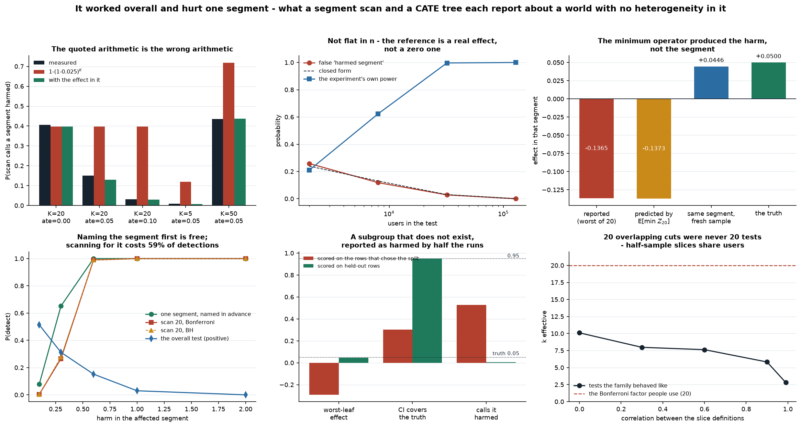

# Heterogeneous Effects

[](https://colab.research.google.com/github/phoebefu6/phoebe-the-builder/blob/main/data-science-cookbook/heterogeneous-effects/demo.ipynb)
[](https://mybinder.org/v2/gh/phoebefu6/phoebe-the-builder/main?labpath=data-science-cookbook/heterogeneous-effects/demo.ipynb)

> The test won overall, then somebody sliced it by country, device, plan and tenure and found the segment it hurt - and on a launch that helped every single user equally, that slicing invents a harmed segment 40% of the time, with a number the arithmetic could have told you before the experiment ran.



## Business Impact

- **Before:** the segment scan at the end of every experiment write-up. Twenty cuts, one of
  them comes out negative, and the launch is held, carved up, or "monitored for segment 7" -
  on an estimate nobody checks the provenance of.
- **After:** the alarm rate of that scan computed in closed form before the test starts, the
  worst segment's number predicted before any data is collected, and one guard that catches
  the failure mode people actually hit - a segment defined after assignment - with a
  1,200-sigma separation and no threshold to tune.
- **Estimated ROI:** the decision this feeds is holding or shipping a launch. The free
  finding: **name the guardrail segment before the test.** Naming one segment in advance
  detects a real harm 0.652 of the time; scanning twenty for it detects the same harm 0.266 of
  the time. Same data, same alpha, 59% of the detections thrown away by looking everywhere.

## What it measures

Eight sections, each a simulation with a known true effect, so every claim is checked against
a number the code already has.

| # | Finding |
|---|---|
| 1 | Both estimators work where they should: the scan finds a real -0.25 segment 0.807 of the time at n=20,000, and an honest CATE tree recovers a covariate-driven effect at RMSE 0.131. **And slicing in the wrong place is worse than not slicing** - the 20-segment scan carries 1.13x the error of quoting one number for everybody |
| 2 | **THE DESIGN CONSTANT, and the version everybody quotes is the wrong arithmetic.** `1-(1-0.025)^K` = 39.7% at K=20 is the alarm rate at a true effect of **zero**. With a real effect the family shifts, and the right form is `1-(1-Phi(-1.96 - tau/se_seg))^K` with `se_seg = sigma*sqrt(4K/n)`: measured 0.150 vs the quoted 0.397 at tau=+0.05, and it matches to MC error at K=5, 20 and 50. **The uncomfortable reading: a scan is most likely to invent a harmed segment exactly when the launch did nothing at all** |
| 3 | **NEGATIVE: the house pattern from Days 165/167/168 does not hold.** Those all found a bias or a size flat in n. This one moves - 0.258 at n=2,000 down to 0.000 at n=128,000 - because the reference is a real effect, not a zero one, and `tau/se_seg` grows with sqrt(n). A bigger test is a safer scan |
| 4 | **The worst segment's number is an estimate of the minimum operator.** True effect +0.05 in every segment; the segment that came out worst reports **-0.1365**, and quadrature on `E[min Z20] = -1.8675` predicts **-0.1373** before any data exists. Re-measured in a fresh sample it returns **+0.0446**. The ranking still carries information - with a real harmed segment, the worst segment IS the harmed one 88.2% of the time - but the number does not |
| 5 | **NEGATIVE: the scan is blind by construction.** A segment is 1/K of the data, so its MDE is exactly sqrt(K) times the experiment's - 0.2802 against 0.0626 at K=20, n=8,000. At the sample size where the experiment itself is done (0.027 catch rate at n=40,000, power 1.000) the guard needs ~25x more traffic to be worth reading. Same shape as Day 165's SRM guard and Day 168's dose-response guard |
| 6 | **The aggregate test is not a weak version of the segment question.** As one segment's harm grows, the overall test's power **falls** - 0.514 at a harm of 0.10 down to 0.000 at 2.00 - because the harm is diluted 1/K. At a harm of 1.00 the launch is a wash in aggregate while a twentieth of users lose 0.95 |
| 7 | **NEGATIVE: "we looked at 20 slices" was never 20 tests, even at zero correlation.** Independent slice *definitions* still give dependent *estimates*, because two half-sample slices share a quarter of the users: k-effective **10.1** at rho=0, falling to **2.8** at rho=0.99. So Bonferroni-20 is already 2x conservative before any correlation in the cuts, and 7x by rho=0.99 - power 0.708 raw against 0.300 corrected. Both numbers are computable from the memberships alone, before an outcome is looked at |
| 8 | **THE HEADLINE - NEGATIVE: a fitted subgroup's effect IS the objective function it was chosen by.** On a world with tau = 0.05 for **everyone**, a depth-2 causal tree's worst leaf reports **-0.2924** with 0.303 coverage and is called significantly harmed in **52.7%** of runs. The same leaf on held-out rows: **+0.0450**, coverage 0.950, called harmed 0.7%. Day 169 found this in a synthetic control's pre-period fit - different fitted object, identical mechanism |
| 9 | **The honest half is not free, and the in-sample estimate is worse at every signal strength.** Leaf error in-sample 0.216 vs honest 0.100 at beta=0, still 0.133 vs 0.092 at beta=0.40 where the heterogeneity is loud. Honest coverage sits at nominal (0.947-0.961) across the whole range; in-sample runs 0.597-0.857 |
| 10 | **NEGATIVE: a post-assignment segment is a data-contract bug, and it produces an impossibility.** Slice on "engaged users" when treatment moves engagement: both parts report harm (-0.094 and -0.110) while the whole correctly reports **+0.051**. **The guard that sees it is algebra, not a test** - the share-weighted mean of segment effects minus the overall effect sits at sd 0.007 for a pre-assignment partition and at -8.40 for the gate, a 1,204-sd separation with no power curve and no threshold. First guard in seven builds with nothing to trade off |
| 11 | **What the "no segment may be harmed" gate buys, both columns together:** uncorrected, it blocks a launch that helped everyone 0.143 of the time and catches a real -0.25 segment 0.728. Bonferroni: 0.002 and 0.278. Correcting makes the gate honest about being weak rather than dishonest about being strong |

The through-line: **a segment scan and a CATE tree fail the same way** - one selects the
subgroup, one fits it, and both publish the number the selection produced. Naming the segment
before the test, and scoring the leaf on rows that did not choose it, are the same fix.

## Tech Stack

Python 3.11 · numpy · scipy (`integrate.quad` for `E[min Z_K]`, so the winner's curse is a
closed form checked against simulation rather than a simulation quoted as a result) ·
matplotlib · Streamlit · pytest · Docker

The CATE tree is ~60 lines of numpy: a greedy variance-reduction split on the transformed
outcome `Y* = Y(W-p)/(p(1-p))`, whose conditional mean is `tau(X)`, with the structure and the
leaf effects fittable on different halves. No sklearn, so the honest/in-sample switch is a
visible argument rather than a library setting.

## Demo

**[Run the interactive demo notebook →](demo.ipynb)** - pre-rendered with outputs, or click the
Colab/Binder badges above to run it live.

```bash
pip install -r requirements.txt
python evidence.py                # the eight-section measurement, ~80s
python -m pytest -q test_hte.py   # 22 assertions behind every number above
python make_chart.py              # the six-panel figure
streamlit run app.py              # pick a world, run the scan, watch the guard fire
```

The app's point is section 10 made tactile: switch the world to "segment measured AFTER
assignment" and the parts-vs-whole gap goes from +0.04 to -5.01 while the scan itself reports
two confidently harmed segments.

## Learning Connection

Built while working through the experimentation run in this cookbook - the seventh build, and
the second about what happens **after** a clean test lands.
[`peeking-cost`](../peeking-cost/) (when you looked),
[`srm-detector`](../srm-detector/) (who ended up in which arm),
[`cuped-variance`](../cuped-variance/) (needing fewer users),
[`diff-in-diff`](../diff-in-diff/) (when you could not randomise),
[`interference-check`](../interference-check/) (when the units touch each other),
[`synthetic-control`](../synthetic-control/) (when there is only one treated unit).

Section 8 is [`synthetic-control`](../synthetic-control/)'s finding in a different field: a
diagnostic that IS the objective function is evidence the optimiser worked and nothing else.
Section 5 is the third calibrated-but-blind guard in a row. Section 10 is the first one in the
whole run that has no power problem, and the reason is worth carrying forward - it checks an
accounting identity instead of estimating a parameter.

Applies: multiplicity arithmetic done in closed form rather than by rule of thumb, extreme
value quadrature, sample splitting as the price of a quotable subgroup effect, and the habit of
testing the closed form you assumed (section 2's received one was wrong, and the test that
catches it is in the suite).

## Impact Note

- **Who benefits:** anyone who reads or writes the segment table at the end of an experiment
  write-up, and anyone deciding whether one bad-looking segment should hold a launch.
- **Potential risks:** the honest reading of section 5 is that a post-hoc segment scan cannot
  protect a group you care about, and that is uncomfortable when a scan is the only protection
  in place. Removing it is not the lesson. Three habits are: name the guardrail segments before
  the test and size for them, run the parts-vs-whole check on every segment table so a broken
  split is caught for free, and quote any discovered subgroup's effect from data that did not
  choose it.
