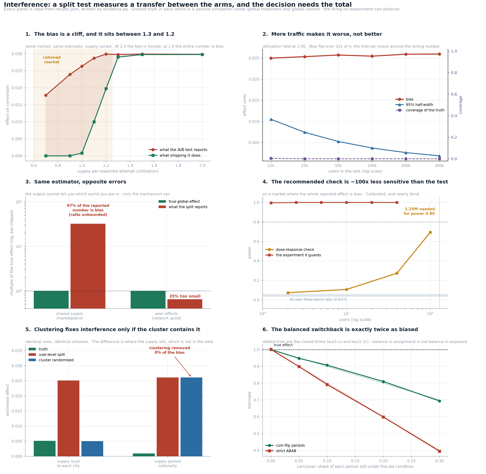

# Interference Check

[](https://colab.research.google.com/github/phoebefu6/phoebe-the-builder/blob/main/data-science-cookbook/interference-check/demo.ipynb)
[](https://mybinder.org/v2/gh/phoebefu6/phoebe-the-builder/main?labpath=data-science-cookbook/interference-check/demo.ipynb)

> The A/B test said +26%. It shipped to everybody and nothing moved. Nobody made a mistake: a split test measures the difference between the arms, and the decision needed the total.



## The one-paragraph version

A randomised test estimates the difference between a treated unit and a control unit **in a
world where half of everybody is treated**. The decision it gets used for is the difference
between everybody treated and everybody control. Those are the same number only if one
unit's assignment cannot touch another unit's outcome - the "no interference" half of SUTVA,
the assumption nobody writes on the test plan. It is false in every marketplace, every
shared budget, every social feature and every shared model. This build constructs two worlds
where it fails **in opposite directions**, measures the damage, and then measures the three
designs usually offered as the fix - including how well the recommended *detector* works.

Ground truth throughout is a second simulation of the same world under global treatment and
global control. That is precisely the quantity a real experiment can never observe, and the
only reason the bias is knowable here.

## What it found

**1. A textbook-clean test can be 97% bias.** 20,000 buyers, 2,000 things to sell, control
buyers attempt at 10% and treated at 13% - the feature genuinely works. The split reports
**+0.02633** (SE 0.00424, p < 0.05 in 100% of runs). Shipping it to everybody delivers
**+0.00082**. The estimate is the supply the treated arm won off the control arm; treat
everybody and there is nobody left to take it from.

**2. The bias is a cliff, and the edge sits between utilisation 1.3 and 1.2.**

| supply per attempt | split reports | shipping delivers | overstates by |
|---|---|---|---|
| 2.00 | 0.02983 | 0.02977 | 0.2% |
| 1.30 | 0.02977 | 0.02902 | **2.6%** |
| 1.20 | 0.02990 | 0.01973 | **51.5%** |
| 1.10 | 0.02871 | 0.01002 | 186% |
| 1.00 | 0.02635 | 0.00082 | 3,096% |
| 0.90 | 0.02391 | 0.00000 | infinite |

Both columns have closed forms, verified against simulation: the truth is
`min(p_t, S/n) - min(p_c, S/n)`, and the split is
`(p_t - p_c) x min(1, S / (n x mean attempt rate))`. That second formula is *why* the readout
cannot warn you - both arms face the same rationing factor, so it cancels out of the
difference. No dashboard distinguishes 1.30 from 1.20.

**3. NEGATIVE RESULT: more traffic makes it worse, not better.** Scaling the market and the
supply together (utilisation held at 1.00), bias moves 0.02497 -> 0.02594 across a 32-fold
range of n - flat within Monte-Carlo error - while the standard error falls 5.7x. Coverage
of the true global effect is 0.004 at n=12,500 and **0.000** everywhere after; the
experiment's own power never drops below 0.996. *n* is in the variance and it is not in the
bias. A tight, confident, highly significant interval around the wrong number is the
expected output of doing this carefully. Same shape as the [`diff-in-diff`](../diff-in-diff/)
build's parallel-trends violation, same cause.

**4. NEGATIVE RESULT: the same estimator fails in both directions, and the output cannot say
which.** Second world: 300 peer groups of 20, direct effect `tau = 1.0`, indirect effect
`gamma = 0.5`, so the truth is 1.5. The split returns **0.9748** against a closed form of
`tau - gamma/(m-1)` = 0.9737. The bias is `-gamma x m/(m-1)` = **-0.5263** exactly, with no
*n* in it - the split recovers the direct effect, misses the indirect one entirely, and then
overshoots by one peer's worth the other way. It misses **35%** of the real effect. In the
marketplace the identical estimator *overstated* by ~100% of its own reading. Same
randomisation, same clean p-value, opposite error. Which way you are wrong is a fact about
the mechanism, argued before the test - it is not a caveat you can append afterwards,
because it changes the **sign**.

**5. NEGATIVE RESULT: the recommended guard test is ~100x less sensitive than the test it
guards.** The standard defence is a dose-response design - run at two treated shares (10%
and 50%) and test whether the effect depends on the share. It is a valid test: false-alarm
rate **0.047** under no interference. It is also nearly blind.

| users | power of the check |
|---|---|
| 20,000 | **0.073** |
| 100,000 | 0.107 |
| 400,000 | 0.273 |
| 1,000,000 | 0.693 |
| ~1.29M (extrapolated) | 0.80 |

The experiment itself is at power 0.996+ by n=12,500. The check needs about **103x** that
traffic to reach 0.80. At the sample size where you are actually running the test it fires
0.073 of the time on a market where the whole reported effect is bias - against its own
0.047 false-alarm rate. Compare [`srm-detector`](../srm-detector/), where the guard was 6x
*more* sensitive than its experiment and still not protective: a guard test being calibrated
says nothing about whether it guards.

**6. NEGATIVE RESULT: cluster randomisation at the wrong level removes 0% of the bias and
pays the whole cost.** 40 cities x 500 buyers. Two versions of the same market - supply
local to each city, or the identical total pooled nationally. Nothing a data team can see
distinguishes them: same rows, same volumes, same conversion rate.

| | true effect | user-level split | cluster randomised | bias removed |
|---|---|---|---|---|
| supply local to each city | 0.00510 | 0.02512 | **0.00503** | 99.6% |
| supply pooled nationally | 0.00095 | 0.02611 | **0.02612** | **-0.1%** |

Cluster randomisation is not a fix for interference. It is a fix for interference *that stops
at the cluster edge*, and where that edge is is a claim about the supply chain, not about the
schema. Same failure the [`diff-in-diff`](../diff-in-diff/) build found for clustered standard
errors: the received advice is about the cluster **count**, and the thing that decides it is
the **level**.

**7. NEGATIVE RESULT, derived here rather than looked up: the textbook design effect
understates the price of clustering.** `1 + (m-1) x ICC` compares cluster assignment to
*simple* random assignment - but a within-group 50/50 split is not simple random assignment,
it is **stratified** by the cluster, so it cancels the between-group variance exactly rather
than in expectation. Against that baseline the right expression is `1 + m x (sd_group/sd_user)^2`.

| ICC | textbook `1+(m-1)ICC` | derived `1+m(sd_g/sd_u)^2` | measured |
|---|---|---|---|
| 0.000 | 1.00 | 1.00 | 0.99 |
| 0.059 | 2.12 | 2.25 | 2.38 |
| 0.168 | 4.20 | **5.05** | **5.14** |
| 0.360 | 7.84 | **12.25** | **11.94** |

Sizing a cluster test off the textbook number buys 20% too little traffic at ICC 0.168, and
the gap widens with `m` (56% too little at 0.360).

**8. NEGATIVE RESULT: the balanced switchback is exactly twice as biased as coin-flipping.**
Randomising time instead of users fixes a shared pool - unless the system does not switch
instantly. With a fraction `c` of each period still under the old condition, coin-flip
assignment attenuates by `c` and strict ABAB alternation attenuates by `2c`, because a
treated period's predecessor is *always* a control period.

| carryover | coin-flip (closed form) | strict ABAB (closed form) |
|---|---|---|
| 0.05 | 0.9480 (0.950) | 0.8989 (0.900) |
| 0.10 | 0.9072 (0.900) | 0.7919 (0.800) |
| 0.20 | 0.8100 (0.800) | 0.5987 (0.600) |
| 0.30 | 0.6940 (0.700) | 0.3948 (0.400) |

Balance in the assignment is not balance in the exposure. Burn-in removes it, and the MSE
minimum sits at **burn-in = the true carryover** (0.20 measured against 0.20 true) - discard
less and the bias survives any sample size; discard more and you pay `1/(1-b)` of the
variance for nothing. So the knob is a *measurement* of settling time, not a preference. If
nobody has measured it, the switchback's attenuation is unknown and its result is a lower
bound on the effect - which is at least honest.

## What to put in the test plan

1. The interference **mechanism** you are ruling out, named before the test - shared supply,
   shared budget, shared model, peers, or none. It decides the sign of your error and no
   output can recover it.
2. For a constrained market: **utilisation** during the test window. 1.3 overstates by 3%,
   1.2 by 52%.
3. Never "we will re-run it bigger to be sure". Bias is flat in *n*; coverage goes to 0.000.
4. If you ran a dose-response check, report its **power**, not its p-value.
5. If you clustered, state what the cluster is a boundary **of**, and defend that it contains
   the mechanism.
6. If you switchbacked, report the measured settling time and the burn-in.

## Business Impact
- **Before:** a marketplace, ads or social team ships an A/B winner, the topline does not
  move, and the post-mortem blames execution or seasonality. The failure is unattributable
  because the experiment was run correctly.
- **After:** the mechanism is named on the test plan, utilisation is on the readout, and the
  design (split / cluster / switchback) is chosen against a measured bias rather than habit.
  A blocked test is downgraded to a lower bound instead of being reported as a point estimate.
- **Estimated ROI:** one avoided false rollout. The measured case here is a feature that
  reads +26% and delivers +0.8% - the difference between a roadmap built on it and one that
  is not.

## Tech Stack
Python 3.11, numpy, scipy, pandas, matplotlib, Streamlit, pytest, ruff, Docker.
No dataset - every world is simulated so that the counterfactual is available.

## Demo

**[Run the interactive demo notebook](demo.ipynb)** - pre-rendered with all outputs, or use
the Colab / Binder badges above to run it live.

```bash
pip install -r requirements.txt
python evidence.py                     # the nine-section measurement (~110s)
python -m pytest -q test_interference.py   # 25 assertions behind every number
python make_chart.py                   # the six-panel figure
streamlit run app.py                   # pick a mechanism and a design, watch the gap
```

`app.py` has four tabs: shared supply (the test overstates), peer effects (the test
understates), the guard test's power, and switchback carryover.

## Learning Connection
Fifth build in the experiment-soundness run, after [`peeking-cost`](../peeking-cost/) (when
you looked), [`srm-detector`](../srm-detector/) (who ended up in which arm),
[`cuped-variance`](../cuped-variance/) (needing fewer users) and
[`diff-in-diff`](../diff-in-diff/) (when you could not randomise at all). Those four asked
whether the analysis was sound. This one is about the assumption *inside* a perfectly
executed randomised test: that the units do not touch each other.

Applies: potential outcomes under interference, exposure mappings, random rationing,
linear-in-means peer effects, cluster randomisation and design effects, switchback design
and carryover, and power analysis of a diagnostic rather than of an experiment.

**Reading, for results this build re-derives rather than cites:** Blake & Coey (2014) on
marketplace interference; Aronow & Samii (2017) on exposure mappings; Bojinov, Simchi-Levi &
Zhao (2023) on switchback design; Karrer et al. (2021) on network cluster randomisation.

## Impact Note
- **Who benefits:** anyone running experiments where the units share something - marketplace
  and ads teams, social and referral features, shared-budget or shared-inventory systems,
  and anyone A/B testing a model that itself learns from both arms.
- **Potential risks:** the simulated worlds are deliberately simple - uniform random
  rationing, one interference channel at a time, linear-in-means peer effects. Real markets
  mix mechanisms and have priority queues, so the numbers here are illustrative of *shape*
  and magnitude, not transferable point estimates. The closed forms are exact for the stated
  models only. The opposite risk is worse: reading section 6 as "clustering does not work"
  rather than "clustering works when the cluster contains the mechanism", and abandoning the
  one design that actually fixes this.
