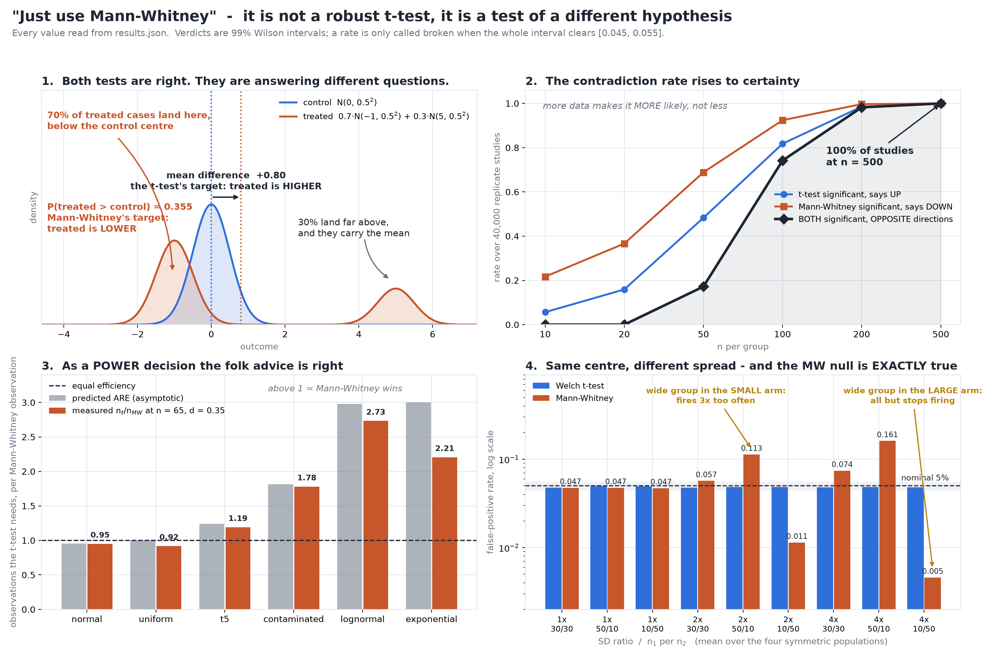

# Just Use Mann-Whitney?

[](https://colab.research.google.com/github/phoebefu6/phoebe-the-builder/blob/main/data-science-cookbook/nonparametric-swap/demo.ipynb)
[](https://mybinder.org/v2/gh/phoebefu6/phoebe-the-builder/main?labpath=data-science-cookbook/nonparametric-swap/demo.ipynb)

> Two defensible tests, one dataset, both significant, opposite conclusions - because "just use Mann-Whitney" swaps the question, not just the method.



## The short version

A two-sample t-test asks about `mu_B - mu_A`. The Mann-Whitney U test asks about `P(B > A)`.
Shift one distribution sideways and those agree in sign, so nobody notices the substitution.
Step off that model and they part company.

This build constructs a design where the disagreement is **arithmetic rather than bad luck**:

| | |
|---|---|
| control | `N(0, 0.5^2)` |
| treated | `0.7 * N(-1, 0.5^2)  +  0.3 * N(5, 0.5^2)` |
| true mean difference | **+0.80** — the t-test's target says treated is HIGHER |
| true `P(treated > control)` | **0.3551** — Mann-Whitney's target says treated is LOWER |

Both numbers are closed form. Most treated cases end up slightly worse; a minority end up a lot
better — the shape of a great many real treatment effects.

Hand that to both tests, 40,000 times:

| n per group | t-test significant, says UP | Mann-Whitney significant, says DOWN | **both significant, OPPOSITE** |
|---:|---:|---:|---:|
| 10 | 0.0564 | 0.2170 | 0.0000 |
| 50 | 0.4828 | 0.6885 | 0.1720 |
| 100 | 0.8178 | 0.9241 | **0.7419** |
| 200 | 0.9853 | 0.9968 | 0.9821 |
| 500 | 1.0000 | 1.0000 | **1.0000** |

**The contradiction rate rises with n.** More data does not resolve it, more data guarantees it.
At small samples the two tests fail to disagree only because neither has the power to say
anything; the contradiction arrives exactly when both tests become trustworthy.

## The part where the folk advice is right

Under a **pure location shift** the two hypotheses coincide, so power is a fair comparison. The
asymptotic relative efficiency of Mann-Whitney to the t-test is `12 * sigma^2 * (integral f^2)^2`,
computed here by quadrature and checked against its three closed forms before anything else is
read — normal gives exactly `3/pi`, uniform exactly `1`, centred exponential exactly `3`.

| shape | predicted ARE | measured `n_t / n_MW` |
|---|---:|---:|
| normal | 0.9549 | 0.9512 |
| uniform | 1.0000 | 0.9198 |
| t5 | 1.2412 | 1.1920 |
| contaminated | 1.8145 | 1.7809 |
| lognormal | 2.9803 | 2.7330 |
| exponential | 3.0000 | 2.2065 |

Above 1 means Mann-Whitney needed fewer observations. It gives up about 5% on normal data and
wins outright on every other shape measured. **The cost of the swap is not power. It is that the
question changed and nobody announced it.**

The measured column sits below the predicted one, and the gap grows with the prediction — ARE is
a limit as the effect goes to zero and n goes to infinity, while these are finite-n readings at
`d = 0.35`, `n = 65`. The two columns are checked for agreement in **order**, not in value.

## The cost nobody mentions

Two symmetric populations, same centre, different spread. For symmetric distributions that makes
`P(B > A)` **exactly 0.5**, so Mann-Whitney's own null hypothesis is true — and so is the mean
null. Any departure from 5% is not a violated hypothesis. It is the test's variance formula,
which assumes the two distributions are *identical* rather than merely balanced.

| SD ratio | n1 / n2 | Welch | Mann-Whitney |
|---:|---|---:|---:|
| 1x | 30/30 | 0.0494 | 0.0475 |
| 2x | 50/10 | 0.0506 | **0.1111** |
| 2x | 10/50 | 0.0503 | **0.0111** |
| 4x | 30/30 | 0.0505 | **0.0738** |
| 4x | 50/10 | 0.0512 | **0.1586** |
| 4x | 10/50 | 0.0490 | **0.0045** |

*(normal population shown; the full 36-cell grid over four symmetric populations is in
`evidence.txt`)*

Mann-Whitney misses its nominal rate on **21 of 36** designs, worst case 3.6x too often and 13.9x
too quiet. The direction is set by which group is the wide one: wide group in the small arm and
it fires too often; wide group in the large arm and it all but stops firing — and a test that
never rejects does not look broken to anyone reading the output.

**Unequal n is not the precondition**, which is what separates this from the classic
Student's-versus-Welch problem. Balanced designs break too (5 of 12); unequal n changes the size
and the sign.

Welch is not clean here either — it is measurably conservative on the contaminated population, 7
cells, worst 1.20x off nominal. Saying "Welch holds" would have been the easy version of this
table. A test that is a fifth conservative and a test that is 14 times too quiet are both wrong
and they are not comparably wrong.

## Ties

A rank test on a rating scale. Ties can only ever *shrink* `Var(U)`, so the no-ties formula
divides by a standard error that is too large and the test goes quiet.

| scale | SD corrected/uncorrected | null, corrected | null, uncorrected | power lost |
|---:|---:|---:|---:|---:|
| 2-point | 0.8606 | 0.0562 | **0.0172** | 0.172 |
| 3-point | 0.9384 | 0.0499 | **0.0357** | 0.065 |
| 5-point | 0.9768 | 0.0488 | 0.0434 | 0.023 |
| 7-point | 0.9874 | 0.0503 | 0.0473 | 0.013 |

On a binary outcome, dropping the correction takes a 5% test to 1.7% and costs 17 points of
power. SciPy applies it; a lot of hand-rolled rank tests and spreadsheet macros do not.

*Negative result about this study rather than about the test:* the corrected column is flagged on
0 of 4 scales. The 2-point cell is the highest in the table and above nominal, but its 99% Wilson
interval still touches the band, so this build does not have the resolution to call it broken and
does not claim to.

## Business Impact

- **Before:** a normality test fails, the analyst swaps in Mann-Whitney, and the write-up says
  "we used a non-parametric test because the data was skewed" — as though the question were
  unchanged.
- **After:** the mean difference and `P(B > A)` are reported side by side, and when they disagree
  that disagreement is the headline rather than a hidden fork in the analysis.
- **Estimated ROI:** one reversed decision. On the design above, a launch call made on the rank
  test and a launch call made on the t-test go opposite ways at any sample size worth running.

## Tech Stack

Python · NumPy · SciPy · Matplotlib · Streamlit · pytest · Docker

## Demo

**[Run the interactive demo notebook →](demo.ipynb)** — pre-rendered with outputs, or click the
Colab/Binder badges above to run it live.

For the Streamlit app, where you build a mixture with sliders and watch the two verdicts
separate in real time:

```bash
pip install -r requirements.txt
streamlit run app.py
```

To regenerate every number in this README:

```bash
python evidence.py     # writes evidence.txt + results.json
python make_chart.py   # writes the audit figure, with a painted-geometry self-check
pytest -q              # 60 tests
```

## How this is kept honest

- **Calibration first.** `integral f = 1` on 6 of 6 shapes, and the ARE closed forms on normal,
  uniform and exponential, before any result is reported. The hand-rolled uncorrected rank test
  is checked against SciPy on tie-free data to `3.5e-17`, so the tie column measures ties and not
  an implementation difference.
- **Verdicts are intervals.** A nominal 5% test is called broken only when its whole 99% Wilson
  interval clears `[0.045, 0.055]` at that cell's replicate count.
- **Power is gated.** It is compared only where both tests control Type I. That gate disqualified
  3 cells — and they were the cells where Mann-Whitney's advantage looked largest.
- **One source of numbers.** The chart, the app and the notebook read `results.json`; none of
  them recomputes a verdict.
- **The notebook embeds the library by AST extraction**, not by hand-copying, and uses the
  library's own seeds — so its rows *are* the evidence file's cells. It runs fewer replicates, so
  it flags fewer cells, and it says so in the notebook rather than reading as a contradiction.
- **The chart measures itself.** `make_chart.py` renders, then asserts no annotation overlaps
  another or sits on a plotted curve, and fails the build if one does. It caught a real collision
  during this build.

## Learning Connection

Built while working through two-sample rank procedures and the Behrens-Fisher problem for ranks.
Applies: hypothesis identification (what a test's null actually says), Monte Carlo study design
with a calibration cell, and asymptotic relative efficiency as a prediction that finite-n
simulation can be checked against.

## Impact Note

- **Who benefits:** anyone who reaches for a non-parametric test because a normality check
  failed, and anyone reviewing an analysis that did.
- **Potential risks:** the honest reading of this build is *report both quantities*, not *never
  use Mann-Whitney*. Under a pure location shift the rank test is the better bet on five of six
  shapes measured, and a reader who takes "Mann-Whitney is broken" away from section 3 has
  swapped one piece of folk advice for another.

## Siblings in this domain

| build | interrogates |
|---|---|
| [`t-test-variants`](../t-test-variants) | which of the five things called a t-test |
| [`normality-test-trap`](../normality-test-trap) | the **one**-sample signed-rank swap |
| [`assumption-pretest-cost`](../assumption-pretest-cost) | Student vs Welch, and the pretest |
| [`p-value-dance`](../p-value-dance) | what p does under replay |
| [`effect-size-reader`](../effect-size-reader) | `P(X>Y)` as an **estimate** |
| **this one** | `P(X>Y)` handed to a **test** |
