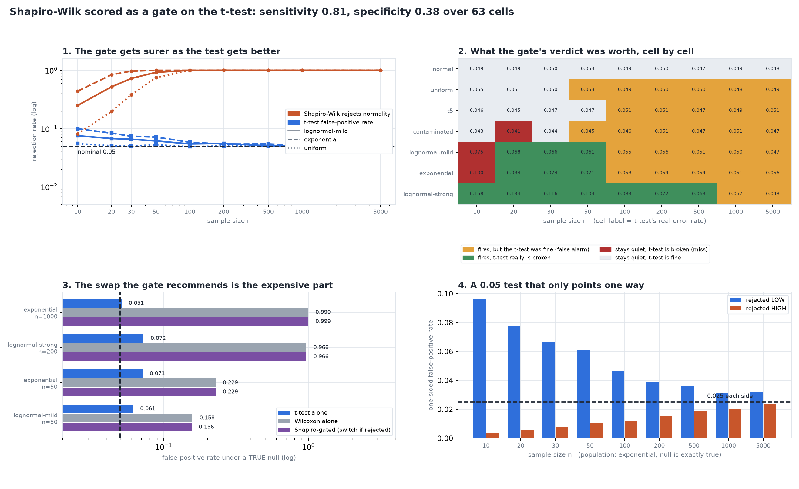

# The Normality-Test Trap

[](https://colab.research.google.com/github/phoebefu6/phoebe-the-builder/blob/main/data-science-cookbook/normality-test-trap/demo.ipynb)
[](https://mybinder.org/v2/gh/phoebefu6/phoebe-the-builder/main?labpath=data-science-cookbook/normality-test-trap/demo.ipynb)

> Shapiro-Wilk says your data is not normal, so you abandon the t-test. Across 63 measured cells that gate fires 29 times on a t-test that was already correct, and the substitute it sends you to runs at a 98% false-positive rate.

## The problem

"Run a normality test first" is one of the most reliably taught steps in applied statistics, and
it rests on two things that are both false.

**A normality test is a power curve, not a verdict.** On one fixed population, Shapiro-Wilk
rejects 25% of the time at n=10 and 100% of the time at n=500. The population did not change.
Only the sample size did. The test does not answer "is my data normal" - it answers "do I have
enough data to notice that it is not", and every real-world column fails that eventually.

**The t-test never asked for normal data.** It asks that the *sampling distribution of the mean*
be close to normal - which the Central Limit Theorem delivers at exactly the sample sizes where
Shapiro becomes unstoppable. So the two curves run in opposite directions in n, and the gate
fires hardest precisely where it is least needed.

This build measures both, on the same simulated samples, under a null that is **exactly true** -
every population is standardised to mean 0 and the hypothesis tested is that the mean is 0. So
every rejection counted is a false positive by construction. Nothing here is an argument.

## What it found

**63 cells: 7 populations x 9 sample sizes, 8,000-20,000 replicates each.**

### 1. Shapiro-Wilk scored as what people use it for - a gate on the t-test

Positive = the gate fires. Condition = the t-test's real error rate is outside `[0.045, 0.055]`.

| | |
|---|---|
| sensitivity (catches a broken t-test) | **0.81** |
| specificity (stays quiet when it is fine) | **0.38** |
| false alarms | **29 of 47** cells where the t-test was correct |
| misses | 3 cells |

Specificity is the number that matters, because a gate's whole job is to stop you using a test
that would mislead you. Firing on 29 correct tests is not caution - it is routing you to a
substitute, and the substitute is the expensive part.

### 2. The two curves run in opposite directions

Population fixed at `lognormal-mild` (skew 1.75 - the shape of most revenue, latency and
session-length columns). Only n changes.

| n | Shapiro rejects normality | t-test's real error rate |
|---|---|---|
| 10 | 0.250 | 0.0754 |
| 20 | 0.521 | 0.0675 |
| 30 | 0.725 | 0.0656 |
| 50 | 0.924 | 0.0614 |
| 100 | 0.999 | 0.0546 |
| 200 | 1.000 | 0.0556 |
| 500 | 1.000 | 0.0505 |
| 5000 | 1.000 | 0.0466 |

### 3. The crossover - where the gate fires on a test that works

| population | gate fires from | t-test not shown broken from | crossover |
|---|---|---|---|
| uniform | n=50 | n=10 | **n=50** |
| t5 | n=100 | n=10 | **n=100** |
| contaminated | n=50 | n=10 | **n=50** |
| lognormal-mild | n=20 | n=100 | **n=100** |
| exponential | n=20 | n=100 | **n=100** |
| lognormal-strong | n=10 | n=1000 | **n=1000** |

### 4. The swap is where the money goes

The second half of the move is "not normal, so use the non-parametric one". Wilcoxon signed-rank
is **not** a robust t-test. It tests a different null - symmetry about zero - and a right-skewed
variable with mean exactly 0 has a **median below 0**. So the null the t-test is testing is true
while the null Wilcoxon is testing is false.

| population | n | t-test alone | Wilcoxon alone | Shapiro-gated |
|---|---|---|---|---|
| lognormal-mild | 200 | 0.0556 | 0.4456 | **0.4456** |
| lognormal-mild | 1000 | 0.0496 | 0.9792 | **0.9792** |
| exponential | 1000 | 0.0512 | 0.9989 | **0.9989** |
| lognormal-strong | 1000 | 0.0573 | 1.0000 | **1.0000** |

At n=1000 on mildly skewed data, doing the responsible-looking thing takes a correctly-sized 5%
test to a **98% false-positive rate**.

### 5. Negative result: symmetric non-normality is harmless

Not one `uniform` or `t5` cell has a broken t-test anywhere in the grid, while Shapiro rejects
both at 1.000 from n=200 upward. Light tails, heavy tails and a 5% contamination mixture all
leave the t-test inside its band. **Tail weight is not the problem. Skew is.** Every one of the
16 genuinely broken cells is a skewed population, and 15 of them are at n<=200.

### 6. Negative result: the blind spot is small, and it is where Shapiro is weakest

Only 3 cells have a broken t-test that Shapiro would have waved through - all at n=10 or n=20,
exactly where the normality test has the least power. The gate is not merely uninformative; its
errors are arranged so that it is quiet in the one place it would be useful.

### 7. The defect the two-sided p-value hides

A sample that happens to miss a long right tail has both a low mean **and** a low variance - and
the low variance shrinks the standard error the low mean is divided by. The two errors compound
instead of cancelling, so the test rejects downward far more than upward.

| population | n | rejected low | rejected high | two-sided | asymmetry |
|---|---|---|---|---|---|
| lognormal-strong | 20 | 0.1328 | 0.0014 | 0.1341 | **98x** |
| lognormal-strong | 50 | 0.1004 | 0.0032 | 0.1036 | **31x** |
| exponential | 20 | 0.0777 | 0.0058 | 0.0835 | 13x |
| lognormal-mild | 500 | 0.0316 | 0.0190 | **0.0505** | 1.7x |

The last row is the point: a cell can sit at a perfectly respectable 0.0505 two-sided and still
be a test that points one way.



## Business Impact

- **Before:** an analyst runs a normality test, it rejects (it always rejects on real data at
  real sample sizes), and the analysis switches to a rank test - silently changing the hypothesis
  from "did the mean move" to "did the distribution shift", and on skewed data reporting a
  significant result almost every time regardless of truth.
- **After:** the question changes from "is my data normal" - which has no useful answer - to
  "at my n, with my skew, does the procedure I am about to run control its error rate?" That is
  a simulation, and the simulation is twenty lines: it is `measure()` in the notebook.
- **Estimated ROI:** the decision rule is one line - **below n=100 on visibly skewed data, do not
  trust a bare t-test; above it, do not trust the gate**. The cost of getting this wrong is not
  time, it is the 29 false alarms above, each one a correct analysis thrown away, and the 98%
  false-positive rate of the substitute that replaced it.

## Tech Stack

Python 3.11, numpy, scipy (`shapiro`, `ttest_1samp`, `wilcoxon`), matplotlib, Streamlit, pytest,
Docker. No data set - the whole point is a null that is exactly true, which only simulation gives.

## Demo

**[Run the interactive demo notebook →](demo.ipynb)** - pre-rendered with outputs, or click the
Colab/Binder badges above to run it live. Its headline tables use the study's own seeds and
replicate count, so the rows in the notebook **are** the cells in `evidence.txt`, number for
number.

For the Streamlit app, where you set your own population and n and the Monte-Carlo runs live:

```bash
pip install -r requirements.txt
streamlit run app.py
```

To regenerate every number in this README:

```bash
python evidence.py     # writes evidence.txt and results.json (~6 min)
python make_chart.py   # writes the audit figure from results.json
pytest                 # 45 tests: statistics vs scipy, samplers vs closed-form moments, findings
```

## How the harness keeps itself honest

A false-positive study is worthless if the null it claims to simulate is not actually true, and a
measured error rate is worthless if the statistic underneath it is wrong. Both are tested:
`one_sample_t_p` is checked against `scipy.stats.ttest_1samp` to 1e-12, and every sampler is
checked against its closed-form skew and kurtosis.

**The bug this build shipped and then fixed.** The first version decided "is this cell broken" by
comparing the point estimate to `[0.045, 0.055]`, and ran only 1,500 replicates at n=5000 to save
time. It promptly flagged its own **exact calibration cell** - a one-sample t on normal data,
whose true error rate is 0.05 with no approximation anywhere - as broken. A detector that fires
on its own known-good cell is measuring its own noise. Every verdict is now a 99% Wilson interval
computed at that cell's replicate count, a cell is called broken only when the whole interval
clears the band, and the replicate tiers were raised until every tier can resolve it. The
regression guard is `test_a_noisy_cell_is_never_called_broken`.

The same rule then had to be pushed into the chart and the notebook, which had each grown their
own copy of the comparison and disagreed with `evidence.txt` about four cells.

## Learning Connection

Direct successor to [`t-test-variants`](../t-test-variants) (Day 174), which found that Welch's
correction is not a normality fix and under skew is the *worse* test. That left the obvious
question open: if the fix does not work, does the diagnostic that recommends it work either?

Deliberately **not** covered here: the variance pretest (Levene/Bartlett/F, then pick Student or
Welch). Different assumption, different finding, its own build. This one owns the normality
pretest only.

## Impact Note

- **Who benefits:** anyone who has ever been told to run a normality test before a t-test -
  which is most people who took an applied statistics course.
- **Potential risks:** "skip the normality test" is not "skip thinking". The 16 broken cells are
  real: on strongly skewed data below about n=100, a bare t-test genuinely is inflated, and
  directionally so. The replacement is a simulation at your own n and skew, not a shrug. And the
  grid is 7 populations and one test - a two-sample design, a different alpha, or a population
  outside this set has to be measured, not extrapolated.
