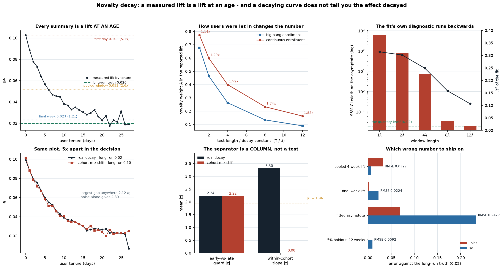

# Novelty Decay: A Measured Lift Is a Lift at an Age

[](https://colab.research.google.com/github/phoebefu6/phoebe-the-builder/blob/main/data-science-cookbook/novelty-decay/demo.ipynb)
[](https://mybinder.org/v2/gh/phoebefu6/phoebe-the-builder/main?labpath=data-science-cookbook/novelty-decay/demo.ipynb)

> The test said +10%, the launch delivered +2%, and the lift-by-tenure chart that everyone
> agrees explains it cannot tell you whether the effect decayed or whether you were measuring
> a different set of users each week.



Every summary of a test window is a lift **at an age**, and the launch decision is about a
population that will be older than every user in the test. That much is folklore. This build
measures the parts that are not, and the headline is that the chart people reach for to
diagnose novelty cannot distinguish it from two other mechanisms with opposite implications.

## What this measures

**1. Three numbers off one curve, and the decision needs a fourth.** On a 28-day test of an
effect decaying `0.10 -> 0.02`, the first-day lift reads 0.103 (5.1x the long-run truth), the
pooled window lift 0.052 (2.6x) and the final-week lift 0.023 (1.2x). The tenure curve is an
honest estimator and recovers the shape correctly; no scalar summary of it estimates the
quantity being decided on.

**2. THE DESIGN CONSTANT: how users were let in changes the reported lift, on its own.** The
pooled lift is `tau_inf + (tau0 - tau_inf) * A`, where `A` is the user-day-weighted mean of
`exp(-t/lam)` over the tenures the window contains. There is no `n`, no `sigma` and no outcome
in `A` - it is arithmetic on the release calendar. Big-bang enrollment gives every tenure
equal weight; continuous enrollment gives tenure `t` weight `T-t`, keeping the population
younger and weighting the novelty component **up** by 1.14x at `T = lam` rising to 1.82x at
`T = 12 lam`. Two tests of identical length, on identical users, on an identical effect,
report lifts **26.6% apart** at `T = 4 lam` (0.0411 vs 0.0520, closed form matching simulation
to 0.0001). This runs the *opposite* way to the usual intuition that a gradual ramp dilutes
novelty.

**3. The asymptote is the parameter the window never observes, and its diagnostic points
backwards.** Fitting the decay curve and reading off its limit gives a 95% interval **609
wide** on a quantity of 0.02 at `T = lam` - simultaneously admitting a zero long-run effect
(74.0% of runs) and one five times the truth (91.0%). The interval becomes usable at about
`T = 8 lam` (0.0177 against a truth of 0.0200, sd 0.0088), which is exactly the regime where
the final window of the test has already measured the asymptote directly: **the fit is only
reliable when it is unnecessary.** NEGATIVE RESULT: `R2` runs the wrong way down that
ladder - 0.314 at the useless `T = lam` and 0.107 at the reliable `T = 12 lam` - because a
longer window is mostly flat curve, so there is less variance left to explain precisely when
the model is trustworthy. A reader choosing between two fits on goodness of fit picks the
shorter, worse one.

**4. The guard is the first in four builds that is neither inert nor free.** The
early-week-vs-late-week comparison is calibrated (fires 0.035 on a flat effect) and reaches
0.607 power at 8,400 users where the experiment itself is already at 1.000 - roughly **6x the
traffic** to see the decay, ~24x to be as sure about it as the test is about the effect. That
is a real price on a ladder real tests reach, unlike the SRM check (Day 165), the
dose-response check (Day 168) and the segment scan (Day 170), which all needed traffic nobody
has. It also answers a different question: it detects that the lift **moved**, and says
nothing about where it settles. A guard can be well-powered for the wrong estimand.

**5. HEADLINE: a decaying lift is not evidence that the effect decayed.** Suppose nobody's
effect decays at all and each user has a permanent effect fixed by the cohort they joined in.
Only cohorts enrolled by day `T-1-t` are old enough to appear at tenure `t`, so the tenure-`t`
lift is a **prefix mean** of the cohort effects - and pinning those prefix means to a target
curve inverts in closed form: `C_j = tau(T-1-j)`, `m_j = (j+1)C_j - j C_{j-1}`. This
reproduces the decay curve **exactly** (every tenure to 1e-12), and it has a consequence:
`mean(m) = C_{T-1} = tau(0) = tau0`. The no-decay world's true average effect equals the decay
world's *first-day* effect, so the two worlds are **5x apart in the decision** (0.02 vs 0.10)
and identical in the plot. Measured over 28 tenures x 300 runs, the largest standardised gap
anywhere is 2.12 against an expected max of 2.30 for 28 pure-noise comparisons - the biggest
difference they show is smaller than noise alone produces. The early-vs-late guard fires
identically on both (mean z 2.24 vs 2.22).

**What separates them is a COLUMN, not a test.** Real tenure decay bends every cohort's own
curve; a cohort mix shift bends none of them and only looks like decay once the cohorts are
pooled. The within-cohort tenure slope (cohort fixed effects, 406 cohort-tenure cells)
separates them at mean z -3.30 vs -0.00, firing 0.900 vs 0.050. It needs the enrollment date
in the table, so a dashboard that dropped it cannot run this at any sample size - a
data-contract requirement rather than a statistical choice. Same shape as Day 168's cluster
level: the fix has to live at the level that contains the mechanism.

**NEGATIVE RESULT, and it is a limit on the previous build's best find:** Day 170's
share-weighted accounting identity separated a legitimate partition from a post-assignment one
by 1,204 sd with no threshold at all. The tenure version of that identity closes to machine
precision (6e-18) in **both** worlds, because tenure is a legitimate partition in both - a mix
shift and a decay are each perfectly consistent bookkeeping. An identity can only catch a
violation of itself, and neither failure here is one. The family of free guards stops here.

**6. Survivorship makes the identical estimator fail upward, and the retention check is
blind.** A permanent effect of 0.05 plus churn whose hazard falls with user value in the
treated arm only - no decay and no cohort structure anywhere - produces a lift that **grows**
from 0.083 at tenure 0 to 0.602 at tenure 27 (12.0x the truth), pooling to 0.343 (6.9x) with a
positive slope that reads as "the effect compounds, ship it and expect more". The obvious
guard is nearly inert: total retention differs by **1.5%** (0.4205 vs 0.4267, mean |z| 0.58,
firing 0.088) while the lift is overstated seven-fold, because the mechanism is
**compositional** - the treatment sheds low-value users and keeps high-value ones, and the two
flows almost cancel in the headcount while doing all the damage to the mean. Counting users
cannot see a change in who they are. Cross-link to Day 168: the same estimator failing in both
directions, with the output unable to say which.

**7. What the honest fix costs.** A long-term holdout's resolution is arithmetic: the MDE at
allocation `p` relative to a 50/50 test is `1/(2 sqrt(p(1-p)))`, with no `n` and no `sigma` in
it. A **5% holdout carries 2.29x the MDE** of the very test that shipped the feature, and it
must resolve a *smaller* quantity (`tau_inf/tau0 = 0.20` here), so matching the original power
takes **132x the user-days** - which is why the honest version of this fix is measured in
quarters. Measured at 95/5 over 84 days it recovers 0.0200 +/- 0.0096 against a truth of
0.0200, significant in only 0.560 of runs.

**And one holdout carrying several launches is a joint cost.** The daily gap is a sum of step
functions, so the release calendar - not the statistics - decides whether one launch's share is
recoverable. NEGATIVE RESULT, opposite to the intuition that a busy calendar is hopeless:
attribution is nearly **free** while the launches are separable (six launches 30 days apart
cost 0.55x a dedicated test per launch, *below* 1, because 240 days of daily gaps carry more
information than one readout of a big test), rising only to 2.93x at one day apart - and then
on the same day the per-launch effects are **not identified at any sample size**, because the
design matrix loses **rank** rather than becoming imprecise. There is no gradient to manage at
the end, and which side you are on is computable from the ship dates alone. Same structure as
Day 161's warehouse invoice; same flavour as Day 169's permutation floor.

**8. So which wrong number do you ship on?** Scored against the long-run truth over 200 runs:

| policy | mean claim | bias | sd | RMSE |
|---|---|---|---|---|
| pooled 4-week lift | 0.0521 | +0.0321 | 0.0061 | 0.0327 |
| final-week lift | 0.0214 | +0.0014 | 0.0224 | 0.0224 |
| fitted asymptote | -0.0481 | -0.0681 | 0.2336 | 0.2427 |
| 5% holdout, 12 weeks | 0.0199 | -0.0001 | 0.0092 | 0.0092 |

The fitted asymptote is both biased and 38x noisier than the readout it replaces, so its RMSE
is 7x worse than the naive pooled lift. There is no readout of a four-week test that answers
the question - the choice is which wrong number to ship on, and the pooled lift, the default,
is the one that is confidently wrong.

## The reusable shape

**When a readout is a function of an exposure distribution, changing the distribution changes
the readout - so a number that moved is evidence about the distribution, not yet about the
effect.** Tenure, cohort and survival all move that distribution, and only one of the three is
the thing people conclude.

## Business Impact
- **Before:** a launch is sized on the lift the test window reported, and when the number
  fades the team argues about novelty with a chart that cannot settle it.
- **After:** the window's readout is separated from the long-run quantity, the enrollment
  process is priced, and the one diagnostic that can distinguish decay from a mix shift is
  named - along with the column it requires.
- **Estimated ROI:** on a decaying effect this size the default readout overstates the
  long-run value **2.6x**; the survivorship case overstates it **6.9x** with the sign of the
  trend reversed. Both are forecast errors that get carried into a roadmap.

## Tech Stack
Python 3.9+, numpy, scipy (`optimize.curve_fit`, `stats`), matplotlib, Streamlit, pytest.
No datasets and no API keys - every world is generated, and the two closed forms are verified
against simulation.

## Demo

**[Run the interactive demo notebook ->](demo.ipynb)** - pre-rendered with all outputs, or
click the Colab/Binder badges above to run it live.

```bash
pip install -r requirements.txt
python evidence.py                              # the 8-section measurement, ~85s
python -m pytest test_novelty.py test_app.py    # 33 assertions behind every number
streamlit run app.py                            # pick a world, then read what the plot cannot say
python make_chart.py                            # the six-panel figure
```

## Files
| file | what it is |
|---|---|
| `novelty.py` | three worlds, the readouts, and the two closed forms |
| `evidence.py` | the measurement run; writes `results.json` + `evidence.txt` |
| `test_novelty.py` | 26 assertions on the arithmetic and the worlds |
| `test_app.py` | 7 headless AppTest checks, addressed by widget key |
| `app.py` | Streamlit explorer |
| `make_chart.py` | the six-panel audit figure |
| `demo.ipynb` | the pre-rendered walkthrough |

## Learning Connection
Built while working through experimentation and causal inference. Applies: exposure-weighted
estimands, cohort/tenure decomposition, Simpson's paradox in a panel, identification vs
precision in a step-function design, non-linear least squares and the identifiability of an
extrapolated parameter.

## Impact Note
- **Who benefits:** anyone deciding whether a shipped lift will persist, and anyone asked to
  explain a fading number.
- **Potential risks:** the within-cohort separator is a diagnostic, not a repair - it says
  which mechanism you are looking at, and does not fix the estimate. The worlds here are
  deliberately clean; a real product has all three mechanisms at once, and the build does not
  claim to decompose a mixture. The `132x` figure is specific to the `tau_inf/tau0 = 0.20`
  used throughout, and the MDE ratio itself is general.

## Reading
For the results this build re-derives rather than cites: Hohnhold, O'Brien & Tang (2015) on
learning effects and long-term holdbacks; Kohavi, Tang & Xu (2020), *Trustworthy Online
Controlled Experiments*, on novelty/primacy and holdout design; Dmitriev et al. (2017) on
misinterpreted metric movements; Chen, Liu & Xu (2019) on long-term effects via surrogates.

## Where this sits
The experimentation series:
[`peeking-cost`](../peeking-cost/) (the stopping rule is part of the test),
[`srm-detector`](../srm-detector/) (a passing guard is not evidence),
[`cuped-variance`](../cuped-variance/) (variance reduction as a bet on a correlation),
[`diff-in-diff`](../diff-in-diff/) (parallel trends when you could not randomise),
[`interference-check`](../interference-check/) (a split measures a transfer between arms),
[`synthetic-control`](../synthetic-control/) (the control group as a fitted object),
[`heterogeneous-effects`](../heterogeneous-effects/) (a segment you found is not one you named).
