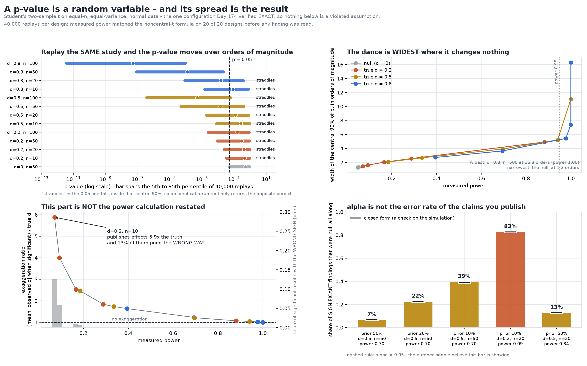

# A p-value Is a Random Variable, and the Spread of That Variable Is the Result

[](https://colab.research.google.com/github/phoebefu6/phoebe-the-builder/blob/main/data-science-cookbook/p-value-dance/demo.ipynb)
[](https://mybinder.org/v2/gh/phoebefu6/phoebe-the-builder/main?labpath=data-science-cookbook/p-value-dance/demo.ipynb)

> "p = 0.049" gets written up as a finding, but nobody has ever watched the same study run twice - so this replays one true effect forty thousand times and reports what the p-value actually does.



## The setup, and why it matters

Everything below is Student's two-sample t on **equal-n, equal-variance, normally distributed**
groups. That is not laziness. The sibling build [`t-test-variants`](../t-test-variants) verified
that this is the single configuration where Student's t is **exact** - its Type I error sits at
0.0500 and its power matches the noncentral-t formula to the replicate noise.

So nothing here can be blamed on a violated assumption, a wrong test, or a shaky approximation.
The test is right. The dance is the p-value's own.

**Calibrated on 20 of 20 designs** before any finding was read, and the 5 null designs all pass a
Kolmogorov-Smirnov uniformity test. A harness that cannot reproduce a known truth has no business
reporting an unknown one.

## What it found

### 1. The dance is real, and it is widest where it matters least

| design | power | 5th pct of p | median | 95th pct | orders of magnitude |
|--------|------:|-------------:|-------:|---------:|--------------------:|
| d=0, n=50 (null) | 0.0496 | 0.0505 | 0.505 | 0.952 | **1.28** |
| d=0.2, n=20 | 0.0929 | 0.0234 | 0.417 | 0.936 | 1.60 |
| d=0.5, n=20 | 0.3353 | 0.00186 | 0.121 | 0.833 | 2.65 |
| d=0.5, n=100 | 0.9411 | 3.7e-07 | 0.000498 | 0.0599 | 5.21 |
| d=0.8, n=500 | 1.0000 | 8.8e-43 | 3.6e-34 | ~0 | **16.30** |

The folk version of this story says the p-value is unreliable because it bounces around, and the
implied fix is to distrust p-values. The measurement says the opposite: **the spread is narrowest
under the null (1.26 orders) and widest at the highest power in the grid (16.30 orders)**, with a
rank correlation of 1.000 between power and spread across all 20 designs. Raw spread is not the
hazard. It is not even pointed in the right direction to be the hazard.

### 2. The decision-relevant version of the dance is exactly "power < 0.95"

What matters is not the width but whether the central 90% **straddles 0.05** - whether an
identical rerun routinely returns the opposite verdict. That happens on 11 of the 15 designs with
a real effect, including `d=0.5, n=100` at **94% power**, whose 95th percentile is 0.0599.

But that predicate is an identity: `p95 < alpha` if and only if more than 95% of replicates fell
below alpha, which is to say `power > 0.95`. Nothing is left over.

**The decision-relevant dance is not an extra hazard sitting on top of low power. It is low power,
restated in a more alarming vocabulary.** It is asserted as an identity in `test_pvalue.py` rather
than argued in prose. Everything this build has to say beyond the power calculation is in the
three sections below.

For scale: 80% power needs **n = 394 per group at d=0.2**, 64 at d=0.5, 26 at d=0.8.

### 3. The winner's curse - the part that is NOT power restated

| design | power | exaggeration (type M) | wrong sign (type S) | 99% CI | median published d |
|--------|------:|----------------------:|--------------------:|--------|-------------------:|
| d=0.2, n=10 | 0.0706 | **5.88x** | **12.65%** | [0.1112, 0.1435] | 1.077 |
| d=0.2, n=20 | 0.0929 | 4.00x | 5.74% | [0.0483, 0.0680] | 0.751 |
| d=0.5, n=20 | 0.3353 | 1.73x | 0.06% | [0.0002, 0.0014] | 0.819 |
| d=0.8, n=50 | 0.9775 | 1.02x | 0.00% | [0.0000, 0.0002] | 0.807 |

At `d=0.2, n=10` the significant results report **5.9x the true effect** and **12.6% of them point
the wrong way**. The study was honestly run, correctly analysed, and statistically significant.
The p-value carries no information about which case you are in.

This vanishes with power - every design above 0.99 power sits inside 1.005x - which is why the
test asserts both halves separately. "It shrinks" and "it disappears" are different claims and
only the second is the finding.

### 4. Conditioning on "I observed p = 0.05" buys nothing

Draw studies until one lands in p in [0.045, 0.055], then rerun **that same study** from the same
true effect:

| design | hits | rerun median p | rerun 95th pct | rerun significant | plain power | differs? |
|--------|-----:|---------------:|---------------:|------------------:|------------:|:--------:|
| d=0.2, n=50 | 4,455 | 0.290 | 0.908 | 0.1641 | 0.1677 | no |
| d=0.5, n=20 | 6,550 | 0.118 | 0.832 | 0.3377 | 0.3379 | no |
| d=0.5, n=50 | 6,304 | 0.0140 | 0.396 | 0.6989 | 0.6969 | no |
| d=0.8, n=20 | 6,236 | 0.0150 | 0.400 | 0.6892 | 0.6934 | no |

**The replication significance rate is the plain unconditional power, on 4 of 4 designs** - inside
a 99% Wilson interval of it every time. With the true effect held fixed, replicate p-values are
independent, so the observed 0.05 told you nothing about the rerun that you did not know before
you looked.

The famous "a replication of p = 0.05 could come back anywhere from 0.0001 to 0.44" is real - 74.5%
of reruns at `d=0.2, n=50` come back above p = 0.10 - but it is not a fact *about the 0.05*. It is
the ordinary sampling distribution of p at that power, and it was there before the first study ran.

### 5. alpha is not the error rate of the claims you publish

A mixture: a share of hypotheses are real, the rest are exactly null. Among the results that come
out significant, how many were null all along?

| share of hypotheses true | design | power | false share | 99% CI | closed form |
|-------------------------:|--------|------:|------------:|--------|------------:|
| 50% | d=0.5, n=50 | 0.70 | 6.7% | [0.0642, 0.0689] | 0.0669 |
| 20% | d=0.5, n=50 | 0.70 | 22.4% | [0.2188, 0.2302] | 0.2230 |
| 10% | d=0.5, n=50 | 0.70 | 39.5% | [0.3866, 0.4032] | 0.3924 |
| 10% | d=0.2, n=20 | 0.09 | **82.6%** | [0.8166, 0.8352] | 0.8263 |

Simulated, then checked against `alpha(1-prior) / (alpha(1-prior) + prior x power)` - the formula
is a **test of the simulation**, not a substitute for it, and it lands inside the interval on
every row. At a 10% prior and 9% power, **83% of everything that clears p < 0.05 is null**, and
alpha never sees it, because neither power nor the prior appears anywhere in a p-value.

## The practical version

A p-value is not a bad instrument. It is a **narrow** one. It answers "how surprising is this data
if nothing is going on", and it is routinely read as an answer to three questions it does not
contain:

| the question people ask it | what actually answers it | measured here |
|---------------------------|--------------------------|---------------|
| "how big is the effect?" | the estimate, and its type M inflation | up to 5.9x too big |
| "will this replicate?" | the power, which the p-value does not change | replication rate = power, exactly |
| "how likely is my hypothesis?" | the prior and the power | up to 83% of significant findings null |

## Business Impact
- **Before:** a result is filed as "significant" or "not significant", one number, one rerun's
  worth of evidence, and the write-up treats 0.049 and 0.051 as different kinds of thing.
- **After:** a design is read as a distribution before it is run - what the p-value will do, how
  inflated a published estimate will be, what a rerun would say, and what share of findings at
  this power and prior will be wrong.
- **Estimated ROI:** ~2 hours/week of argument avoided per analyst, and the larger saving is the
  experiments not launched at n=20 where a "significant" result is 4x inflated one time in ten.

## Tech Stack
Python 3.11, NumPy, SciPy (`ttest_ind`, `nct`, `kstest`), pandas, matplotlib, Streamlit, pytest,
Docker. No data files - every number is generated from a seed.

## Demo

**[Run the interactive demo notebook -->](demo.ipynb)** - pre-rendered with outputs, or click the
Colab/Binder badges above to run it live.

For the Streamlit app:
```bash
pip install -r requirements.txt
streamlit run app.py
```

Regenerate everything:
```bash
python evidence.py        # -> evidence.txt, results.json
python make_chart.py      # -> p_value_dance_audit.png / .svg
python build_notebook.py && python -m nbconvert --to notebook --execute demo.ipynb --output demo.ipynb
pytest                    # 42 tests
```

## How this build is wired

- `pvalue.py` is the only engine. The chart, the app, the notebook and `evidence.txt` all read its
  verdicts instead of recomputing them - the defect [`normality-test-trap`](../normality-test-trap)
  shipped was three artifacts that had each grown a private copy of one comparison and disagreed
  about four cells.
- `demo.ipynb` embeds the engine **by AST extraction from `pvalue.py` at build time**, so the
  notebook cannot hold a stale copy - it holds the library's own source text, character for
  character, and `test_notebook.py` asserts it. It also uses the library's seeds, so its printed
  rows *are* the cells in `evidence.txt`; a test walks every cell and fails if any row is missing.
- Every rate comparison goes through a **99% Wilson interval** at that cell's replicate count,
  never a point estimate.
- Every predicate a finding is stated as must be shown **capable of returning either answer**. A
  test that only ever sees `True` is testing a constant.

## Learning Connection
Built while studying experiment design and the replication literature (Gelman & Carlin on type M
and type S errors; Ioannidis on positive predictive value; Cumming on the sampling distribution of
p). Applies: noncentral-t power, Wilson intervals, simulation calibrated against closed forms,
and the discipline of stating a finding as a falsifiable predicate rather than a paragraph.

## Impact Note
- **Who benefits:** anyone who has to read or defend a p-value - analysts, PMs reading experiment
  write-ups, and reviewers deciding whether a result is worth acting on.
- **Potential risks:** "p-values are meaningless" is the wrong lesson and this build argues
  against it - sections 1 and 2 show the alarming version of the dance is just the power
  calculation. Misread as licence to ignore significance testing, it would do harm. The findings
  that survive are about *magnitude*, *replication* and *prior*, and all three are fixed by
  designing for power, not by abandoning the test.
