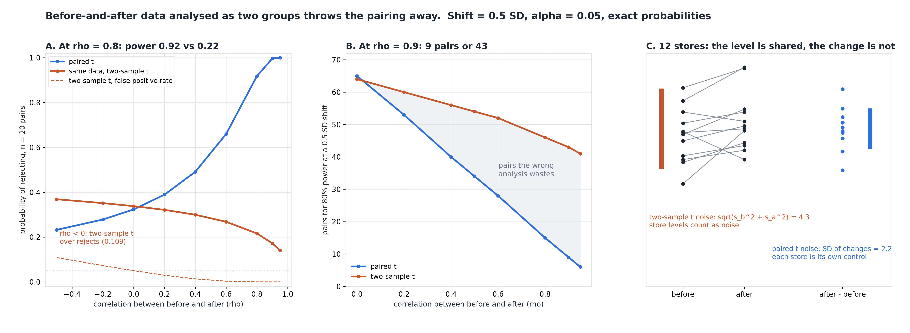

# Before-and-After Data Is Not Two Groups

[](https://colab.research.google.com/github/phoebefu6/phoebe-the-builder/blob/main/data-science-cookbook/paired-power/demo.ipynb)
[](https://mybinder.org/v2/gh/phoebefu6/phoebe-the-builder/main?labpath=data-science-cookbook/paired-power/demo.ipynb)

> We measured the same stores before and after, then tested them as two separate groups - and a change the data clearly shows came out as "no significant difference".



## The short version

Twelve stores, weekly sales before and after a process change. Sales SD $4k, a store's week-to-week
correlation 0.85, true lift $2k.

| analysis of the same 12 pairs | result |
|---|---|
| paired t (each store against itself) | p = 0.0410 -> a finding |
| two-sample t (before column vs after column) | p = 0.2538 -> "no significant difference" |

This is not a lucky seed. At this design the paired test rejects and the two-sample test does not on
**75% of datasets** (the reverse: 0.005%). Exact power: 0.821 paired, 0.071 two-sample.

Every study number is **exact**, not simulated. The paired test is a noncentral t. The two-sample test
on paired data is not, because its denominator mixes two correlated variances; under normality
(n-1)(s_b^2 + s_a^2) = (1+rho)A + (1-rho)B with A, B independent chi-square(n-1), so a 2-D quadrature
over A and B gives its rejection rate exactly. Shift = 0.5 SD, alpha = 0.05.

## What throwing the pairing away costs

**Power at a 0.5 SD shift, n = 20 pairs:**

| rho | -0.5 | 0 | 0.4 | 0.6 | 0.8 | 0.9 |
|---|---:|---:|---:|---:|---:|---:|
| paired t | 0.232 | 0.324 | 0.491 | 0.660 | **0.918** | 0.997 |
| two-sample t, same data | 0.369* | 0.338 | 0.300 | 0.268 | **0.216** | 0.172 |

\* inflated - see finding 2.

**Pairs needed for 80% power:**

| rho | 0 | 0.4 | 0.6 | 0.8 | 0.9 | 0.95 |
|---|---:|---:|---:|---:|---:|---:|
| paired | 65 | 40 | 28 | 15 | **9** | 6 |
| two-sample, same data | 64 | 56 | 52 | 46 | **43** | 41 |
| pairs wasted | -1 | 16 | 24 | 31 | 34 | 35 |

The findings:

1. **The wrong analysis gets worse as the data gets better.** Tighter pairing should make a shift
   easier to see. For the two-sample test it makes it harder: at n = 20 its power falls from 0.338 to
   0.172 as rho goes 0 to 0.9, while the paired test's rises to 0.997. At n = 5 it falls to 0.028 -
   below alpha. It prices the mean difference at variance 2/n whatever rho is, so it can never get
   below about 31 pairs; the paired test prices it at its true 2(1-rho)/n.
2. **"It is just conservative, so it is safe" holds only for rho > 0.** On the same data the two-sample
   test's false-positive rate is 0.0033 at rho = 0.6 - so it survives review - but **0.109 at rho = -0.5**,
   more than double its label. Negative pairing is real: a budget moved between two lines, a see-saw
   between two channels, time taken from one task and given to another.
3. **Negative result: pairing is not free.** The paired test spends n-1 degrees of freedom instead of
   2n-2. Below a break-even correlation, that costs more than the pairing buys: **0.107 at 3 pairs,
   0.059 at 10, 0.020 at 80**. The cost is small (worst in the grid: 0.095 vs 0.108 at n = 5, rho = 0),
   and repeated measurements on one unit almost always correlate far above 0.1, so this is not a reason
   to ignore the pairing - but "always pair" is not a free lunch on tiny, weakly linked samples. And the
   analysis is chosen from the design, never from which p-value came out smaller.

**Recommendation:** if each row is one unit measured twice, run the paired test and report the sample
correlation beside it. Size the study with the correlation you expect: at rho = 0.8 you need 15 pairs,
not the 64 a two-group calculator tells you.

## Calibration

- Quadrature at rho = 0 vs Student's noncentral t (15 designs, n = 3 to 200): max gap **3.5e-07**
- 160 vs 320 Gauss-Legendre nodes: gap 1.5e-07
- Vectorised decisions vs `scipy.stats.ttest_rel` / `ttest_ind` on raw data: **0 mismatches in 800**
- Raw bivariate-normal Monte Carlo, 20,000 reps on 6 designs x 2 analyses: 11 of 12 inside their 99%
  Wilson interval. **One miss** (n = 40, rho = 0.95, two-sample: exact 0.7951, MC 0.8025). Twelve 99%
  checks miss once about 11% of the time by chance. The re-check rule was added AFTER this miss was
  seen, so read it as a follow-up, not a pre-registered test: a re-run at 10x the reps on a fresh seed,
  with both results printed. It lands at 0.7949 at 200,000 reps (three further 200k seeds: 0.7958,
  0.7936, 0.7949), which rules out a quadrature error at 1-rho = 0.05.
- Engine defect caught on the first run: scipy's `nct.cdf(-c, df, nc)` returns **nan** far in the tail
  (nc ~ 10, n = 40, rho = 0.95), which silently made one power cell NaN. The lower tail is now
  `nct.sf(c, df, -nc)` by symmetry, with a test.
- Tests also show the checks *can* fail: the rho = 0 anchor must not match at rho = 0.3, and replicates
  drawn at the wrong rho must land outside the interval.

## Business Impact
- **Before:** before/after pilots (store trials, process changes, training programmes, a model re-run
  on the same accounts) are often put in two columns and run through a two-group test or calculator.
  At a typical rho of 0.8 that analysis keeps less than a quarter of the power, and sizes the pilot at
  3x the units it needs.
- **After:** paste before and after. You get both p-values, the sample correlation, the power each
  analysis has at your n and rho, and a verdict - including the negative-correlation warning.
- **Estimated ROI:** a pilot sized for 15 pairs instead of 46 finishes in a third of the time, and a
  real effect stops being written up as "no significant difference".

## Tech Stack
Python, NumPy, SciPy (`nct`, `chi2`, Gauss-Legendre quadrature, `ttest_rel`, `ttest_ind`), Matplotlib,
Streamlit, pytest

## Demo

**[Run the interactive demo notebook →](demo.ipynb)**. It is pre-rendered with outputs, or use the
Colab/Binder badges above to run it live. The study numbers are exact, so the notebook reproduces
them to the digit; only its Monte Carlo cross-check runs at 4,000 reps.

```bash
pip install -r requirements.txt
python evidence.py      # ~3 seconds, writes evidence.txt + results.json
python make_chart.py    # the audit figure; fails if any label overlaps another or leaves its panel
streamlit run app.py    # paste your own before and after
pytest -q               # 24 tests
```

## Learning Connection
Built while studying paired designs and power (noncentral t, the distribution of a sum of correlated
chi-squares, relative efficiency 1/(1-rho)).
Applies: exact power by conditioning on the variance estimate, quadrature over chi-square quantiles,
calibrating a new integral against a closed form at the point where they must coincide.

## Impact Note
- **Who benefits:** analysts running before/after pilots and anyone sizing one, plus reviewers who
  need to know why "no significant difference" came back on a change everyone could see
- **Potential risks:** the study assumes bivariate normal data with equal SDs before and after. With
  heavy tails use a signed-rank test on the differences. The paired test needs genuine pairs in the
  same order: a sorted or shuffled column produces a fake correlation and a meaningless p-value.
