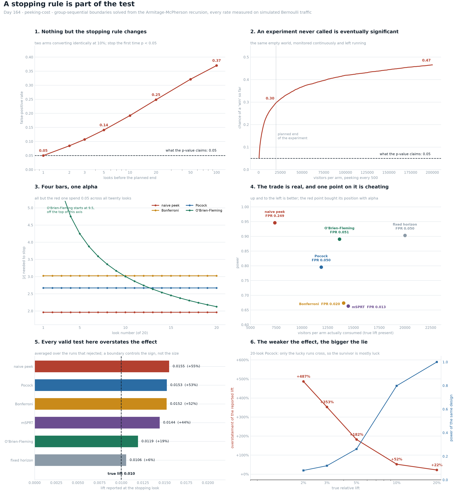

# Peeking Cost

[](https://colab.research.google.com/github/phoebefu6/phoebe-the-builder/blob/main/data-science-cookbook/peeking-cost/demo.ipynb)
[](https://mybinder.org/v2/gh/phoebefu6/phoebe-the-builder/main?labpath=data-science-cookbook/peeking-cost/demo.ipynb)

> Somebody opens the experiment dashboard every morning and ships the variant the day it goes green. The p-value on that screen was computed as if they had looked exactly once, at a sample size fixed before the test started, so it is not the number they are acting on - and nothing in the tool tells them which number they are.

**Day 164 - Data Science Cookbook.** Group-sequential boundaries solved from the Armitage-McPherson recursion and checked against the published 1977/1979 tables, then five stopping rules measured on simulated Bernoulli traffic in a world whose true effect is known: false-positive rate, power, traffic consumed, the effect each one would report, and interval coverage at the stopping look. 45 tests, a six-panel figure, and a notebook that rebuilds all of it from numpy and scipy.



> **A daily peek for three weeks is a 0.250 test.** Two arms converting identically at 10%, 20,000 visitors per arm, stop the first time p < 0.05: the measured false-positive rate is **0.250** at 20 looks, **0.141** at 5 and **0.051** at 1. Nothing about the effect changed between those rows. The stopping rule is doing all of it.
>
> **There is no sample size at which it becomes safe.** Peeking every 500 visitors per arm and leaving it running: **0.306** by 20,000 per arm, **0.470** by 200,000. A random walk crosses any fixed line eventually, so an experiment nobody calls is eventually "significant".
>
> **The correction is not the expensive part - and peeking is not actually cheating.** Pocock reaches a verdict on **11,866** visitors per arm against the fixed test's 20,000 (**40.7% less traffic**) at a real cost of 0.106 power, and its measured false-positive rate is **0.050** exactly. Sequential designs are faster *and* valid. The naive peek is faster and invalid, and those are the same fact: its power is **0.948** against the fixed test's 0.904 for the identical reason its FPR is 0.249.
>
> **NEGATIVE RESULT: a valid 0.05 test still overstates the effect by half.** Among the runs that rejected, Pocock reports a lift of **0.01521** against a true 0.01000 - **+52.1%** - and O'Brien-Fleming, also an exact 0.05 test, reports **+19.2%**. The ordering follows how *early* a rule may stop, not how valid it is. A boundary controls how often you are wrong about the **sign**; it says nothing about the **size**, which is the number the roadmap gets built on.
>
> **And it is worst exactly where it does most damage.** At a true 5% relative lift the same design reports **+182.8%**; at 2%, **+504.0%**. Low power means only the lucky runs cross, so the survivor is mostly luck.
>
> **A boundary is valid for its own schedule and nothing else.** The Pocock constant solved for 20 looks, run at 40, leaks to **0.064**. The O'Brien-Fleming *shape* re-indexed by information fraction holds at **0.053** - because that re-indexing *is* the alpha-spending construction. One extra mid-week check invalidates one of these and not the other, and the dashboard says 0.05 either way.
>
> **NEGATIVE RESULT: the improvised correction is not a near-enough Pocock.** Bonferroni across looks was expected to be the forgivable shortcut. It spends **38%** of the alpha it was given and loses **0.122** of power at K=20, and the gap widens with K (0.015 at K=2, 0.184 at K=50) because more looks means more overlap for it to ignore.
>
> **The free half is the one nobody builds.** Adding "from the halfway look, if it is flat or negative, kill it" to O'Brien-Fleming returns **30.7%** of the traffic an empty experiment would have eaten, for **-0.002** power and **-0.024** false-positive rate. A futility boundary cannot manufacture a false positive.

## Business Impact

- **Before:** a dashboard p-value, refreshed daily, acted on the first morning it drops below 0.05. Its false-positive rate is 5x what it claims, the lift it reports is ~50% too high, and its 95% interval covers the truth 92% of the time. None of that is visible from the screen.
- **After:** the schedule is fixed before the test, the boundary is solved for that schedule, and the report carries the alpha actually spent plus a flag that the effect at the stopping look is selected upward. The team keeps the speed - 40.7% less traffic per verdict - and gets to keep the 0.05 too.
- **Estimated ROI:** on this world, one in four "wins" from an uncorrected daily peek is pure noise, and the ones that are real arrive with the lift overstated by half. At a 20-day cadence a corrected sequential design decides on 11,866 visitors per arm instead of 20,000, which is roughly eight days of traffic returned per experiment.

## Where this sits

First build in **experimentation and causal inference**, the section that had nothing in it. The estate already had the fixed-horizon toolkit - [`ab-test-calc`](../../analytics-accelerator/ab-test-calc/) (Day 23) runs one test, [`sample-size-calc`](../sample-size-calc/) (Day 123) sizes it, [`stat-test-advisor`](../stat-test-advisor/) (Day 111) picks which test, [`crosstab-chi2`](../crosstab-chi2/) (Day 120) runs a 2x2. All four assume a single analysis at a sample size fixed in advance. This is the first one about **when you look**, which is the assumption every real experiment breaks.

It is **not** [`ab-test-calc`](../../analytics-accelerator/ab-test-calc/) (one test, one horizon, no stopping rule) and not [`sample-size-calc`](../sample-size-calc/) (how many, not when). Nearest in spirit is [`guardrail-metric`](../../analytics-engineering-bi/guardrail-metric/) (Day 160), which showed a guardrail is a constraint with a *power*; this shows a stopping rule is part of the *test*. Both belong to the decision-support arc alongside [`decision-log`](../../mini-saas-products/decision-log/), [`pre-mortem`](../../mini-saas-products/pre-mortem/), [`expected-value-calc`](../../mini-saas-products/expected-value-calc/) and [`cost-of-delay`](../../mini-saas-products/cost-of-delay/): a scoring rule, a risk register, a valuation and a sequence are all worthless if the evidence feeding them was collected under a rule nobody wrote down.

## Tech Stack

Python 3.10+, numpy, scipy, pandas, matplotlib, Streamlit, pytest. No data files, no API keys, no network.

## What it does

Eight sections in `evidence.py`. Every number below is printed by it and asserted in `test_sequential.py`.

### 1. The boundary is computed, not looked up

A boundary is the solution to "how much alpha does this shape spend over K looks". With equally spaced analyses the accumulating statistic is a random walk, so the probability of *ever* crossing is built by carrying the still-continuing sub-density forward one convolution per look - the recursion in Armitage, McPherson & Rowe (1969). Then bisect on the scale constant.

**VERIFIED** against Pocock (1977) and O'Brien & Fleming (1979) as tabulated in Jennison & Turnbull (2000):

| K | Pocock solved | published | OBF final solved | published |
|---:|---:|---:|---:|---:|
| 2 | 2.1775 | 2.178 | 1.9764 | 1.977 |
| 3 | 2.2878 | 2.289 | 2.0034 | 2.004 |
| 4 | 2.3600 | 2.361 | 2.0237 | 2.024 |
| 5 | 2.4125 | 2.413 | 2.0393 | 2.040 |
| 10 | 2.5541 | 2.555 | 2.0855 | 2.087 |
| 20 | 2.6710 | 2.672 | - | - |

Largest disagreement over 11 published constants: **0.0015**, and it shrinks monotonically as the integration grid refines (2.4018 -> 2.4100 -> 2.4104 -> 2.4125 against a published 2.413), so the residual is discretisation and not a modelling error.

The two shapes are opposite bets. At K=20 Pocock holds **2.670** at every look; O'Brien-Fleming demands **9.500** at the first and **2.124** at the last, spending 0.0000 of its alpha at look 1 of 5 and 0.0244 at look 5. Same 0.05, completely different behaviour.

### 2. The false-positive rate of a peek

Both arms convert at exactly 10.0%, so every "significant" result is false by construction. 100,000 simulated experiments per row; Monte Carlo SE near a rate of 0.25 is 0.0014.

| looks | visitors/arm between looks | measured FPR | vs nominal |
|---:|---:|---:|---:|
| 1 | 20,000 | 0.051 | 1.0x |
| 2 | 10,000 | 0.083 | 1.7x |
| 3 | 6,666 | 0.106 | 2.1x |
| 5 | 4,000 | 0.141 | 2.8x |
| 10 | 2,000 | 0.193 | 3.9x |
| **20** | **1,000** | **0.250** | **5.0x** |
| 50 | 400 | 0.319 | 6.4x |
| 100 | 200 | 0.374 | 7.5x |

Peeking every 500 visitors per arm and never calling it: 0.131 by 2,000 per arm, 0.306 by 20,000, **0.470 by 200,000**. The rate has no ceiling below 1.0.

Note what the first column is: it is **looks**, not days. Ten looks in one afternoon cost exactly what ten looks over ten days cost. "We only check weekly" is a claim about the calendar, and the calendar is not in the formula.

### 3. Four corrections, one schedule

K=20 looks, 20,000 visitors per arm at the end. Null world for the false-positive rate; a real 10% relative lift (0.100 -> 0.110) for power and consumed traffic.

| rule | FPR | power | E[N]/arm, effect present | E[N]/arm, nothing there |
|---|---:|---:|---:|---:|
| fixed horizon (1 look) | 0.050 | 0.904 | 20,000 | 20,000 |
| naive peek | **0.249** | **0.948** | **7,364** | 16,587 |
| Bonferroni across looks | 0.019 | 0.676 | 14,052 | 19,757 |
| Pocock | 0.050 | 0.798 | 11,866 | 19,351 |
| O'Brien-Fleming | 0.050 | 0.892 | 13,636 | 19,798 |
| mSPRT (tau = 0.010) | 0.013 | 0.665 | 14,503 | 19,868 |

The naive row is not just wrong, it is **appealing**: the highest power and the lowest sample size in the table. Both of those are the same defect as the 0.249. It is not a faster test, it is a looser one - and that is why telling people not to peek does not work.

The honest speed is real, and it is the argument worth making instead: Pocock decides on 11,866 visitors per arm against 20,000, **40.7% less traffic**, at a cost of 0.106 power, with an exactly nominal 0.050. O'Brien-Fleming keeps nearly all the power (0.892 vs 0.904) and saves less.

### 4. Negative result: a valid test still overstates the effect

Stopping the moment the estimate is extreme enough to cross a line *selects on the estimate*. True lift 0.01000; among the runs that rejected:

| rule | reported lift | overstated by | 95% CI coverage | ... when it rejected |
|---|---:|---:|---:|---:|
| fixed horizon | 0.01056 | +5.6% | 0.952 | 0.973 |
| naive peek | 0.01549 | +54.9% | 0.942 | 0.959 |
| Bonferroni | 0.01520 | +52.0% | 0.922 | 0.919 |
| Pocock | 0.01521 | **+52.1%** | 0.923 | 0.932 |
| O'Brien-Fleming | 0.01192 | +19.2% | 0.944 | 0.963 |
| mSPRT | 0.01440 | +44.0% | 0.933 | 0.934 |

The ordering follows how **early** a rule may stop, not how valid it is. Pocock and O'Brien-Fleming are both exact 0.05 tests and are 33 points apart on bias. A boundary controls the rate at which you are wrong about the sign. It says nothing about the size.

And the overstatement is worst exactly where the decision is hardest - same 20-look Pocock design, weaker and weaker true effects:

| true relative lift | fixed power | Pocock power | reported lift | overstated by |
|---:|---:|---:|---:|---:|
| 20% | 1.000 | 1.000 | 0.02445 | +22.3% |
| 10% | 0.902 | 0.796 | 0.01525 | +52.5% |
| 5% | 0.382 | 0.260 | 0.01414 | **+182.8%** |
| 3% | 0.168 | 0.118 | 0.01338 | +346.0% |
| 2% | 0.102 | 0.080 | 0.01208 | **+504.0%** |

At low power only the lucky runs cross, so the survivor is mostly luck. This is the winner's curse arriving through the stopping rule, and it is why an underpowered sequential test is worse than an underpowered fixed one: same missing power, plus a headline number that is five times too big.

### 5. A boundary is valid for its own schedule and nothing else

| rule solved for 20 looks, run at 40 | FPR |
|---|---:|
| Pocock constant 2.670 held at 40 looks | **0.064** |
| OBF shape re-indexed by information fraction | 0.053 |
| mSPRT, same tau, 40 looks | 0.014 |
| mSPRT, same tau, 400 looks to 200k/arm | 0.030 |

The OBF *shape* survives because re-indexing by information fraction *is* the alpha-spending construction (Lan & DeMets 1983) - it fixes the shape, not the count. The Pocock *constant* does not. One extra stakeholder refresh breaks one of these silently and not the other.

mSPRT (Robbins 1970; the two-sample form in Johari et al.) never needed the schedule: a likelihood ratio mixed over N(0, tau^2) is a martingale under the null, so it is valid at every stopping time simultaneously - 0.014 at 40 looks and 0.030 at 400.

That generality is not free, and the price is `tau`:

| tau | tau / true effect | FPR | power | E[N]/arm |
|---:|---:|---:|---:|---:|
| 0.002 | 0.2x | 0.000 | 0.096 | 19,800 |
| 0.005 | 0.5x | 0.005 | 0.591 | 16,279 |
| 0.010 | 1.0x | 0.013 | 0.665 | 14,503 |
| 0.020 | 2.0x | 0.015 | 0.630 | 14,448 |
| 0.050 | 5.0x | 0.010 | 0.534 | 15,539 |

Every row is a valid test - that column never exceeds 0.05, which is the entire point - and power runs from 0.096 to 0.665 across a parameter nobody documents. Even at the matched tau, mSPRT rejects a real lift 0.665 of the time against O'Brien-Fleming's 0.892 on identical data: **0.227 of power** is what freedom from the schedule costs. Buy it when the schedule genuinely cannot be fixed. Do not buy it to feel safe.

### 6. The free half of sequential design

Every rule above stops early only on a **win**. The other reason to stop is that nothing is happening - and a futility boundary cannot manufacture a false positive, because it only ends runs that were not going to reject. Rule: from look 10 of 20, stop if the observed z is below zero.

| design | FPR | power | E[N]/arm, nothing there | E[N]/arm, effect present |
|---|---:|---:|---:|---:|
| Pocock, success only | 0.050 | 0.798 | 19,351 | 11,866 |
| Pocock + futility at z<0 | 0.044 | 0.798 | **13,397** | 11,740 |
| O'Brien-Fleming, success only | 0.050 | 0.892 | 19,798 | 13,636 |
| O'Brien-Fleming + futility at z<0 | 0.027 | 0.890 | **13,712** | 13,510 |

**30.7%** of the traffic an empty experiment would have consumed, returned, for -0.002 power. The saving lands exactly where it should: on the experiments that had nothing in them. This is the cheapest thing in the build and the one least often implemented, because a dashboard is built to celebrate wins and has nowhere to put "stop, this is dead".

### 7. Negative result: the improvised correction is not a near-enough Pocock

This section was written expecting Bonferroni-across-looks to be the forgivable shortcut. It measured out the other way. Bonferroni ignores the correlation between overlapping looks - a Z at look 20 is nearly the same random variable as a Z at look 19 - so at K=20 it demands 3.023 where the exact answer is 2.670:

| K | Pocock b | Bonferroni b | Pocock power | Bonferroni power | power lost |
|---:|---:|---:|---:|---:|---:|
| 2 | 2.175 | 2.241 | 0.875 | 0.861 | 0.015 |
| 5 | 2.410 | 2.576 | 0.840 | 0.794 | 0.047 |
| 10 | 2.553 | 2.807 | 0.818 | 0.738 | 0.080 |
| 20 | 2.670 | 3.023 | 0.799 | 0.677 | **0.122** |
| 50 | 2.795 | 3.291 | 0.775 | 0.591 | **0.184** |

It spends **38%** of the alpha it was given. So the correction *is* worth getting right - what it is not worth is more than the decision to look at all, which adds +0.199 to the false-positive rate and +54.9% to the reported lift.

**Second negative result: "peek less often" is a weak lever.** From the section 2 table, cutting a daily peek (0.250) back to weekly (0.106) still leaves 2.1x the nominal rate, and two looks is already 1.7x. There is no number of looks small enough to make an uncorrected peek honest except one.

### 8. What the experiment report should say

Not "p = 0.03". A p-value is a statement about a **procedure**, so the procedure has to be in the report.

| rule | FPR | power | E[N] | lift bias | CI cov. | verdict |
|---|---:|---:|---:|---:|---:|---|
| fixed horizon | 0.050 | 0.904 | 20,000 | +5.6% | 0.952 | honest, slowest, unbiased - the benchmark |
| naive peek | 0.249 | 0.948 | 7,364 | +54.9% | 0.942 | invalid; the speed **is** the error |
| Bonferroni | 0.019 | 0.676 | 14,052 | +52.0% | 0.922 | valid; spends 38% of its alpha, loses 0.12 power |
| Pocock | 0.050 | 0.798 | 11,866 | +52.1% | 0.923 | valid and fastest; report an adjusted estimate |
| O'Brien-Fleming | 0.050 | 0.892 | 13,636 | +19.2% | 0.944 | valid, keeps the power, saves the least |
| mSPRT | 0.013 | 0.665 | 14,503 | +44.0% | 0.933 | valid at **any** stopping time; tau is a real choice |

Four things belong in the report: the look schedule fixed before the test, the boundary and the alpha it spends, the effect with a bias adjustment, and the traffic actually consumed. Peeking is not cheating, and it is not free. It is a design choice that has to be priced before the experiment starts - because the boundary that makes it valid cannot be chosen after you have looked.

## Demo

**[Run the interactive demo notebook →](demo.ipynb)** - pre-rendered with every output and chart, or click the Colab/Binder badges above to run it live.

```bash
pip install -r requirements.txt
python evidence.py                        # the full run, ~11s
python -m pytest test_sequential.py -q    # 45 assertions, ~9s
python make_chart.py                      # rebuild the six-panel figure
streamlit run app.py                      # price your own schedule
```

The Streamlit app leads with the false-positive rate and then shows a second table nobody usually gets: the effect size each rule would report back. Drag the true-lift slider down and watch every valid test's headline number pull away from the truth.

## Learning Connection

Built while working through sequential experiment design - Armitage, McPherson & Rowe's (1969) recursion for repeated significance tests, Pocock (1977), O'Brien & Fleming (1979), Lan & DeMets (1983) alpha-spending, and Robbins' (1970) mixture SPRT as it reaches industry through always-valid p-values. Applies: solving a published result from scratch so the implementation can be checked against the table, then measuring the procedure on simulated data whose truth is known rather than arguing about it from the theory that produced the boundary.

## Impact Note

- **Who benefits:** anyone who ships on a dashboard p-value, and anyone who has been told "just don't look" and kept looking anyway.
- **Potential risks:** this is a two-arm balanced Bernoulli world with equally spaced analyses, independent visitors, no seasonality, no novelty effect, no interference between arms and one metric. Real experiments break every one of those, and unequal information increments in particular need alpha-spending rather than the equal-look boundaries solved here. The tables are a demonstration of how to price a stopping rule, not defaults to paste into a test plan.
