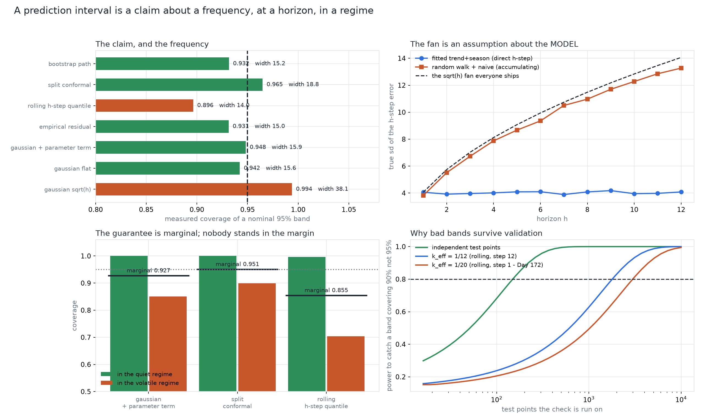

# A Prediction Interval Is a Claim About a Frequency, at a Horizon, in a Regime

[](https://colab.research.google.com/github/phoebefu6/phoebe-the-builder/blob/main/data-science-cookbook/prediction-interval/demo.ipynb)
[](https://mybinder.org/v2/gh/phoebefu6/phoebe-the-builder/main?labpath=data-science-cookbook/prediction-interval/demo.ipynb)

> "The point forecast is useless" - so the chart gets a 95% band, and the band's claim is never checked, because the check almost nobody runs has almost no power.

A point forecast is a number and a 95% interval is a **claim about a frequency**. Day 172
(`forecast-backtest`) treated the backtest protocol as an estimator of a point error; this build
takes the next step and asks whether the band keeps its promise - at the horizon it will be
read at, and in the regime the reader is standing in.

The process is synthetic, so the frequency is measurable rather than assumed: 600 independent
futures, band built on the history, count the hits. Seven interval methods are put through it -
the textbook Gaussian band with `sqrt(h)` widening, the same band unwidened, the regression
interval with its parameter-uncertainty term, empirical residual quantiles, quantiles of actual
rolling h-step errors, split conformal, and a residual bootstrap.

**Not a duplicate:** [`calibration-checker`](../../ml-engineering-toolkit/calibration-checker)
(Day 78) calibrates classification probabilities. This is interval coverage for multi-step
forecasts - a different object, a different failure mode.



## What it found

**HEADLINE: the band almost every forecast ships does not undercover - it OVERCOVERS, at 2.71x
the width.** Residual sd widened by `sqrt(h)` delivers **0.994** coverage on a nominal 95%
claim (1.000 by h=12) at a mean width of 38.1 against 14.1 for the narrowest honest band. That
is not a safe error. It is a band nobody can plan against, and it trains readers to ignore the
fan.

**The `sqrt(h)` fan is an assumption about the MODEL, and two lines of numpy say whether it
holds.** Fit `log sd(h-step error) = a + b log h`: a random walk forecast by its last value
gives **b = +0.519** (its error is a sum of h shocks, so `sqrt(h)` is exactly right); a fitted
trend+season model making a DIRECT h-step statement gives **b = +0.010** - its error does not
accumulate at all. The fan is borrowed from a different estimator, and the exponent is
measurable before anything ships.

**The parameter-uncertainty term is nearly free and it is the difference between keeping the
claim and not.** At 36 training points the flat band covers **0.896** at h=12 and the same band
with `s*sqrt(1 + x0'(X'X)^-1 x0)` covers **0.937**, costing 1.12x the width; by 480 points the
two agree (0.953 vs 0.955) and the term costs 1%. This is also the honest version of a fan: it
widens with extrapolation distance, unlike `sqrt(h)`, which widens with an assumption.

**HEADLINE NEGATIVE RESULT: conformal keeps its guarantee exactly, and the guarantee is not the
promise people hear.** In a two-regime world - quiet and volatile blocks, **average variance
held equal to the flat world** (verified: 15.99 vs 16.00), so nothing in the aggregate looks
different - split conformal's marginal coverage is **0.950**, dead on nominal. Conditional on
regime it is **1.000 in the quiet half and 0.898 in the volatile half**: the only half where
anyone consults an interval. The Gaussian band splits 1.000 / 0.850 and the rolling h-step
quantile 0.997 / 0.708. No marginal check in existence can see this, because the two errors are
constructed to cancel in the average.

*(This section had to be rebuilt: the obvious regime construction - multiply and divide sigma
by `sqrt(r)` - leaves the mean variance at `sigma^2 (r + 1/r)/2`, which is **4.6x louder** at
r=9, and would have made the experiment a test of "more noise" rather than of "the same noise,
unevenly spread". A test caught it.)*

**Pointwise coverage is not path coverage.** The same intervals that cover **0.948** at a point
contain the whole twelve-step path **0.535** of the time. How much a simultaneous band must
widen depends on how many independent horizon tests the path really is, and that is measurable
as `k_eff = log(path) / log(pointwise)`: **11.5 of 12 at rho=0, 4.0 at rho=0.9** - so the
Bonferroni intuition is right in the first case and wasteful in the second.

**NEGATIVE RESULT: small per-point shortfalls compound along the path.** At a nominal 99% the
same construction measures **0.9876** per point - a 0.0024 rounding error at a point, which
becomes 0.861 against a promised 0.886 over twelve horizons. The t quantile instead of z
recovers **41%** of the gap; the rest is the sd being estimated, and it does not go away by
choosing a nicer quantile.

**Autocorrelation degrades every method and widening does not repair it.** At rho=0.9 the
Gaussian band covers 0.883, conformal 0.899 (exchangeability is broken, so its guarantee is
gone too) and the rolling quantile 0.679, while the true h-step error sd barely grows
(ratio 1.12 from h=1 to h=12) - so the failure is the level of the band, not its shape.

**DESIGN CONSTANT - why bad bands survive validation.** The power of a one-sided check that a
nominally 95% band really covers 90%: **0.326** on 20 independent test points, and **0.152** on
20 rolling backtest windows, using Day 172's measured `k_eff` of 1/20 for windows stepped by 1.
Reaching 0.8 takes ~250 independent points, or ~3,000 overlapping ones. Measured to match: a
coverage figure from 20 overlapping windows has an sd of **0.048** across repeats, so 0.95 and
0.90 are within one standard deviation of each other on the evidence a normal backtest supplies.

**Coverage is not a score; a proper one ranks differently.** The interval score (width plus a
miss penalty, in the same units) ranks `gaussian + parameter term` first and the shipped
`sqrt(h)` band **last of seven** - while the `sqrt(h)` band looks best of all on the "did it
cover?" column it will be judged on. Coverage can always be bought by widening; that is what
the fan does.

## Business Impact
- **Before:** a 95% band that is really a 99% band (too wide to plan against) or really an 89%
  band in the regime that matters, with a validation that could not have told the difference.
- **After:** the fan's exponent is measured rather than assumed, the parameter term is included,
  coverage is checked conditionally and on the path as well as pointwise, and the check's power
  is known before it is run.
- **Estimated ROI:** stops two failures that cost real money - planning against a band nobody
  believes, and being surprised in exactly the conditions an interval exists for.

## Tech Stack
Python - numpy (every method hand-rolled), scipy (one t quantile), Streamlit, matplotlib,
pytest (24 assertions, including a diff of the notebook's inline engine against the library)

## Demo

**[Run the interactive demo notebook →](demo.ipynb)** - pre-rendered with outputs, or click the
Colab/Binder badges above to run it live.

```bash
pip install -r requirements.txt
streamlit run app.py        # build a band, then measure whether its claim holds where you stand
python evidence.py          # the eight-section measurement run, ~20s
python -m pytest            # 24 assertions
python make_chart.py        # the four-panel audit figure
```

## How it works
1. **`intervals.py`** - a process whose future can be redrawn (trend + seasonality, optional
   AR(1) noise, optional volatility regimes at constant average variance), the seven methods,
   and the machinery that records hits, widths and the regime each future point was drawn in -
   so pointwise, conditional and path coverage all come out of one run.
2. **`coverage_run`** - the measurement. Coverage is a frequency, so it is counted, not derived.
3. **`evidence.py`** - eight sections, each an experiment rather than a citation.
4. **`app.py`** - pick a world, a method and a level; read the three coverage numbers, the
   conditional split, the power of the check, and the proper-score ranking.

## Learning Connection
Built while studying forecast uncertainty and conformal prediction.
Applies: regression prediction intervals, conformal calibration and its marginal-vs-conditional
distinction, proper scoring rules, simultaneous bands, and power analysis for a validation check.

## Impact Note
- **Who benefits:** anyone publishing a forecast with a band on it, and anyone being asked to
  trust one.
- **Potential risks:** the numbers are properties of THIS process. What transfers is the method
  (redraw the future, count, split by regime, and check the check) and the mechanisms - the fan
  exponent, the marginal-conditional gap, path compounding, and the power of the coverage test.
