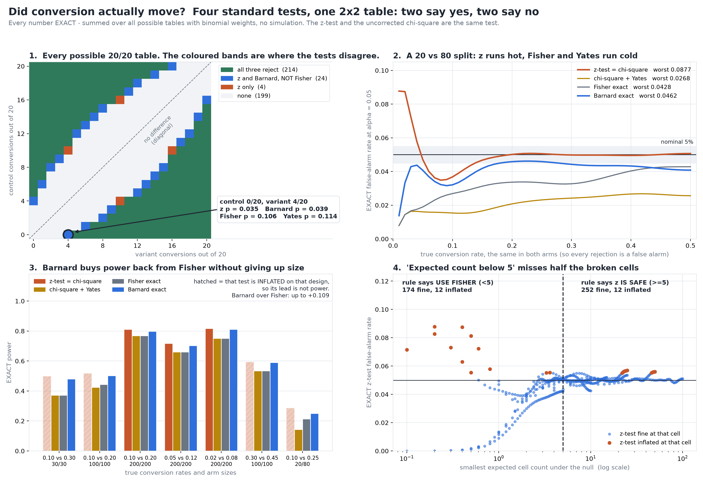

# Did Conversion Actually Move?

[](https://colab.research.google.com/github/phoebefu6/phoebe-the-builder/blob/main/data-science-cookbook/proportion-test/demo.ipynb)
[](https://mybinder.org/v2/gh/phoebefu6/phoebe-the-builder/main?labpath=data-science-cookbook/proportion-test/demo.ipynb)

> 0 of 20 converted in control, 4 of 20 in the variant: two standard tests say it moved, two say it did not - and which one you ran decides the launch.



## The short version

Four tests are routinely run on a 2x2 conversion table:

| test | p on 0/20 vs 4/20 | verdict |
|---|---:|---|
| two-proportion z-test | 0.0350 | moved |
| chi-square + Yates | 0.1138 | not shown |
| Fisher exact | 0.1060 | not shown |
| Barnard exact | 0.0386 | moved |

The table is not hand-picked: it is the smallest table on a 20/20 design where the z-test rejects
and Fisher does not. And the list is really three tests, not four - **the pooled z-test squared
is Pearson's chi-square**, written here from two separate formulas and equal to `1e-14`. "We ran a
z-test and a chi-square and they agreed" is one test run twice.

For fixed arm sizes there are only `(n1+1)(n2+1)` possible tables, so every false-alarm rate and
every power number below is **exact** - a weighted sum over the whole outcome grid. No simulation,
no seeds, no intervals.

## Who runs hot, who runs cold

Both arms at the same true rate, so every rejection is a false alarm. Size = the worst rate over
true rates 0.01 to 0.50. Nominal 0.05; INFLATED above 0.055, CONSERVATIVE below 0.045.

| n1/n2 | z = chi-square | Yates | Fisher | Barnard |
|---|---:|---:|---:|---:|
| 20/20 | 0.0534 | 0.0215 | 0.0253 | 0.0498 |
| 50/50 | **0.0569** | 0.0352 | 0.0352 | 0.0488 |
| 200/200 | 0.0512 | 0.0402 | 0.0402 | 0.0496 |
| 20/80 | **0.0877** | 0.0268 | 0.0428 | 0.0462 |
| 10/100 | **0.0826** | 0.0214 | 0.0400 | 0.0452 |
| 50/200 | **0.0813** | 0.0338 | 0.0420 | 0.0461 |

*(9 designs in `evidence.txt`)*

- **z-test:** inflated on 6 of 9 designs, worst 1.75x nominal on a 20 vs 80 split - the shape of a
  holdout or a slow ramp.
- **Fisher:** conservative on **9 of 9**. It conditions on both margins, and that discreteness means
  it can almost never spend its full 5%.
- **Yates:** its size equals Fisher's **exactly** on 5 of 9 designs. The continuity correction does
  not repair the z-test; it turns it into an approximation of Fisher, conservatism included.
- **Barnard:** above 0.05 on 0 of 9 (it maximises over the unknown common rate, so it cannot be), and
  inside the band on 8 of 9.

## "Use Fisher when an expected count is below 5" - scored

The rule, scored as a classifier against the z-test's exact false-alarm rate on 450 design x rate
cells:

| | z actually fine | z actually inflated |
|---|---:|---:|
| rule says z is safe (all expected >= 5) | 252 | **12** |
| rule says use Fisher (an expected < 5) | **174** | 12 |

It calls **half the inflated cells safe** - the worst at 50/50, an expected count of 25, false-alarm
rate 0.0569 - and **94%** of the cells it sends to Fisher were already fine. The z-test's error on a
2x2 comes from the outcome lattice being discrete, not only from small counts, so a count threshold
is the wrong instrument for it.

## What Fisher's caution costs

| true rates | n1/n2 | z | Yates | Fisher | Barnard | Barnard - Fisher |
|---|---|---:|---:|---:|---:|---:|
| 0.10 vs 0.30 | 30/30 | 0.500* | 0.372 | 0.372 | 0.480 | **+0.109** |
| 0.10 vs 0.20 | 100/100 | 0.518* | 0.425 | 0.444 | 0.502 | +0.057 |
| 0.02 vs 0.08 | 200/200 | 0.817 | 0.751 | 0.751 | 0.811 | +0.061 |
| 0.30 vs 0.45 | 100/100 | 0.594* | 0.535 | 0.535 | 0.590 | +0.055 |
| 0.10 vs 0.25 | 20/80 | 0.287* | 0.144 | 0.214 | 0.250 | +0.036 |

\* z is INFLATED at that design, so its lead is not power - an inflated test detects more because
it rejects more of everything.

**Barnard beats Fisher on 7 of 7 designs, by up to 11 points of power, while holding size.** On the
30/30 design, a reader who runs Fisher and a reader who runs the z-test disagree on 12.8% of all
experiments; Barnard and Fisher on 10.9%.

## Business Impact

- **Before:** an A/B readout on a small or lopsided test is called "not significant" by Fisher, or
  "significant" by the z-test, and nobody notices the verdict was chosen by the test rather than the
  data.
- **After:** all four p-values side by side, plus each test's exact worst-case false-alarm rate AT
  YOUR ARM SIZES - computable before launch, so the choice of test is made once, in the plan, not
  after the numbers are in.
- **Estimated ROI:** one reversed launch call per small test. On a 30/30 design at 10% vs 30%, one
  experiment in eight flips between "moved" and "not shown" depending only on the test.

## Tech Stack

Python · NumPy · SciPy · Matplotlib · Streamlit · pytest · Docker

## Demo

**[Run the interactive demo notebook →](demo.ipynb)** — pre-rendered with outputs, or click the
Colab/Binder badges above to run it live.

For the Streamlit app, where you type in your own counts:

```bash
pip install -r requirements.txt
streamlit run app.py
```

To regenerate every number here:

```bash
python evidence.py     # writes evidence.txt + results.json (about 2 seconds - it is all exact)
python make_chart.py   # the audit figure, gated on a painted-geometry self-check
pytest -q              # 32 tests
```

## How this is kept honest

- **Calibrated against scipy first.** Fisher and Yates match `scipy.stats` to `2.2e-16` on every
  table of a 15/12 design. Barnard matches `scipy.stats.barnard_exact` to `1.1e-4`: a 400-point
  nuisance grid can only UNDER-estimate the supremum it maximises, and a test asserts it never
  overshoots.
- **"Exact" is checked once against brute force** - a 200,000-draw simulation of one rejection rate
  lands within 0.004 of the enumerated value.
- **Nothing is hand-picked.** The four-answer table is chosen by a stated rule; the lattice's
  nesting (Fisher inside Barnard inside z) is measured on all 441 tables of the 20/20 design, with
  an `other` bucket for any table that breaks it - it held 0 - and is not claimed for other designs.
- **The notebook runs the same exact computation**, so its tables *are* `evidence.txt`'s, and a test
  checks that verbatim.
- **The chart checks itself before saving.** Text, legends and the callout are asserted clear of each
  other and of every lattice cell before `savefig` - the order Day 180 found had been backwards. It
  caught the first layout's callout and legend sitting on the rejection regions.

## Learning Connection

Built while working through exact tests for 2x2 tables - conditional (Fisher) against unconditional
(Barnard), and the continuity correction. Applies: exact enumeration over a discrete outcome space,
size as a supremum over a nuisance parameter, and scoring a folk rule as a classifier.

## Impact Note

- **Who benefits:** anyone reading a small or unbalanced A/B conversion test, and anyone writing the
  analysis plan for one.
- **Potential risks:** the honest reading is *pick the test before the data and report its size*, not
  *Fisher is wrong*. Fisher never exceeds 5%, which is what a regulated readout may need, and the
  z-test on a large balanced split (200/200 here) is within the band.

## Siblings in this domain

| build | interrogates |
|---|---|
| [`crosstab-chi2`](../crosstab-chi2) | runs **one** chi-square test well |
| [`t-test-variants`](../t-test-variants) | the same disagreement audit, for **means** |
| [`ci-overlap-fallacy`](../ci-overlap-fallacy) | exact coverage of proportion **intervals** |
| **this one** | four **tests** on one 2x2, and what each costs |
