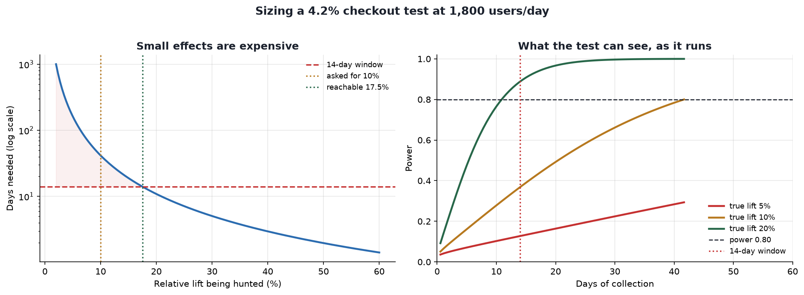

# Sample Size & Power Calculator

[](https://colab.research.google.com/github/phoebefu6/phoebe-the-builder/blob/main/data-science-cookbook/sample-size-calc/demo.ipynb)
[](https://mybinder.org/v2/gh/phoebefu6/phoebe-the-builder/main?labpath=data-science-cookbook/sample-size-calc/demo.ipynb)

> "How many users do we need?" gets asked at the start of every experiment and answered by vibes. Then the test runs two weeks, comes back flat, and gets filed as "no effect" - when the honest reading is that it never had the power to see the effect it was looking for.

**Day 123 - Data Science Cookbook.** Size the test, price the ambition, and find out before you start whether the traffic you have can see the lift you want.

## Business Impact
- **Before:** A two-week test gets scheduled because two weeks is how long tests take. Nobody computes what it can detect, so a flat result is indistinguishable from a real win the test was too small to see. The redesign gets shelved on evidence that was never there.
- **After:** The pre-test doc states the detectable effect up front. On the bundled scenario, detecting the 10% lift the team asked for needs **42 days**, but only **14** are available - so the honest ceiling is a **17.5%** lift, and the 14-day test would have had **power 0.37** against the 10% target. That is a 63% chance of missing a real win.
- **Estimated ROI:** one function call before the test instead of a quarter spent acting on a false negative, plus the two weeks of engineering and traffic a doomed test would have burned.

## What it does

Three questions, answered in the order that actually matters:

| Question | Function | Bundled scenario answer |
|---|---|---|
| How many users? | `n_for_proportions` | 37,513 per arm for a 10% lift on 4.2% |
| **What can I detect with the traffic I have?** | `mde_for_proportions` | 17.5% relative in a 14-day window |
| How long will it take? | `duration_days` / `plan` | 42 days at 1,800 users/day |

Most calculators stop at the first row. The second is the one that stops a doomed test, because you do not get to choose your traffic.

### The cost curve

Effect appears **squared** in the denominator, so ambition scales brutally:

| Relative lift | Users / arm | Days at 1,800/day |
|---|---|---|
| 2% | 903,700 | 1,004 |
| 5% | 146,642 | 163 |
| 10% | 37,513 | 42 |
| 20% | 9,803 | 11 |
| 50% | 1,770 | 2 |

Detecting a 2% lift takes nearly three years on a surface that will be redesigned four times before then. This table is the answer to "can't we just be a bit more sensitive?"

### Three ways a correctly-sized test still gets invalidated

All three are decided before the test starts, and all three are checked here:

- **Multiple arms.** Alpha is per comparison, not per test. An innocent 4-arm test carries a **14.3%** chance of a false winner while the room believes it is 5%. Bonferroni and Sidak corrections are wired into every calculation.
- **Peeking.** The notebook simulates 2,000 A/A tests - two identical variants, no effect whatsoever. Looking once: 4.2% false positives. Checking daily for two weeks: **22.6%**. Nothing about the data changed, only the stopping rule.
- **Partial exposure.** A 25% traffic ramp is a 4x longer test. Easy to forget when quoting a duration.

### Continuous metrics

Revenue and AOV need the metric's standard deviation, not a rate. Sized here with **exact two-sample t-test power via the noncentral t distribution**, not the normal approximation, which understates n at small samples. A $1 AOV shift against a $42 standard deviation is Cohen's d = 0.024 - a genuinely tiny effect, priced accordingly. Variance sets the bill, not the dollar amount.

## Tech Stack
Python · scipy (`norm`, `nct`, `brentq`) · numpy · pandas · Streamlit · matplotlib · Docker

## Demo

**[Run the interactive demo notebook →](demo.ipynb)** - pre-rendered with outputs, the cost curve, and the power-over-time chart. Or click the Colab/Binder badges above to run it live.



For the Streamlit app:
```bash
pip install -r requirements.txt
streamlit run app.py
```
Set your baseline, the lift worth shipping for, your daily traffic and your decision window. Get users per arm, days needed, a feasibility verdict, the detectable effect inside your window, and a downloadable plan CSV. Toggle to continuous mode for revenue-style metrics.

The math lives UI-free in `power.py`, so it imports into a pipeline or a pre-test doc generator. `build_notebook.py` regenerates `demo.ipynb` for reproducibility.

## Verification

The sizing and power functions are independent derivations, so they check each other: feeding `n_for_proportions` output back through `power_for_proportions` returns **0.800** against the 0.80 that was requested. The t-test solver reports achieved power of exactly **0.800** at the n it returns. The MDE solver bisects on the sizing function itself rather than a closed-form shortcut, so it cannot drift from the sample-size answer.

## Learning Connection
Built while studying experiment design and statistical inference.
Applies: two-proportion z-test power derivation, the noncentral t distribution for exact t-test power, minimum detectable effect as the inverse problem, family-wise error and Bonferroni/Sidak corrections, and a Monte Carlo demonstration of why fixed-horizon tests cannot be peeked at.

## Impact Note
- **Who benefits:** anyone sizing an A/B test - growth, product, data science - and analysts who need to say "this test cannot answer that question" with arithmetic behind them.
- **Potential risks:** Sample size is only as good as the baseline you feed it, so use a recent rate from the same surface and seasonality, not a global average. Every number assumes **one look at the end**; if you need to stop early, use a sequential design rather than this plus willpower. A test sized on a proxy metric can be perfectly powered for the wrong thing, and power 0.80 still means a 1-in-5 miss rate on real effects, which matters when the decision is one-way. Novelty effects mean a short test can measure curiosity rather than preference. Finally, "not feasible" is a scoping result, not permission to run it anyway and interpret the p-value loosely.

## Related builds
- **[stat-test-advisor](../stat-test-advisor/)** (Day 111) - which test to run once the data is in
- **[threshold-explorer](../../ml-engineering-toolkit/threshold-explorer/)** (Day 122) - picking a decision cutoff on purpose
- **[ab-test-calc](../../analytics-accelerator/ab-test-calc/)** (Day 23) - significance after the test
