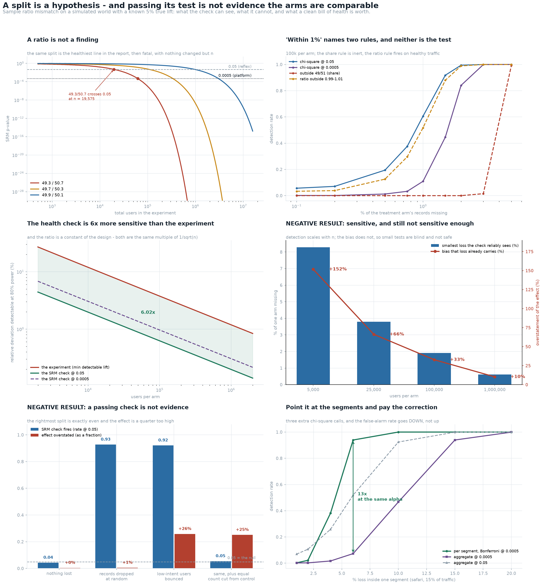

# SRM Detector

[](https://colab.research.google.com/github/phoebefu6/phoebe-the-builder/blob/main/data-science-cookbook/srm-detector/demo.ipynb)
[](https://mybinder.org/v2/gh/phoebefu6/phoebe-the-builder/main?labpath=data-science-cookbook/srm-detector/demo.ipynb)

> The experiment dashboard says the split came out 49.3 / 50.7. Somebody decides that is close enough to even and reads the result. Nothing on that screen says whether 49.3 / 50.7 is the healthiest line in the report or proof that the experiment is void - and nothing on it says that the test which would settle the question is a test of counts, while what the experiment actually needs is comparability.

**Day 165 - Data Science Cookbook.** Five SRM tests and two rules of thumb, measured against a two-stratum world with a known 5% true lift and a bias available in closed form: false-positive rate, power, the sample size at which one fixed ratio changes verdict, the smallest mismatch each test size can catch, and the bias that mismatch already carries. 39 tests, a six-panel figure, and a notebook that rebuilds all of it from numpy and scipy.



> **A split is a hypothesis, and a percentage is not one.** 49.3 / 50.7 is **p = 0.66** at n = 1,000 and **p = 1.6e-44** at n = 1,000,000. It crosses 0.05 at **n = 19,575** and 0.0005 at **n = 61,856**. Nothing about the split changes across that range. Report the p-value, the n and the threshold, or report nothing.
>
> **NEGATIVE RESULT: a passing check is not evidence the arms are comparable.** Apply a selective loss to treatment and remove the identical *number* of users from control at random - a bot filter, a dedup step, a "drop sessionless users" rule. The split comes out exactly even, the check fires **0.0543** of the time at a 0.05 threshold (that is the null, not a weak signal), and the reported lift is **6.283%** against a true **5.0%** - an overstatement of **26%**. An SRM test is a test of counts. Equal counts are consistent with any amount of missing exchangeability.
>
> **The verdict carries no information about the harm either.** Two mechanisms, the same 1.50% of the treatment arm missing: records dropped at random flags **0.9162** of the time and biases the effect **+0.7%**; low-intent users bounced out of a redirect flags **0.9190** and biases it **+25.8%**. The detector is **0.0028** apart on those two, because a detector sees two integers and a mechanism is not two integers. A flag is a trigger to find out *who* is missing. It is not a severity score.
>
> **The reassuring half: the health check is 6x more sensitive than the experiment it protects.** At 80% power and alpha 0.05 it catches a **0.626%** relative deviation in the split where the experiment needs a **3.77%** relative lift - and the ratio is **6.02x** at 100k per arm, **6.07x** at 5k and **6.00x** at 1M. It is a constant of the design, not a property of the data, because both instruments are the same multiple of 1/sqrt(n). Even a 100x stricter alpha leaves it ahead at **3.90x**.
>
> **NEGATIVE RESULT: 6x more sensitive, and still not sensitive enough.** Detection scales with n. The bias does not - it is a property of who went missing. At **25,000 per arm**, an ordinary experiment, the smallest mismatch the platform threshold can reliably catch is **3.79%** of one arm, and a selective loss that size already overstates the effect by **66%**. At 5,000 per arm: **+152%**. The check only becomes genuinely protective around **1,000,000 per arm** (0.61% loss, +10% bias), which is not the size of most experiments. Everything below the line is invisible, and invisible is not the same as harmless.
>
> **NEGATIVE RESULT: which test to use is not a decision.** Over 4,000 trials the five statistical tests - Pearson chi-square, Yates-corrected, G-test, z-test on the proportion, and the O(n) exact binomial - reach a different verdict on **6** of them (**0.15%**), and only where the p-value already sits within a factor of **1.11** of the threshold. z^2 *is* the chi-square statistic, to 1e-14. The debate is free; the threshold is not.
>
> **"Within 1%" names two rules, four times apart, failing in opposite directions.** "Share within 1 point of 50%" tolerates a share deviation of 0.01000. "Arm ratio within 0.99-1.01" tolerates **0.00249**. The share rule fires on **0.0%** of the mismatches the chi-square test catches 46% of the time, and stays inert at n = 10,000,000 where the p-value is 0. The ratio rule is a genuine detector with a **2.42%** false-alarm rate - **48x** the 0.0005 it stands in for.
>
> **Point it at the segments, and the correction is not the expensive part.** A 6% loss confined to one 15%-of-traffic segment is caught **0.064** of the time by the aggregate check at 0.0005 and **0.941** of the time by a Bonferroni-corrected per-segment sweep - **15x**, for three extra chi-square calls. And the corrected sweep false-alarms **0.0005** of the time on a healthy world against **0.1355** for the same three tests at an uncorrected 0.05. It detects more *and* cries wolf less.
>
> **Why the published threshold is 0.0005 - the second reason nobody states.** Optional stopping applies to the health check exactly as [Day 164](../peeking-cost/) priced it for the effect test, and the health check is the thing people look at every morning. Twenty daily looks at a nominal 0.05 is a **0.257** test. At 0.0005 it lands at **0.0035** - still 7x its nominal alpha, but **74x** fewer false alarms. The strict threshold is partly just an unstated correction for peeking.

## Business Impact

- **Before:** the split is eyeballed as a percentage, or tested at 0.05, or tested at 0.05 every morning for three weeks. A quarter of the "healthy" verdicts in that last case are false alarms; a mismatch under ~2% of one arm at ordinary sample sizes is invisible; and a mismatch that leaves the counts even is invisible at any sample size while overstating the effect by a quarter.
- **After:** the check is run once, at the end, at 0.0005, split by segment with a Bonferroni divisor, and reported as p-value plus n plus threshold. A flag routes to a "who is missing" investigation rather than to a severity debate. The report carries what the test size could not have seen, so a clean bill of health is read as narrowly as it deserves.
- **Estimated ROI:** the corrected segment sweep found 15x more of a segment-confined break at a *lower* false-alarm rate than the uncorrected aggregate, which is three lines of code. The expensive failure it prevents is the other direction: acting on a lift that a bounced-redirect mismatch inflated by 26%, and building a roadmap on it.

## Where this sits

Second build in **experimentation and causal inference**, after [`peeking-cost`](../peeking-cost/) (Day 164). That one showed a stopping rule is part of the test; this one shows the *assignment* is too, and that its health check is much better at answering a question nobody quite asked. Together they cover the two assumptions every real experiment breaks - when you look, and who ended up in which arm.

It is **not** [`ab-test-calc`](../../analytics-accelerator/ab-test-calc/) (Day 23, runs one test), **not** [`sample-size-calc`](../sample-size-calc/) (Day 123, how many users), **not** [`stat-test-advisor`](../stat-test-advisor/) (Day 111, which test for the effect) and **not** [`crosstab-chi2`](../crosstab-chi2/) (Day 120, runs a 2x2 well). All four assume the two arms are comparable. This is the build that asks what the evidence for that assumption is worth.

Nearest in spirit is [`guardrail-metric`](../../analytics-engineering-bi/guardrail-metric/) (Day 160): a guardrail is a constraint, and a constraint has a power. Same shape here - a health check is a hypothesis test, and a hypothesis test has a power, a threshold, an alpha it actually spent, and a null hypothesis that is not the thing you wanted reassurance about.

## Tech Stack

Python 3.10+, numpy, scipy, pandas, matplotlib, Streamlit, pytest. No data files, no API keys, no network.

## What it does

Eight sections in `evidence.py`. Every number above is printed by it and asserted in `test_srm.py`.

### 1. The test is not the decision

`chi2_critical` is checked against the published 3.8415 and 12.1157. `z^2` is shown to *be* the chi-square statistic (gap 1.15e-14), so two of the five candidates are the same test. The chi-square p-value tracks the exact binomial to within a factor of 1.11 across a grid of n and deviation. Then the verdicts are compared trial by trial rather than as flag rates - comparing rates measured on different trial counts would report Monte Carlo error as a difference between tests. **6 disagreements in 4,000 trials.**

### 2. A ratio across sample sizes

One fixed split, 49.3 / 50.7, evaluated from n = 1,000 to n = 10,000,000, with the crossing point for each threshold solved by bisection.

### 3. The two rules of thumb

Both "within 1%" readings, measured on the healthy world and on a 1.5% loss. One is inert, one has a 2.42% false-alarm rate. They are wrapped to return 0.0 when they fire so a rule of thumb and a hypothesis test can be measured on the same axis - which is the only way to see that they are four times apart.

### 4. Sensitivity, against the experiment's own

`mdd_share` and `mde_rel_lift` solve both 80%-power thresholds by bisection (cross-checked against the textbook `(z_a + z_b) * se` form to within 2%), across a 200-fold range of sample size.

### 5. The mismatch that cannot be seen

For each test size, the smallest reliably-detectable loss is paired with the closed-form bias a *selective* loss that size produces. The bias is verified scale-free (identical to 1e-12 across a 1000-fold change in n) while the detection threshold moves by 25x.

### 6. Four mechanisms

`healthy`, `mcar_loss` (records dropped at random), `selective_loss` (low-intent users bounced), `balanced_selective` (the same, with the identical count removed from control at random). Simulated flag rates and biases, each checked against `analytic_est_lift` to within 0.004.

### 7. The verdict against the harm

The two mechanisms with identical count loss, side by side.

### 8. Segments, multiplicity and stopping

A loss confined to one segment, aggregate versus Bonferroni-corrected per-segment; the false-alarm arithmetic at 500 experiments x 20 slices a year; and the realized false-positive rate of a daily check over 1, 5 and 20 looks at both thresholds.

## A note on the simulator

The first four tests in `test_srm.py` exist because of a bug this build hit and nearly shipped. The original `simulate` handed each arm exactly `per_arm` users. That is not how assignment works - randomisation splits the *traffic*, so the arm counts are `Binomial(2m, 0.5)` and have a null distribution to test. With fixed quotas the healthy world produces p-values pinned near 1.0, the measured false-positive rate reads **0.000**, and every power curve becomes a step function. A miscalibrated null does not look like a broken simulator; it looks like an unusually good detector. So the null is now asserted at both thresholds, the sd of the arm count is asserted against `sqrt(2m/4)`, and the per-segment any-of-three rate is asserted against `1 - 0.95^3`.

A second claim did not survive its own test: an early run found all five statistical tests identical on 600 trials, and the assertion `max - min == 0` failed on a different seed. The honest number is 6 in 4,000, always at the boundary - which is the stronger form of the point anyway.

## How to run

```bash
pip install -r requirements.txt

python evidence.py            # the measured argument, ~5s
python -m pytest -q           # 39 assertions, ~4s
python make_chart.py          # the six-panel figure
streamlit run app.py          # check one split, and see what it cannot see
```

**[Run the interactive demo notebook →](demo.ipynb)** - pre-rendered with all outputs, or click the Colab / Binder badges above to run it live.

## Learning Connection

Built while working through experiment design for the FDE portfolio's experimentation section. Applies: goodness-of-fit testing, the difference between an asymptotic and an exact test in practice, power and minimum-detectable-effect solving, stratified data-generating processes, familywise error control, and the discipline of testing a simulator's null before trusting anything it measures.

## Impact Note

- **Who benefits:** anyone who reads or signs off on an A/B test result, and anyone maintaining the assignment pipeline underneath it.
- **Potential risks:** the bias figures come from one reference world (30% low-intent users converting at 2%). The *direction* and *scale-freeness* of the bias are general; the exact percentages are not, and the notebook's "try your own" cell includes a world where the same mechanism biases the effect downward. The larger misreading to avoid is treating a passing SRM check as clearance - section 6 exists precisely because it is not one, and the only reliable guard against a balanced selective loss is a pre-experiment A/A run through the same pipeline, where the true effect is known to be zero.
