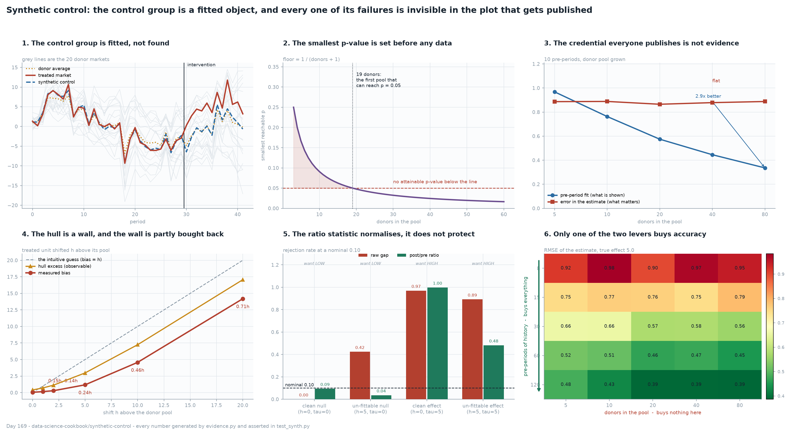

# Synthetic Control

[](https://colab.research.google.com/github/phoebefu6/phoebe-the-builder/blob/main/data-science-cookbook/synthetic-control/demo.ipynb)
[](https://mybinder.org/v2/gh/phoebefu6/phoebe-the-builder/main?labpath=data-science-cookbook/synthetic-control/demo.ipynb)

> One market got the intervention and there is no control group, so a weighted average of the
> other markets gets fitted to stand in for one - and the pre-period plot that everybody
> publishes as proof was chosen to look good, so it cannot tell you when the fit is lying.



## Business Impact

- **Before:** a single market, region or account gets a change, and the read-out is "revenue
  went up 8% after we launched" against no counterfactual at all - or against a hand-picked
  "similar" market, which is the same thing with extra steps.
- **After:** a fitted counterfactual that beats the closest-looking market by 2.7x and the
  donor average by 3.3x on RMSE, plus three checks that say when to distrust it - one of which
  (the p-value floor) is answerable before the study starts.
- **Estimated ROI:** the decision this feeds is usually a rollout worth six or seven figures.
  The cheapest finding here costs nothing to apply: **count the donors first.** A study with
  10 comparison markets has exactly zero power at p <= 0.05 no matter how large the effect is,
  and that is knowable on day one rather than after the analysis.

## What it measures

Nine sections, each a simulation with a known true effect, so every claim is checked against
a number the code already knows.

| # | Finding |
|---|---|
| 1 | The estimator works: RMSE 0.58 against diff-in-diff 1.21, closest donor 1.49, donor average 1.84 |
| 2 | **The p-value floor is 1/(J+1) and it is arithmetic, not data.** 19 donors is the smallest pool that can ever print 0.05. At 10 donors the power of a 0.05 test is **0.000 at every effect size**, including one that 40 donors detects with certainty |
| 3 | **NEGATIVE: the pre-period fit is not evidence.** Growing the pool 16x improves it 2.9x - the published picture gets strictly more convincing - while the error on the estimate goes 0.887 -> 0.888. Within a pool, the correlation between how good the fit looks and how wrong the answer is stays at ~0.00 |
| 4 | **NEGATIVE: the intuitive closed form is wrong.** A treated unit sitting above its pool by `h` does not produce a bias of `h` - the optimiser buys part of it back by tilting toward high-level donors, so the bias is 0.15h at h=1 rising to 0.71h at h=20. The convex-combination guarantee itself holds exactly (2,400/2,400 fits inside the donor band). The observable diagnostic is **hull excess**, which needs no counterfactual and which nobody reports |
| 5 | The one guard in this build that works: the post/pre MSPE ratio fires 0.036 on a true null the raw gap flags 0.424 of the time. It costs 0.41 of power when the effect is real, and its actual job is **normalisation, not robustness** - placebo units are extreme points of their own pools and are fitted worse than the treated unit, so the raw-gap reference distribution is drawn from harder problems (median p 0.714 under a clean null) |
| 6 | **NEGATIVE: dropping the simplex constraint buys a better fit and a worse answer.** With 12 pre-periods and 20 donors, unconstrained regression interpolates the pre-period **exactly** - RMSPE 0.000, the most convincing version of section 3's picture - and is the worst estimator measured here, 1.82x |
| 7 | **NEGATIVE: a spillover into one donor attenuates by exactly its own weight.** `tau(1 - sum_j w_j gamma_j)` matches measurement to a constant 0.0012 across contaminations that destroy two thirds of the effect - and that constant is the estimator's own clean bias, so the closed form is exact. The pre-period RMSPE is **bit-for-bit unchanged**: the credential is perfect while the answer is wrong |
| 8 | Anticipation is the one failure the pre-period screen can see - and only when it is loud. Full leakage over 2 periods costs -16.9% and is caught 0.830 of the time; a quarter of the effect leaking over 4 periods costs -7.0% and is caught 0.150, against the screen's own 0.10 false-alarm rate. **Its sign is negative**, opposite to every other bias here |
| 9 | **NEGATIVE: donors are not a sample-size lever.** 16x the pool moves the RMSE 3% and is indistinguishable from doing nothing; 15x the history moves it 47%. But in section 4 the same 16x pool removes 63% of a real bias - donors buy hull *coverage*, history buys *accuracy*, and the pre-period plot cannot tell you which problem you have |

The through-line: **five of the six failures leave the pre-period plot untouched or improve
it.** The one credential the method presents for itself is the objective function it was
optimised against.

## Tech Stack

Python 3.11 · numpy · scipy (`nnls` with the sum-to-one constraint appended as a weighted row -
exact, and ~30 microseconds per fit, which is what makes thousands of placebo permutations
cheap) · matplotlib · Streamlit · pytest · Docker

## Demo

**[Run the interactive demo notebook →](demo.ipynb)** - pre-rendered with outputs, or click the
Colab/Binder badges above to run it live.

```bash
pip install -r requirements.txt
python evidence.py                  # the nine-section measurement, ~12s
python -m pytest -q test_synth.py   # 22 assertions behind every number above
python make_chart.py                # the six-panel figure
streamlit run app.py                # pick a failure mode, watch the credential stay clean
```

The app's point is section 7 made tactile: choose "a donor was treated too" and the estimate
falls from 5.00 to 2.10 while the pre-period RMSPE stays at 0.601 - the same value as the
clean run, to three decimals.

## Learning Connection

Built while working through the experiment-soundness run in this cookbook. This is the sixth
and the first that is not about a randomised test:
[`peeking-cost`](../peeking-cost/) (when you looked), [`srm-detector`](../srm-detector/) (who
ended up in which arm), [`cuped-variance`](../cuped-variance/) (needing fewer users),
[`diff-in-diff`](../diff-in-diff/) (when you could not randomise) and
[`interference-check`](../interference-check/) (when the units touch each other).

Section 7 is [`interference-check`](../interference-check/)'s finding one level out:
contamination between the treated unit and its own fitted control group, rather than between
two arms of one experiment. Sections 3 and 8 are [`diff-in-diff`](../diff-in-diff/)'s
pre-trends result again - a calibrated diagnostic whose power arrives after the damage - and
section 5 is the first guard across all six builds that actually earns its keep.

Applies: constrained optimisation as an estimator rather than a fitting step, permutation
inference and its granularity, and the discipline of testing the closed form you assumed
(section 4's was wrong, and the test that caught it is in the suite).

## Impact Note

- **Who benefits:** anyone reading or writing a single-unit intervention study - a market
  launch, a regional policy, a pricing change in one country, a single-account pilot.
- **Potential risks:** this makes a defensible-looking counterfactual easy to produce, and the
  method's own credential does not police it. Two habits keep it honest: report the hull
  excess alongside the pre-period fit, and decide the donor pool before looking at outcomes -
  the p-value floor makes pool size a design decision, and choosing donors after seeing the
  result is choosing your own reference distribution.
