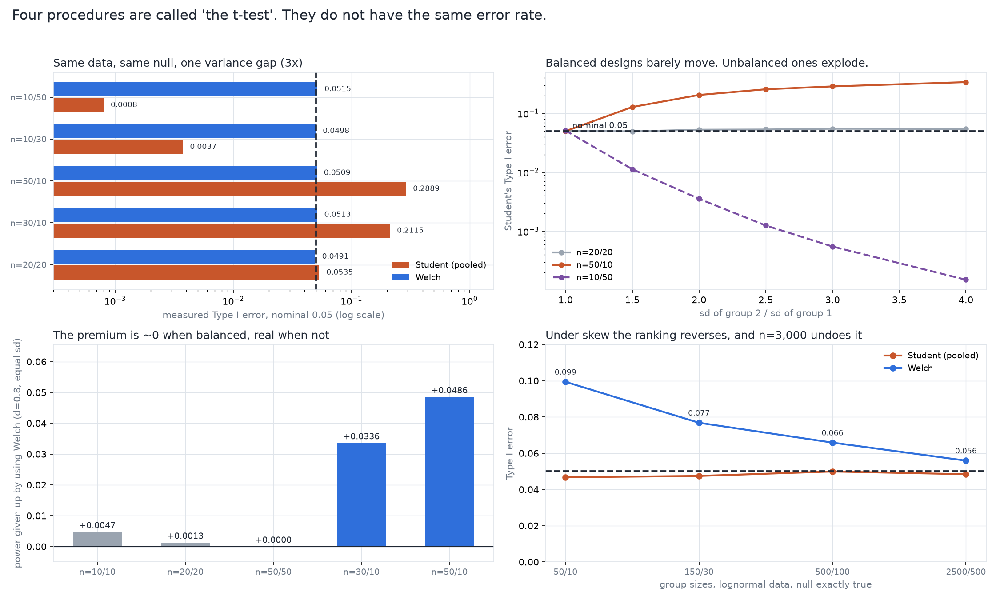

# Which t-test? Four procedures, four different error rates

[](https://colab.research.google.com/github/phoebefu6/phoebe-the-builder/blob/main/data-science-cookbook/t-test-variants/demo.ipynb)
[](https://mybinder.org/v2/gh/phoebefu6/phoebe-the-builder/main?labpath=data-science-cookbook/t-test-variants/demo.ipynb)

> "We ran a t-test" does not name a procedure. On 50 users against 10 with unequal spread, the textbook t-test calls a coin-flip significant 29% of the time while claiming 5%.



## What it measures

The null is synthetic and **exactly true**, so the rejection rate is not an argument, it is a
count: draw 40,000 pairs of samples where the two groups really do have the same mean, run each
test, and see how often it says otherwise. Anything above 0.05 is a false positive you would
have shipped.

| Design (null true, normal data) | Student's (pooled) | Welch's | z shortcut |
|---|---|---|---|
| n=20/20, equal sd | 0.0524 | 0.0522 | 0.0598 |
| n=20/20, **3x** sd gap | 0.0520 | 0.0483 | 0.0599 |
| n=50/10, 3x sd gap (small group more variable) | **0.2940** | 0.0511 | 0.0811 |
| n=10/50, 3x sd gap (large group more variable) | **0.0007** | 0.0506 | 0.0574 |

Across all 15 normal-data cells Welch stayed inside [0.0483, 0.0532]. Student's ranged from
0.0007 to 0.2940 - a 420-fold spread, on one null, from nothing but how the observations were
split between the groups.

## Three findings, two of them negative

**1. The variance gap is not the diagnostic. Imbalance is.** The rule everyone repeats is "check
whether the variances are equal". A **6x** variance gap on a balanced design leaves Student's at
0.0565 - 1.13x nominal, barely worth mentioning. The same gap at n=50/10 is 0.3741. The pooled
variance is a weighted average that gives the bigger group more say, so when the *small* group
carries the spread the standard error comes out too small and the test over-rejects; reverse the
sizes and it over-corrects into a test with no power left. Same violated assumption, opposite
failure, and the assumption check looks at neither.

The mechanism fits in one line: at n=50/10 with a 3x gap, Student's spends **58** degrees of
freedom while Welch's honest count is **9.49**.

**2. Welch is nearly free, but not quite - and the premium is where you would least like it.**
On balanced designs the power given up is 0.0013 at n=20 and 0.0000 at n=50. But on an
*unbalanced, equal-variance* design - the one corner where Student's is both valid and genuinely
better - Welch gives up **0.0520** of power at n=50/10, d=0.8. That is the honest cost of the
default. It is still the right default, because you only learn which cell you are in by looking
at the data you are about to test.

**3. Welch is not a robustness fix, and under skew it is the worse test.** It corrects unequal
*variance*, which is not the same as correcting *assumptions*. On lognormal data with unequal
group sizes the ranking reverses:

| lognormal, null true | Student's | Welch's |
|---|---|---|
| n=50/10 | 0.0503 | **0.0952** |
| n=150/30 | 0.0452 | 0.0790 |
| n=500/100 | 0.0481 | 0.0640 |
| n=2500/500 | 0.0478 | 0.0535 |

For a skewed variable the sample mean and the sample variance are positively correlated, so the
small group's variance estimate is low exactly when its mean is low, and Welch - which leans on
that separate estimate - inherits the correlation. Student's pooled estimate borrows stability
from the big group and happens to survive. It takes about **3,000 observations** for the CLT to
repair it, on a skew that is entirely ordinary for revenue or session length.

## The harness is calibrated before it is believed

Student's t on balanced, equal-variance, normal data is **exact**: 0.05 by construction, not by
approximation. So the study runs that cell ten times first and reports the spread (0.0478 to
0.0514) as its own noise floor. Every later verdict is read against that band - at 40,000
replicates a Wilson interval will flag a 1.05x departure that means nothing in practice, and a
detector that has never been shown to recover a number it is guaranteed to produce is not a
detector.

The four implementations are written from the formulas so the notebook is readable, then checked
against `scipy`: the largest disagreement over 200 random samples is **1.1e-16**. And the paired
t-test turns out not to be a fifth procedure at all - it is the one-sample test on the
differences, identical to the last bit.

## Business Impact
- **Before:** a default `ttest_ind` call, an unexamined `equal_var=True`, and a 29% false-positive rate on any unbalanced comparison - which is most real ones, because groups are rarely the same size.
- **After:** the error rate of your actual design, measured in seconds, before you run the test on real data.
- **Estimated ROI:** one avoided false positive. The expensive part of a bad A/B readout is never the analysis.

## Tech Stack
Python 3.9+, numpy, scipy, matplotlib, Streamlit, pytest, Docker

## Demo

**[Run the interactive demo notebook →](demo.ipynb)** - pre-rendered with outputs, or click the
Colab/Binder badges above to run it live.

For the Streamlit app, where you drag your own design around instead of editing constants:

```bash
pip install -r requirements.txt
streamlit run app.py
```

Regenerate every number quoted above:

```bash
python evidence.py     # -> evidence.txt, results.json
python make_chart.py   # -> t_test_variants_audit.png / .svg
pytest                 # 45 tests: the statistics, the findings, and the notebook's inline copy
```

## What is deliberately not here

The conditional procedure - run Levene's test, then pick Student's or Welch's based on the result
- is its own question with its own answer, and it is the next build in this domain
(`assumption-pretest-cost`). Measuring it here would have pre-empted a finding that deserves its
own study.

## Learning Connection
Opens the statistical-testing domain of the portfolio. Complements
[`stat-test-advisor`](../stat-test-advisor) (Day 111), which picks *which* test to use, with what
each test costs when its assumption fails. The measured-Type-I-error method is the same one
[`peeking-cost`](../peeking-cost) (Day 164) and [`srm-detector`](../srm-detector) (Day 165) use
on stopping rules and assignment.

## Impact Note
- **Who benefits:** anyone comparing two groups of unequal size - which is nearly every A/B test with a holdout, every pre/post with churn, every cohort comparison.
- **Potential risks:** these rates are for the distributions simulated here. "Welch is fine" is a claim about normal-ish data; the skew section is the counterexample, and the app is there so you can check your own shape rather than trusting the table. A simulation tells you what a test does under the model you gave it, not what your data is.
