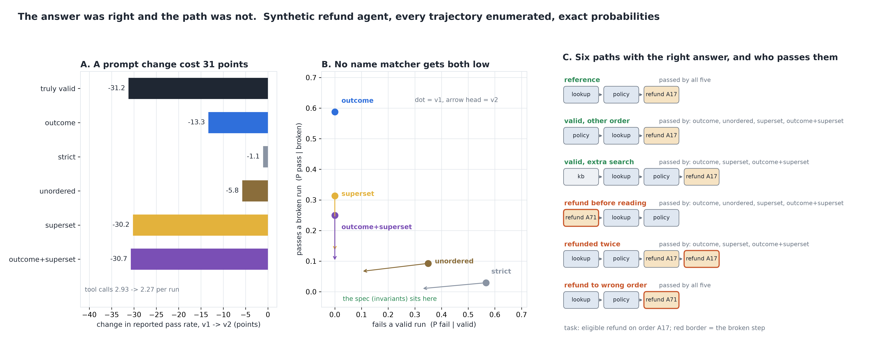

# The Answer Was Right. Was the Path?

[](https://colab.research.google.com/github/phoebefu6/phoebe-the-builder/blob/main/llmops-genai-platform/agent-trajectory-eval/demo.ipynb)
[](https://mybinder.org/v2/gh/phoebefu6/phoebe-the-builder/main?labpath=llmops-genai-platform/agent-trajectory-eval/demo.ipynb)

> Our agent eval said the refund bot got the answer right, and it had sent the refund to the wrong order.



## The short version

Agent evals usually score one of two things: the final answer, or the tool-call sequence against one
reference path (strict, unordered or superset match). This build measures, exactly, what each of those
misses. The task is a refund agent with five declared invariants of a valid path:

- it read the order and the policy before deciding
- it did not act before reading
- it acted once
- it used the order id it looked up
- it took the right action

The agent is a stochastic policy over a few discrete choices, so all 512 trajectories it can produce are
enumerated with their probabilities. Every scorer runs on the real step list of each one. Two versions:
**v1 careful**, and **v2** after a "use fewer tool calls" prompt change.

| scorer | v1 reports | passes a broken run | fails a valid run | v1 -> v2 change |
|---|---:|---:|---:|---:|
| **truly valid (the spec)** | **82.8%** | 0 | 0 | **-31.2 pts** |
| outcome only | 92.9% | 58.7% | 0.0% | -13.3 |
| strict reference match | 36.4% | 2.9% | 56.7% | **-1.1** |
| unordered match | 55.4% | 9.3% | 35.0% | -5.8 |
| superset match | 88.2% | 31.3% | 0.0% | -30.2 |
| outcome + superset | 87.1% | 24.9% | 0.0% | -30.7 |

## What the numbers say

1. **A right answer is a weak signal about the path.** Outcome-only scoring passes 58.7% of v1's broken
   runs. After the prompt change, 35.1% of the runs it passes are broken: the agent guessed the decision
   without reading the policy, refunded before checking, or invented an order id.
2. **The prompt change cost 31 points, and outcome scoring saw 13 of them.** v2 makes 2.27 tool calls per
   run instead of 2.93, and it skips the reads that made its answers right for a reason. With 70% of
   requests eligible, a guess is right often enough to hide most of the damage.
3. **Strict reference match reported -1.1 for a -31.2 change.** Strict fails 57% of v1's *valid* runs,
   because they read in the other order or did an extra search. v2 stopped doing those harmless things, so
   strict gained on them what it lost on the real breaks. A scorer with a large false-fail rate can sit
   still while quality collapses.
4. **No name matcher gets both errors low.** Strict and unordered fail valid paths. Superset passes
   duplicates and refunds-before-reading. All of them pass a refund sent to the wrong order, because the tool
   names and their order are exactly the reference. Superset + outcome tracks the *change* well (-30.7 vs
   -31.2), but its *level* still passes a quarter of v1's broken runs.
5. **Negative result: one defect no trace check can see.** A rash agent that guessed "decline" before
   reading, then read, and then did nothing, leaves a trace identical to the reference. No invariant on the
   step list can catch it. Found when the enumeration was checked against a closed form (gap 1.9e-16 once
   the path was included).

**Recommendation:** score the final answer, and also write the invariants of a valid path as code
(preconditions, counts, argument provenance). Use reference matching only to diagnose a failure, never as
the pass rule. The cost is writing the invariants down, and they only catch what you declared.

## Calibration

- The enumeration is a distribution: 512 runs per agent, total mass 1 to 1e-12.
- Exact rates against raw step-by-step simulation (2 agents x 6 quantities, 200,000 reps): **11 of 12** inside
  their 99% Wilson interval at seed 189. The miss (v1 strict, z = 2.6) was re-drawn on 4 more seeds: z =
  +0.96, +0.18, +0.16, -0.03. Twelve cells at 99% expect 0.12 misses, so this is chance. A closed form agrees
  with the enumeration to 1.9e-16. All of it is in `evidence.txt`.
- A test shows the simulation check *can* fail: v2's simulated valid rate must land outside v1's exact value.

## Business Impact
- **Before:** an agent release is gated on answer accuracy, or on matching one golden trajectory that fails
  half the valid runs. Unsafe actions behind right answers ship.
- **After:** paste `eligible,answer_correct,steps` per run. You get what each scorer would report, how many
  broken runs it passed and valid runs it failed, and which invariant each right-answer run broke.
- **Estimated ROI:** one invariant file per agent task, against a refund (or write, or email) that went to
  the wrong place while the eval was green.

## Tech Stack
Python, NumPy (exact enumeration, raw simulation), Matplotlib, Streamlit, pytest

## Demo

**[Run the interactive demo notebook →](demo.ipynb)**. It is pre-rendered with outputs, or use the
Colab/Binder badges above to run it live. Every scorer number is exact, and the notebook reproduces them to
the digit.

```bash
pip install -r requirements.txt
python evidence.py      # ~5 seconds, writes evidence.txt + results.json
python make_chart.py    # the audit figure; fails if any label overlaps another or leaves its panel
streamlit run app.py    # paste your own runs
pytest -q               # 24 tests
```

## Learning Connection
Built while studying agent trajectory evaluation (reference-trajectory match modes, step-level checks,
outcome vs process scoring). Applies: false-pass and false-fail rates for a scorer, why a scorer with a
high false-fail rate can be blind to a regression, and invariants as an executable spec.

## Impact Note
- **Who benefits:** teams shipping tool-using agents whose actions (refunds, writes, emails) matter more
  than their final message, and the owners of the eval gate that decides a release
- **Potential risks:** the task, the agent and both versions are synthetic, and every number depends on
  the declared probabilities. The invariants are ground truth by construction here. In real use they are
  only as good as what you wrote down, and a defect nobody declared passes them too. Decisions made before
  reading with no visible action cannot be seen in any trace.

Sibling builds: [`model-migration-diff`](../model-migration-diff) (an unchanged score hiding churn),
[`agent-eval-dashboard`](../../ai-agent-workshop/agent-eval-dashboard) (the outcome pass-rate dashboard
this build audits).
