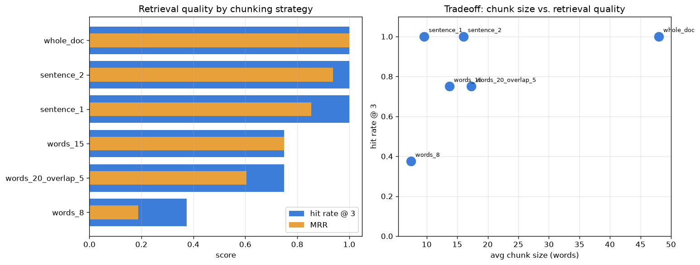

# Chunking Strategy Tester

[](https://colab.research.google.com/github/phoebefu6/phoebe-the-builder/blob/main/llmops-genai-platform/chunk-optimizer/demo.ipynb)
[](https://mybinder.org/v2/gh/phoebefu6/phoebe-the-builder/main?labpath=llmops-genai-platform/chunk-optimizer/demo.ipynb)

> Bad chunks = bad answers. Prove which chunking strategy retrieves best - on evidence, not vibes.

In a RAG system the retriever can only surface a chunk that **actually contains** the answer. Chunk too big and you dilute the signal (and waste context tokens); chunk too small and the answer gets split across boundaries so no single chunk is retrievable. This tool splits a corpus with several strategies, retrieves over the chunks with a dependency-free lexical scorer, and scores each strategy on a **gold eval set**.



## Business Impact
- **Before:** teams pick a chunk size by copying a tutorial, then blame the model when RAG answers are wrong.
- **After:** a repeatable test ranks chunking configs on real retrieval metrics before a single LLM call.
- **Estimated ROI:** kills the most common (and invisible) RAG failure - the answer was never in a retrievable chunk - saving days of misdirected prompt tuning.

## Tech Stack
Python · Streamlit · pandas · matplotlib · a hand-rolled TF-IDF retriever (no embeddings service, no API keys)

## Demo

**[Run the interactive demo notebook →](demo.ipynb)** - pre-rendered with outputs and the tradeoff chart, or click the Colab/Binder badges above to run it live.

For the Streamlit app (leaderboard + per-query inspector):
```bash
pip install -r requirements.txt
streamlit run app.py
```

CLI leaderboard:
```bash
python chunker.py
```

## How it scores
- **hit rate @ k** - fraction of gold questions whose answer-bearing chunk lands in the top-k.
- **MRR** - mean reciprocal rank of the first winning chunk (rewards ranking it #1).
- A chunk only "wins" if it is from the right document **and** contains the exact answer span.

Six strategies ship in the box: `whole_doc`, `words_8`, `words_15`, `words_20_overlap_5`, `sentence_1`, `sentence_2`. Add your own in `chunker.py`.

## Learning Connection
Built while studying RAG, chunking, and vector-retrieval design.
Applies: the retrieval-quality-vs-chunk-size tradeoff, overlap to rescue boundary-straddling answers, and eval-driven config selection. Pairs with **Day 82 - RAG Evaluation Harness** (chunk here, then score retrieval there).

## Impact Note
- **Who benefits:** anyone building or tuning a RAG pipeline who needs to justify a chunking choice.
- **Potential risks:** the bundled lexical retriever isolates the chunking effect - production systems should re-run the test with their actual embedding retriever, since absolute scores will differ.
