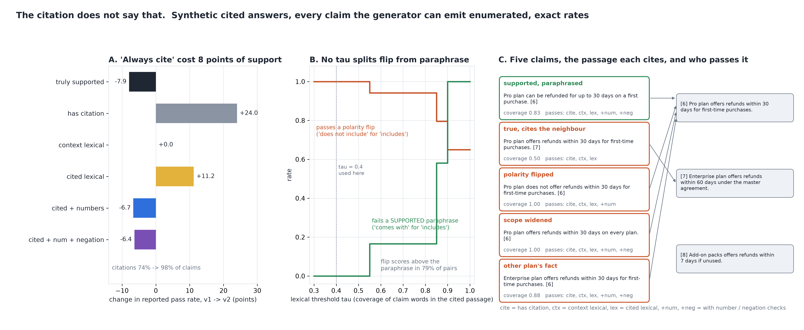

# The Citation Does Not Say That

[](https://colab.research.google.com/github/phoebefu6/phoebe-the-builder/blob/main/llmops-genai-platform/citation-verifier/demo.ipynb)
[](https://mybinder.org/v2/gh/phoebefu6/phoebe-the-builder/main?labpath=llmops-genai-platform/citation-verifier/demo.ipynb)

> We told the model to cite every sentence, citation coverage went from 74% to 98%, and the passages it cited supported 8 points fewer of its claims.



## The short version

A cited RAG answer makes claims and points each at a passage with [n]. Groundedness tools ask whether the claim
is anywhere in the retrieved context (`hallucination-checker`, Day 88). This build asks a narrower question with
a different answer: does the passage the citation *names* say that? Five checkers that see only text are run
against a structural truth on every claim a declared generator can emit:

- a claim is one true fact from a 12-passage product-policy corpus, one of six edits (none, polarity flip,
  widened scope, the neighbouring plan's number, a novel number, the other plan's entity), one of four citation
  choices (the source, the neighbouring passage, an unrelated one, none), verbatim or paraphrased
- SUPPORTED means the cited passage states the same entity, attribute, value, scope and polarity
- the space is finite (576 claims per model version), so every rate is exact; a raw simulation only checks them

Two versions: **v1 cites when sure** (74% of claims cited), and **v2** after an "always cite your sources"
instruction (98% cited, the extra citations landing on the neighbouring passage).

| checker | v1 reports | passes an unsupported claim | fails a supported one | v1 -> v2 change |
|---|---:|---:|---:|---:|
| **truly supported (the cited passage says it)** | **49.8%** | 0 | 0 | **-7.9 pts** |
| has a citation | 74.0% | 48.2% | 0.0% | **+24.0** |
| context lexical (Day 88's question) | 98.0% | 96.0% | 0.0% | +0.0 |
| cited-passage lexical, tau 0.4 | 68.8% | 37.7% | 0.0% | **+11.2** |
| cited lexical + numbers | 59.2% | 18.7% | 0.0% | -6.7 |
| cited lexical + numbers + negation | 56.7% | 13.7% | 0.0% | -6.4 |

## What the numbers say

1. **Citation coverage moved the wrong way.** The instruction raised the share of cited claims by 24 points and
   lowered the share of supported claims by 8. The new citations name the neighbour (same attribute, other
   plan) - the passage a retriever ranks next to the right one.
2. **The cited-passage lexical check reported +11.2 for a -7.9 change.** The neighbour shares most of the
   claim's content words, so a word-overlap check against the cited passage passes it. On v2 it passes 66% of
   unsupported claims, and 48% of what it passes is unsupported.
3. **Half the claims are supported though 81% are true.** The gap is true claims with no citation or with the
   wrong one. The context-level check cannot see this by construction: it asks whether the vocabulary is in the
   context, and here every edit reuses context vocabulary, including the neighbour's number. It passes 98% on
   both versions and does not move.
4. **The number and negation checks see the sign.** They are the only text rules whose delta has the right
   sign. What they still pass: a widened scope ("on every plan"), the other plan's fact, a true claim pointing
   at the wrong passage, and the one place two plans share a number. None of those has a word the passage lacks.
5. **Negative result: no lexical threshold separates a polarity flip from an honest paraphrase.** With a
   standard stopword list, "does not include" and "includes" have identical content words, so a verbatim flip
   has coverage 1.00 against its source. Across every (flip, supported paraphrase) pair the flip scores above the
   paraphrase 79% of the time. Raising tau fails the paraphrases first: at 0.9 it fails 100% of supported
   paraphrases and still passes 65% of flips.

**Recommendation:** report support, not citation coverage - the share of claims whose *cited* passage entails
them. Use the lexical rules as a cheap pre-filter for the claims that cannot be right (a missing number, a
negation mismatch), and send the rest to an entailment judgment (NLI model or LLM judge) against the cited
passage, not the whole context. A citation that names the neighbour is the common failure, and it is the one
that word overlap cannot see.

## Calibration

- The enumeration is a distribution: 576 claims per version, total mass 1 to 1e-12.
- Exact rates against raw simulation (2 versions x 6 quantities, 200,000 reps): **12 of 12** inside their 99%
  Wilson interval at seed 190. All of it is in `evidence.txt`.
- A test shows the simulation check *can* fail: v2's simulated support must land outside v1's exact value.
- **Defect caught during the build:** the first run read the citation marker `[1]` as the number 1 and as a
  content word, so the number check failed every cited claim (0% reported). A checker that tokenises the
  claim with the marker in it has the same bug; markers are stripped before any scoring, and a test holds it.

## Business Impact
- **Before:** the RAG dashboard reports citation coverage and context groundedness. Both go up when the model
  is told to cite everything. Neither sees that the cited passage is the wrong one.
- **After:** paste passages and cited claims. You get each claim's coverage of its cited passage, the five
  verdicts, and the disagreement that names the failure: in the context but not in the citation, a number the
  passage does not hold, a polarity that differs.
- **Estimated ROI:** one eval column (supported-by-citation) in place of two that cannot move the right way,
  against the answer a user checks by clicking the [n] and finding it says something else.

## Tech Stack
Python, NumPy (exact enumeration, raw simulation), Matplotlib, Streamlit, pytest

## Demo

**[Run the interactive demo notebook →](demo.ipynb)**. It is pre-rendered with outputs, or use the
Colab/Binder badges above to run it live. Every checker number is exact, and the notebook reproduces them to
the digit.

```bash
pip install -r requirements.txt
python evidence.py      # <1 second, writes evidence.txt + results.json
python make_chart.py    # the audit figure; fails if any label overlaps another or leaves its panel
streamlit run app.py    # paste your own passages and claims
pytest -q               # 25 tests
```

## Learning Connection
Built while studying citation evaluation for RAG (citation recall and precision, attributable-to-identified-
sources, NLI-based entailment of a claim by its cited passage). Applies: false-pass and false-fail rates for a
checker, why a metric with a large false-pass rate moves against the truth, and the gap between "in the
context" and "in the cited passage".

## Impact Note
- **Who benefits:** teams shipping cited RAG answers, and the owners of the eval dashboard that reports citation
  coverage as if it were support
- **Potential risks:** the corpus, the generator and both versions are synthetic, and every number depends on
  the declared probabilities and the template grammar. The truth is structural by construction; in real use an
  entailment judgment stands in for it and has its own error rate. The lexical rules here use one stopword list
  and one stemming rule; another list that keeps "not" would catch verbatim flips and still pass scope and entity.

Sibling builds: [`hallucination-checker`](../hallucination-checker) (is the claim anywhere in the context - the
baseline here), [`agent-trajectory-eval`](../agent-trajectory-eval) (a scorer that reported -1 for a -31 change,
the previous day).
