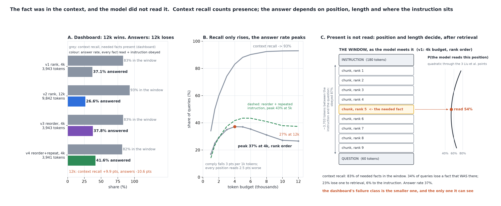

# The Fact Was in the Context, and the Model Did Not Read It

[](https://colab.research.google.com/github/phoebefu6/phoebe-the-builder/blob/main/llmops-genai-platform/context-packing/demo.ipynb)
[](https://mybinder.org/v2/gh/phoebefu6/phoebe-the-builder/main?labpath=llmops-genai-platform/context-packing/demo.ipynb)

> Context recall said 83% of the facts the answers needed were in the window, and 34% of the queries lost a fact that was there - more than were lost to retrieval, and the dashboard counts every one of them as a success.



## The short version

A RAG answer is generated from a **window**: the instruction, the retrieved chunks the packer kept under a token
budget in the order it chose, then the question. `rag-eval` (Day 82) reports **context recall** - the share of
needed facts physically present in the window. The model does not read every position equally well. Liu et al.
(2023, *Lost in the Middle*) measured a U over position - facts at the start and the end are recovered far more
often than facts in the middle - that sinks as the context grows; and an instruction placed once at the top is
obeyed less often the more tokens sit between it and the question. So three numbers describe one window and
they are three quantities:

- a declared, seeded query log: 2,000 queries, 30 candidate chunks each of 120-520 tokens, the answer needing
  1 / 2 / 3 facts (60 / 30 / 10%), each fact's chunk at retriever rank r with P(r) ~ 0.82^r (hit@10 = 81%) and
  missed outright 6% of the time
- a declared reading model: `read(u, L)` is the quadratic through the three Liu points (0.76 / 0.54 / 0.66 at
  4k tokens) sinking 2.5 points per 1,000 tokens of window; `comply(d)` is 0.98 minus 3 points per 1,000 tokens
  between the nearest copy of the instruction and the question
- three numbers per policy: **context recall** (needed facts present - the dashboard), **effective recall**
  (present and at a position that is read), **answer rate** (every needed fact read and the instruction obeyed -
  the user). Given the log, every rate is an exact expectation; a raw Bernoulli simulation only checks them.

| policy | context recall | effective recall | answer rate | instruction obeyed | tokens / query |
|---|---:|---:|---:|---:|---:|
| v1 rank order, 4k budget | 83.0% | 53.3% | 37.1% | 86.9% | 3,943 |
| v2 rank order, 12k budget | **92.9%** | 49.0% | **26.6%** | 69.2% | 9,842 |
| v3 reorder (best at both edges), 4k | 83.0% | 54.1% | 37.8% | 86.9% | 3,943 |
| v4 reorder + instruction repeated before the question, 4k | 81.6% | 53.2% | **41.6%** | 98.0% | 3,941 |

## What the numbers say

1. **Three numbers, none of them the same.** Under v1, 83% of needed facts are in the window, 53% are at a
   position that is read, and 37% of queries get every fact read with the instruction obeyed. The gap between
   the first and the third is the part of the pipeline that happens after retrieval, and the dashboard stops at
   retrieval.
2. **The dashboard ranks the fixes backwards.** Tripling the budget moves context recall +9.9 points and the
   answer rate -10.6: every position reads worse in a 10k-token window and the instruction at the top is obeyed
   69% of the time instead of 87%. Repeating the instruction before the question costs one chunk (context
   recall -1.4 points) and pays +4.5 points of answers. Sorted by context recall: v2 > v1 > v3 > v4. Sorted by
   answer rate: v4 > v3 > v1 > v2. The two orders are exact reverses.
3. **Where the answers went.** Failures split into three classes that sum to one minus the answer rate: the
   fact was not retrieved (v1: 23.4%), the fact was present and not read (33.9%), the instruction was ignored
   (5.6%). The largest class is the one context recall scores as a success. The 12k window turns 13 points of
   retrieval misses into 17.5 points more unread and 6 points more ignored.
4. **Context recall is monotone in the budget; the answer rate is not.** Across budgets from 1k to 12k, context
   recall rises from 34% to 93% and never falls, so a dashboard built on it can only ever recommend a bigger
   window. The answer rate peaks at 4k (37.1%) for rank order and 5k (43.4%) for reorder-plus-repeat, and is
   10 points below its peak at 12k in both. Every candidate fits by ~9.8k tokens, so 12k and larger are the
   same window.
5. **Negative result: the published mitigation is nearly a wash here.** LongContextReorder puts the best chunks
   at both edges and the worst in the middle. On the same kept set (identical on all 2,000 queries; context
   recall and tokens identical to the digit) it halves the share of needed chunks in the middle third (24% ->
   13%) and moves the answer rate +0.7 points. It helps a fact at rank 3 or below (rank 5: 0.568 -> 0.639) and
   sends the rank-2 chunk from second-from-top to the far end, where it reads worse (0.694 -> 0.661) - and 39%
   of needed facts sit at rank 1 or 2. Nothing the retrieval log records distinguishes v1 from v3.
6. **Side result: best-last is worst.** Putting the most relevant chunk next to the question (the "recency"
   argument) reads 34.4% against rank order's 37.1% at the same budget: the top of the window outreads the
   bottom in the Liu curve, and rank order already puts the likeliest chunk there.

**Recommendation:** report the three failure classes, not context recall alone - "present and unread" is
computable from the window layout and a position model, and it is where the answers go. Do not raise the
budget to raise recall without a read on the answer rate; it has an interior maximum. Repeat the instruction
before the question before you reorder chunks: it moved 6x as much here. And treat reorder as a bet on where
your needed facts land in the retriever ranking - it pays below rank 3 and costs at rank 2.

## Calibration

- Exact expectation against raw Bernoulli simulation (4 policies x 2 random quantities, 200 replicates per
  query = 400,000 trials per rate): **8 of 8** inside their 99% Wilson interval at seed 192. Context recall has
  no randomness in it and is asserted equal rather than interval-checked. All of it is in `evidence.txt`.
- A test shows the simulation check *can* fail: v2's simulated answer rate must land outside v1's exact value.
- The three failure classes are asserted to sum to one minus the answer rate on every query.
- **Defect caught during the build:** the first version averaged recall per query while the simulation pooled
  facts, so a quantity with no randomness in it read as OUTSIDE its own interval - two readers of one number.
  Recalls are now pooled over facts in one place, and the deterministic column left the interval check.
- **Chart defect caught:** the first render put the peak label straight across the dashed line and the text-vs-text
  geometry check passed; the check now samples every plotted line and refuses a label a sample lands in.

## Business Impact
- **Before:** the RAG dashboard reports context recall. It goes up when the window is enlarged and down when the
  instruction is repeated, and it ranks the fix that loses 10 points of answers above the one that gains 4.5.
- **After:** describe up to three packing policies (budget, order, instruction placement). You get the three
  numbers and the three failure classes for each, and a banner when the dashboard ranks the policies in the
  opposite order from the answers.
- **Estimated ROI:** one eval column (answer rate with its failure split) in place of one that can only recommend
  a bigger window, and a packing change that is +4.5 points for 180 tokens.

## Tech Stack
Python, NumPy (raw simulation), Matplotlib, Streamlit, pytest

## Demo

**[Run the interactive demo notebook →](demo.ipynb)**. It is pre-rendered with outputs, or use the
Colab/Binder badges above to run it live. Every policy number is an exact expectation over the declared log, and
the notebook reproduces them to the digit.

```bash
pip install -r requirements.txt
python evidence.py      # <2 seconds, writes evidence.txt + results.json
python make_chart.py    # the audit figure; fails if any label overlaps another, leaves its panel, or sits on a line
streamlit run app.py    # your own packing policies
pytest -q               # 31 tests
```

## Learning Connection
Built while studying long-context behaviour and context engineering (Liu et al. 2023 *Lost in the Middle*,
LangChain's `LongContextReorder`, instruction placement in long prompts). Applies: a position-dependent
reading model as a declared object, exact expectations over a seeded log checked by raw simulation, and the
failure decomposition that shows which part of a pipeline an eval column cannot see.

## Impact Note
- **Who benefits:** teams packing retrieved chunks into a prompt, and the owners of the dashboard that reports
  context recall as if it were answer quality
- **Potential risks:** the reading model is declared from three published points and a linear length penalty;
  real models differ by family and by prompt format, and newer long-context models flatten the U. The direction
  of every finding (recall monotone, answer rate interior, order invisible to the log) survives any U-shaped,
  length-sinking curve; the sizes do not. The retriever's rank distribution is declared too, and the reorder
  result depends on it directly - a retriever that puts the needed fact at rank 5+ more often makes reorder pay.

Sibling builds: [`rag-eval`](../rag-eval) (reports context recall - this is the number it leaves out),
[`chunk-optimizer`](../chunk-optimizer) (how to cut the documents - this is what happens to the chunks once
they are in the window), [`rag-staleness`](../rag-staleness) (the previous day: a metric that ranked the fixes
backwards, from the other side of the index).
