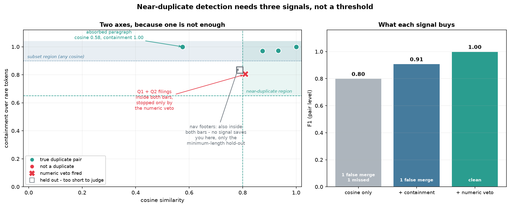

# Embedding Dedup

[](https://colab.research.google.com/github/phoebefu6/phoebe-the-builder/blob/main/llmops-genai-platform/embedding-dedup/demo.ipynb)
[](https://mybinder.org/v2/gh/phoebefu6/phoebe-the-builder/main?labpath=llmops-genai-platform/embedding-dedup/demo.ipynb)

> A duplicate in a vector index does not cost you storage. It costs you the answer.

Retrieval returns the top *k* chunks. If three of those slots hold the same policy paragraph re-exported from three systems, the model sees one document three times and never sees the two documents that got pushed out. On the bundled corpus, the entire top-3 for a refund question is **one document restated three times** - the shipping policy that would have completed the answer never appears.

This finds near-duplicates with a **three-signal gate** and reports every pair it rejected, with the reason.



## Business Impact
- **Before:** dedup is either not done, or done as "cosine > 0.9, merge." The first wastes top-k slots on repeated text; the second silently deletes documents - two quarterly filings off one template score 0.81 and get merged into one.
- **After:** duplicates collapse, template siblings survive with the veto reason recorded, and the rejected list becomes an audit trail. On the sample corpus: 14 documents → **3 clusters**, 4 dropped, **31.3%** of index tokens removed, **zero false merges**.
- **Estimated ROI:** the embedding refund is the small number ($0.000041 here, and it stays small). The real return is the top-3 going from **1 distinct answer to 2** - retrieval quality, not spend.

## Tech Stack
Python · numpy · pandas · Streamlit · matplotlib · TF-IDF + union-find (fully offline, no API key, no model call)

## Key insight

**Cosine similarity conflates *same document* with *same topic*, and no threshold fixes it.**

On this corpus the pair that must **not** merge (Q1 vs Q2 filings, 0.81) scores *higher* than the pair that must (a paragraph absorbed into a longer FAQ, 0.58). Ranked by cosine they are in the wrong order, so every possible cutoff gets one of them wrong. The separating evidence is not in the prose at all - it is in the figures. Two documents that share every sentence and disagree on every number are not the same document.

So the gate uses three signals, each fixing what the others cannot:

| Signal | Question it answers | The case only it catches |
|---|---|---|
| **Cosine** | do these use the same words in the same proportions? | ordinary re-exports and edited forks |
| **Containment** `\|A∩B\|/min(\|A\|,\|B\|)` over rare tokens | is one document's vocabulary a subset of the other's? | the absorbed paragraph - cosine 0.58, containment **1.00**, because cosine reads the longer document's extra material as *difference* |
| **Numeric fingerprint** (Jaccard over asserted numbers, **veto only**) | do these documents make the same claims? | template siblings - identical prose, every figure different |

Measured against labelled duplicate groups, each signal earns its place:

| Gate | Precision | Recall | F1 | Failure |
|---|---|---|---|---|
| cosine only | 0.80 | 0.80 | **0.80** | merges the two filings, misses the absorbed paragraph |
| + containment | 0.83 | 1.00 | **0.91** | still merges the two filings |
| + numeric veto | **1.00** | **1.00** | **1.00** | clean |

**Precision matters more than recall here, and it is not close.** A missed duplicate wastes a fraction of a cent. A false merge deletes a document that no longer exists anywhere in the index - you cannot recover Q1 from Q2.

## Two ways to link, one way to be vetoed

- **`near`** — `cosine ≥ 0.80` **and** `containment ≥ 0.65` → two versions of one document
- **`subset`** — `containment ≥ 0.90` at *any* cosine → one document absorbed into another
- either link is vetoed if both documents assert ≥2 numbers and those numbers disagree (Jaccard < 0.50)

Exact matches after normalisation skip scoring entirely - hash first, it is free. Links close transitively via union-find, and the **longest** member survives each cluster, so a superset keeps the detail a shorter copy dropped.

**Edge cases handled:** ① Fragments below 10 tokens (nav bars, footers, "See also" stubs) are held out before any signal runs. The two footers in the corpus score 0.79 cosine and 0.83 containment - **inside both accept bars**, and no similarity signal can help, because at six tokens they genuinely *are* nearly the same string. Merging them would drag unrelated pages into one cluster. ② The numeric veto abstains rather than guesses when a document has fewer than two numbers. ③ A corpus of 0 or 1 documents has no pairs and returns an empty result instead of raising.

## Not O(n²)

All-pairs cosine is 91 comparisons at 14 documents and **450 million** at 30k. Two documents sharing no discriminative token cannot clear a 0.8 cosine bar, so they never need scoring: an inverted index over tokens appearing in ≤50% of the corpus generates candidates, and only those get compared. Here that skips **57%** of the work, and the saving grows with corpus size because a rare token's posting list stays short.

## Demo

**[Run the interactive demo notebook →](demo.ipynb)** - pre-rendered with the ablation table, the signal chart, and the before/after result page. Or click the Colab/Binder badges above.

Streamlit app - tune the three thresholds and watch precision move:
```bash
pip install -r requirements.txt
streamlit run app.py
```

CLI - clusters, rejections with reasons, ablation, retrieval impact:
```bash
python dedup.py
```

Swap TF-IDF for real embeddings without touching the gate:
```python
E = np.array([embed(d["text"]) for d in docs])   # (n_docs, dim), any provider
result = find_duplicates(docs, vectors=E)        # L2-normalised for you
```

## Learning Connection
Built while studying RAG index hygiene and retrieval evaluation.
Applies: multi-signal decision gates, ablation as evidence (not eyeballed clusters), blocking/candidate generation for quadratic problems, union-find clustering, and precision-weighted design for irreversible operations.

Companions in this product line:
- **Day 92** [`chunk-optimizer`](../chunk-optimizer) - run this after chunking, before embedding
- **Day 91** [`rag-eval`](../rag-eval) - measure whether the narrower result page answers better
- **Day 125** [`token-cost-estimator`](../token-cost-estimator) - what duplicate tokens cost at real corpus size

## Impact Note
- **Who benefits:** anyone maintaining a RAG index fed from multiple systems, where the same content arrives as a web page, a PDF export, and a wiki copy.
- **Potential risks:** dedup is destructive and this tool only ranks candidates - it does not know your retention obligations. Treat the plan as a proposal: **soft-delete or tombstone, do not hard-delete**, especially where the dropped copy is the record of a specific system. The numeric veto is a heuristic tuned on English documents with digit-formatted figures; spelled-out numbers ("four million") slip past it, so template-heavy corpora deserve a manual pass over the rejected list before the thresholds are trusted. TF-IDF is a stand-in for embeddings: it will miss paraphrases that share no vocabulary, which is exactly the case real embeddings catch - pass them in via `vectors=`. And a cluster's "longest member survives" rule optimises for detail, not for authority; if one source is canonical, override the survivor choice.
