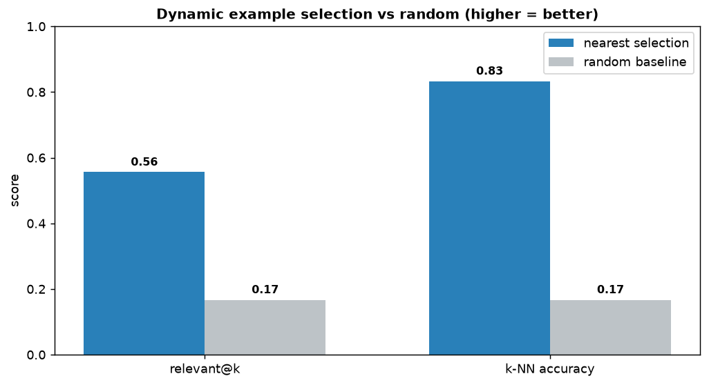

# Few-Shot Example Selector

[](https://colab.research.google.com/github/phoebefu6/phoebe-the-builder/blob/main/llmops-genai-platform/fewshot-selector/demo.ipynb)
[](https://mybinder.org/v2/gh/phoebefu6/phoebe-the-builder/main?labpath=llmops-genai-platform/fewshot-selector/demo.ipynb)

> Stop shipping the same static few-shot examples for every input - pick the ones that actually resemble the query.

Most prompts hard-code a single block of few-shot examples and reuse it for every request. That underperforms: the best examples for "where is my order?" are not the best examples for "reset my password". **Dynamic selection** embeds the incoming query, retrieves the *k* nearest labeled examples from a pool, and puts those in the prompt. This tool implements the selector and quantifies the win against a random baseline.



## Business Impact
- **Before:** one static example block; accuracy caps out and nobody knows why.
- **After:** each request gets examples chosen for *it*; more same-intent examples in front of the model.
- **Measured (sample set):** nearest-example selection lifts relevant@k from **0.17 (random) to 0.56**, and the k-NN accuracy proxy from **0.17 to 0.83**.

## Tech Stack
Python · Streamlit · pandas · matplotlib · standard-library only (no API keys, fully offline)

## How it works
1. **Embed** each pool example and the query (L2-normalized bag-of-words here; swap in real embeddings for production).
2. **Retrieve** the k nearest examples by cosine similarity.
3. **Use** those as the prompt's few-shot block.
4. **Measure** relevant@k (share of selected examples with the query's true label) and a k-NN accuracy proxy, vs a deterministic random baseline.

## Demo

**[Run the interactive demo notebook ->](demo.ipynb)** - pre-rendered with the nearest-vs-random chart, or click the Colab/Binder badges above.

Streamlit app (type a query, see the selected examples + the win metrics):
```bash
pip install -r requirements.txt
streamlit run app.py
```

CLI (runs the evaluation):
```bash
python selector.py
```

## Learning Connection
Built while studying prompt engineering + retrieval.
Applies: dynamic few-shot / example selection (a.k.a. k-NN prompting), embedding retrieval, and measuring prompt quality with a cheap offline proxy before spending on live eval.

## Impact Note
- **Who benefits:** anyone using few-shot prompting for classification, extraction, or formatting where inputs vary a lot.
- **Potential risks:** the lexical embedder misses paraphrases with no shared words (one such miss is in the sample set) and can over-fit to surface terms; use real embeddings for production and keep a held-out set so example selection is measured, not assumed.
