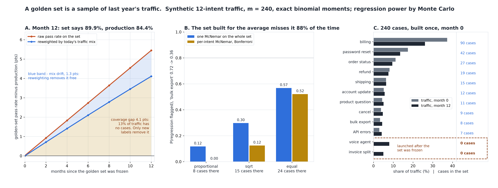

# Is Your Golden Set Still a Sample of Your Traffic?

[](https://colab.research.google.com/github/phoebefu6/phoebe-the-builder/blob/main/llmops-genai-platform/golden-set-builder/demo.ipynb)
[](https://mybinder.org/v2/gh/phoebefu6/phoebe-the-builder/main?labpath=llmops-genai-platform/golden-set-builder/demo.ipynb)

> We labelled 240 real conversations once, called it our eval set, and a year later it still said 90% while customers were getting 84%.



## The short version

A golden set is a sample of production traffic taken on one day. Its pass rate describes production
only while the set still looks like production. This build measures how it stops looking like it, and
what each fix buys.

Setup, synthetic and declared in `golden.py`: 12 intents with a long-tailed mix, 240 labelled cases,
two intents ("voice agent", "invoice split") that launch AFTER the set is frozen and reach 13% of
traffic by month 12. The model is worse on the tail and worse still on the new features.

| golden set frozen at month 0 (proportional allocation) | month 0 | month 12 |
|---|---:|---:|
| true production pass rate | 89.9% | **84.4%** |
| pass rate on the golden set | 89.9% | **89.9%** |
| error | +0.0 pts | **+5.4 pts** |

Wherever the design fixes the per-intent counts, the golden-set pass rate is a weighted sum of
independent binomials, so its bias and SD are **exact**. Simple random sampling with reweighting, and
regression power, are Monte Carlo (20,000 reps).

## What the numbers say

**Error of the headline, m = 240, bias +/- SD in points:**

| design | allocation (10 existing intents) | month 0 raw | month 12 raw | month 12 reweighted |
|---|---|---:|---:|---:|
| random | multinomial on month-0 traffic | +0.0 +/- 1.9 | +5.4 +/- 1.9 | +4.1 +/- 2.3 |
| proportional | 90 42 27 19 15 12 11 9 8 7 | +0.0 +/- 1.9 | +5.4 +/- 1.9 | +4.1 +/- 2.2 |
| sqrt | 51 35 28 24 21 19 17 16 15 14 | -2.4 +/- 2.1 | +3.0 +/- 2.1 | +4.1 +/- 2.0 |
| equal | 24 each | -5.1 +/- 2.3 | +0.4 +/- 2.3 | +4.1 +/- 2.2 |

**Catching a regression** that breaks half the passing "bulk export" cases (0.72 -> 0.36; 3.3% of traffic,
a 1.6-point production drop), with 8% of cases flaky between runs:

| design | cases in that intent | aggregate McNemar | per-intent, Bonferroni | false alarms |
|---|---:|---:|---:|---:|
| proportional | 8 | **0.12** | 0.00 | 0.022 |
| sqrt | 15 | 0.30 | 0.12 | 0.021 |
| equal | 24 | **0.57** | 0.52 | 0.024 |

The findings:

1. **Staleness has two parts, and the free fix only reaches the small one.** Reweighting per-intent pass
   rates by this month's traffic counts needs no labels and removes the **1.3 points** caused by the mix
   shifting between intents that already existed. The other **4.1 points** are the 13% of traffic in
   intents that did not exist on the day the set was built. With no cases there, no weighting can see it.
   Every design ends at exactly the same +4.1 once reweighted (a test pins this to 1e-12).
2. **Negative result: a bigger frozen set does not help.** At m = 60, 240, 960 and 2,400 the reweighted
   bias is +4.1 every time while the SD falls from 4.3 to 0.7. Ten times the labels buys a more precise
   wrong number.
3. **The refresh is small.** Label 5 cases per new intent and reweight: bias gone. Label 20 each (40
   labels, a sixth of a rebuild) and the RMSE is back to **2.16**, against 1.90 on day one. Without the
   reweighting the refresh overshoots (raw -2.6 at 40 each), so the two fixes go together.
4. **The set built to estimate the average cannot see a broken tail.** A proportional set holds 8 bulk-export
   cases and flags the halving **12%** of the time. Equal allocation holds 24 and flags it 57%, and with
   reweighting its headline is unbiased at an RMSE of 2.34 instead of 1.90. Reported raw it is 5.1 points
   low on day one. At month 12 its raw number happens to sit near the truth (+0.4) because two errors
   cancel; that is not a property to rely on.
5. **Negative result: slicing is not a detector.** Per-intent McNemar with a Bonferroni correction is
   *less* powerful than one test on the whole set here (0.52 vs 0.57 on the equal set, 0.00 vs 0.12 on
   proportional): the correction costs more than the slicing buys. Slice to diagnose after an alarm, not to
   raise it.

**Recommendation:** allocate the golden set closer to equal across intents than traffic would (sqrt is the
compromise), always report the pass rate reweighted to this period's traffic, and every month compare the
set's intent list to the traffic's. Any intent above ~2% of traffic with no cases is a gap that only new
labels fix, and 20 cases closes it.

## Calibration

- Exact bias and SD vs a raw simulation of labelling the set (2 designs x 3 cells, 20,000 reps): every bias
  within |z| 2.3 of exact, every SD within 0.8%.
- One-sided exact McNemar vs `scipy.stats.binomtest`: **0 mismatches in 224**.
- Reweighted bias at month 12 equals the analytic coverage-gap bias to 1e-12 for every design; reweighting
  is unbiased at month 0 to 1e-12.
- Tests also show the checks *can* fail: a simulation at twice the budget must not match the exact SD.
- **Engine defect caught on the first run.** Run-to-run noise was first modelled as "each outcome flips with
  probability 0.03". That lowers a re-run's pass rate (at q = 0.9 there are nine passes to flip for every
  fail), and the aggregate test flagged the *same* model **58%** of the time. Flakiness is now per case (8%
  of cases pass each run with probability 1/2, the rest are deterministic), so a re-run keeps its pass rate,
  and a test pins the false-alarm rate under 0.06. The same mistake in a real eval harness (comparing a
  new model against an old run's outcomes instead of re-running both) produces the same phantom regression.

## Business Impact
- **Before:** a golden set is curated once, grows by hand when someone remembers, and its pass rate is
  trusted as the production number. It drifts high as the product launches features the set never saw,
  and a regression in a small intent ships.
- **After:** paste the set's per-intent counts against this period's traffic. You get the raw and
  reweighted pass rate, the traffic share with no cases, the intents too thin to catch a regression, and a
  verdict: coverage gap, stale mix, thin, or representative.
- **Estimated ROI:** a 40-label monthly refresh instead of a 240-label rebuild, and a headline that is off by
  2 points instead of 5.

## Tech Stack
Python, NumPy, SciPy (`stats.binom`, `binomtest`), Matplotlib, Streamlit, pytest

## Demo

**[Run the interactive demo notebook →](demo.ipynb)**. It is pre-rendered with outputs, or use the
Colab/Binder badges above to run it live. The estimation numbers are exact, so the notebook reproduces
them to the digit; only the regression-power cells run at 4,000 reps.

```bash
pip install -r requirements.txt
python evidence.py      # ~2 seconds, writes evidence.txt + results.json
python make_chart.py    # the audit figure; fails if any label overlaps another or leaves its panel
streamlit run app.py    # paste your own golden set against this period's traffic
pytest -q               # 26 tests
```

## Learning Connection
Built while studying evaluation-set design for LLM systems (stratified sampling, post-stratification,
paired comparison of model versions).
Applies: exact moments of a stratified estimator, the difference between bias from mix drift and bias from
coverage, exact McNemar on paired outcomes, and modelling run-to-run nondeterminism without biasing the
comparison.

## Impact Note
- **Who benefits:** teams that ship an LLM feature and report one eval number, and the people who decide
  whether a model upgrade is safe
- **Potential risks:** the traffic is synthetic and the conclusions are about the mechanism, not a claim about
  any real product's numbers. Reweighting assumes intent labels on traffic are accurate; a misrouted intent
  moves weight silently. A pass rate within an intent can drift too (new phrasings inside an old intent),
  which no mix check sees - re-sample a few cases per intent periodically as well.
