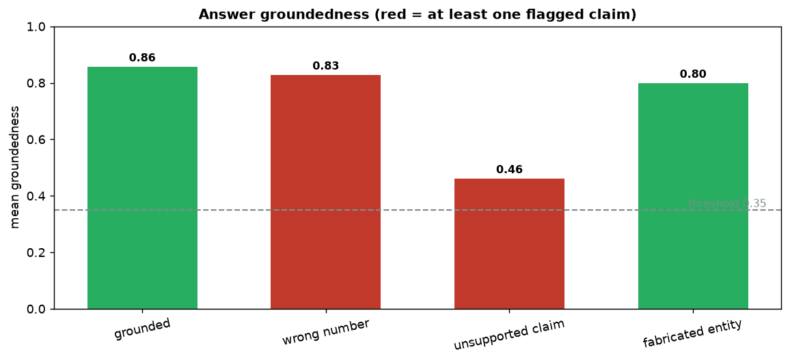

# Hallucination Detector

[](https://colab.research.google.com/github/phoebefu6/phoebe-the-builder/blob/main/llmops-genai-platform/hallucination-checker/demo.ipynb)
[](https://mybinder.org/v2/gh/phoebefu6/phoebe-the-builder/main?labpath=llmops-genai-platform/hallucination-checker/demo.ipynb)

> Flag the claims your RAG answer makes that the retrieved context never supported.

Your RAG pipeline retrieves context, the LLM writes an answer - and sometimes it states something the context never said: a wrong number, an extra "fact", a fabricated entity. This tool scores **groundedness** per claim: it splits the answer into sentence-level claims and measures how well each is supported by the source context, then flags the unsupported ones so you can block, warn, or regenerate *before* the answer reaches a user.



## Business Impact
- **Before:** hallucinations reach users; trust erodes; someone finds out the hard way.
- **After:** every answer carries a groundedness score and per-claim flags; low-scoring answers get gated or retried automatically.
- **Estimated ROI:** on the sample set it catches the wrong-number and unsupported-add-on cases automatically, before human review.

## Tech Stack
Python · Streamlit · pandas · matplotlib · standard-library `re`/`math` only (no API keys, fully offline)

## How it works
1. **Split** the answer into sentence-level claims.
2. **Score** each claim's support = blend of cosine + content-word coverage against the context.
3. **Number check** - any number in a claim must appear in the context (catches "30 days" -> "60 days").
4. **Flag** claims below the support threshold or with unsupported numbers; report an overall groundedness score.

## Honest limitation
The support signal here is **lexical**, not entailment. It reliably catches claims whose key terms/numbers are absent from the context, but it will **miss a fabrication embedded inside an otherwise-grounded sentence** (e.g. a real company description with an invented CEO name bolted on). That exact case is in the sample set and passes - which is the point: a lexical screen is a cheap first gate, not a verdict. For production, pass flagged-or-borderline answers to an **NLI model or an LLM judge**. This tool cuts that expensive second pass down to the answers that actually need it.

## Demo

**[Run the interactive demo notebook ->](demo.ipynb)** - pre-rendered with the groundedness chart, or click the Colab/Binder badges above.

Streamlit app (paste context + answer, tune the threshold):
```bash
pip install -r requirements.txt
streamlit run app.py
```

CLI (runs the sample set):
```bash
python detector.py
```

## Learning Connection
Built while studying RAG evaluation + LLM reliability patterns.
Applies: groundedness scoring, claim decomposition, and the screen-then-judge pattern that keeps hallucination checks affordable at scale.

## Impact Note
- **Who benefits:** anyone shipping RAG / grounded-answer features (support bots, doc Q&A, internal knowledge).
- **Potential risks:** a lexical screen can false-pass embedded fabrications and false-flag correct paraphrases; never treat the score as ground truth - gate borderline cases to a stronger judge and keep a human in the loop for high-stakes answers.
