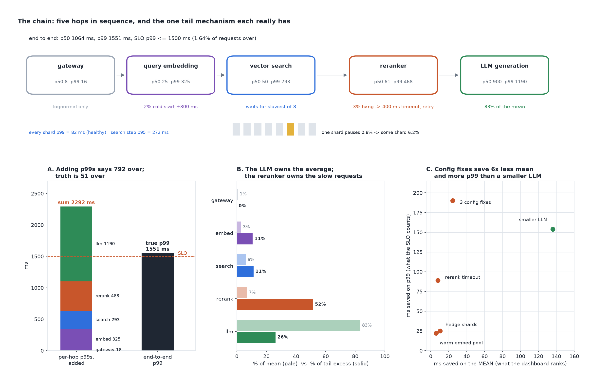

# It Is Slow and Nobody Knows Where

[](https://colab.research.google.com/github/phoebefu6/phoebe-the-builder/blob/main/llmops-genai-platform/latency-budget/demo.ipynb)
[](https://mybinder.org/v2/gh/phoebefu6/phoebe-the-builder/main?labpath=llmops-genai-platform/latency-budget/demo.ipynb)

> Every hop of the RAG chain has its own latency dashboard, and adding them up said we were 792 ms over the SLO. We were 51 ms over, the slow requests were not where the average was, and the fix the dashboard ranked first was not the one the SLO needed.



## The short version

A RAG request walks five hops in sequence: gateway, query embedding, vector search fanned out to 8 shards, reranker,
LLM generation. Each hop is declared as a lognormal body plus the one tail mechanism it really has: a 2% embedding
cold start, a 0.8% shard GC pause, a 3% reranker hang that waits out a 400 ms timeout and retries. Every
distribution lives on a 1 ms grid, so the end-to-end latency is exact:

- sequential hops convolve
- a fan-out step is the max of 8 shards, so its CDF is the shard CDF to the 8th power
- a hedged call is a min, so survival functions multiply
- a timeout-and-retry is a mixture of the body and (timeout + a fresh body)

`llm-router` and `semantic-cache` change latency. This build says where a latency budget is actually spent.

| hop | p50 | p95 | p99 | share of mean | share of tail excess |
|---|---:|---:|---:|---:|---:|
| gateway | 8 | 13 | 16 | 0.8% | 0.0% |
| embed | 25 | 40 | 325 | 2.9% | 10.7% |
| search (8 shards) | 50 | 272 | 293 | 6.0% | 11.4% |
| rerank | 61 | 111 | 468 | 6.9% | 51.6% |
| llm | 900 | 1096 | 1190 | 83.4% | 26.2% |
| **end to end** | **1064** | **1371** | **1551** | | |

## What it found

1. **Percentiles do not add.** The per-hop p99s sum to 2,292 ms; the end-to-end p99 is 1,551 ms. Against a
   1,500 ms SLO the sum says 792 ms over and the truth is 51 ms over (1.64% of requests). A request slow in the
   reranker is almost never also slow in the embedder.
2. **Every shard is healthy, the step is not.** One shard's p99 is 82 ms because its 0.8% GC pause sits above
   it. The search step waits for the slowest of 8, meets a pause on 6.2% of requests, and its p95 is 272 ms.
3. **Three blame rules name three hops.** Mean share blames the LLM (83%). The worst p99/p50 ratio blames the
   embedder (13x). Tail excess, E[hop | request slower than p99] - E[hop], computed exactly and summing to the
   tail's whole excess, blames the reranker's hang-and-retry (52%).
4. **The fix ranking flips.** A 15% smaller LLM saves 136 ms of mean and 154 ms of p99. Three config changes
   together (warm embedding pool, hedge shard calls at 80 ms, rerank timeout 400 to 120 ms) save 24 ms of mean
   and 190 ms of p99. A mean dashboard ranks the LLM 5.6x better. The SLO wants the config changes: 0.07% of
   requests over vs 0.33%, with no model change.
5. **Negative result.** No single config fix beats the smaller LLM on p99. The best, the reranker timeout,
   gets 89 ms. The win needs all three, because each owns a different slice of the tail.

Calibration: 18 of 18 exact tail probabilities sit inside the 99% Wilson interval of 200,000 simulated requests
(seed 194), across the base chain and every fix. Full output in [evidence.txt](evidence.txt).

## Business Impact
- **Before:** a latency review reads per-hop dashboards, adds p99s, blames the biggest bar and funds a model change.
- **After:** the end-to-end distribution is computed from the hops, the tail is attributed exactly, and each fix
  is priced on the p99 and the share of requests over the SLO.
- **Estimated ROI:** a quarter of engineering steered to the fix that moves the SLO, without the quality risk of
  a smaller model.

## Tech Stack
Python, NumPy (exact convolution on a 1 ms grid), Matplotlib, Streamlit, pytest, Docker.

## Demo

**[Run the interactive demo notebook →](demo.ipynb)** - pre-rendered with outputs, or click the Colab/Binder badges above to run it live.

For the Streamlit app (override any hop parameter, set your SLO):
```bash
pip install -r requirements.txt
python evidence.py && python make_chart.py
streamlit run app.py
```

## Files
- `latency.py` - the engine: hop distributions, chain, percentiles, tail attribution, fixes, simulation
- `evidence.py` - runs the study, writes `results.json` and `evidence.txt`
- `make_chart.py` - the audit figure, with a geometry self-check before saving
- `build_notebook.py` - generates `demo.ipynb` with the engine extracted from `latency.py`
- `test_latency.py`, `test_notebook.py`, `test_app.py` - 26 tests

## Learning Connection
Built while studying site reliability engineering for LLM serving (Google SRE book, "The Tail at Scale" by Dean
and Barroso). Applies: latency distributions as objects rather than summary numbers, fan-out amplification,
hedged requests, and exact tail attribution.

## Impact Note
- **Who benefits:** platform and ML engineers running multi-hop LLM services against a latency SLO.
- **Potential risks:** the hops are declared independent. Correlated slowness, for example a shared overloaded
  node, makes the sum of p99s less wrong and the tail attribution less clean. Measure the correlation on real
  traces before trusting the attribution on your system.
