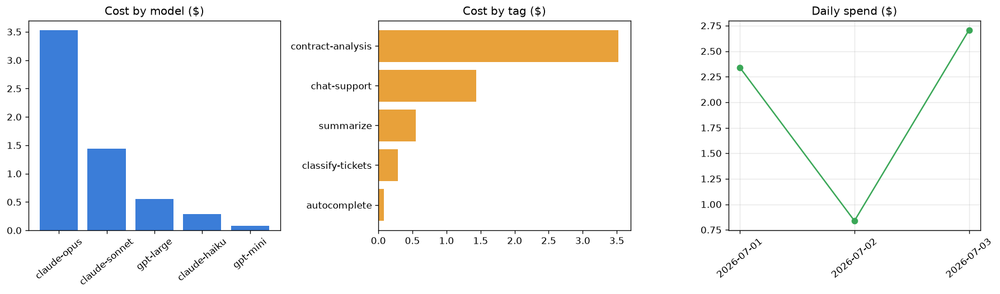

# LLM Cost & Token Tracker

[](https://colab.research.google.com/github/phoebefu6/phoebe-the-builder/blob/main/llmops-genai-platform/llm-cost-tracker/demo.ipynb)
[](https://mybinder.org/v2/gh/phoebefu6/phoebe-the-builder/main?labpath=llmops-genai-platform/llm-cost-tracker/demo.ipynb)

> No more surprise API bills - log every call, roll spend up, watch the budget.

Surprise API bills happen because token usage is invisible until the invoice lands. This tracker logs every call (model, prompt/completion tokens, cost, tag), estimates tokens offline when a provider count isn't handy, and rolls usage up by model, tag, and day - with a monthly budget check.



## Business Impact
- **Before:** token spend is invisible until the monthly invoice; no one knows which feature is expensive.
- **After:** per-call logging + rollups by model / tag / day, plus a running budget %; the biggest line item is obvious.
- **Estimated ROI:** turns billing from a monthly surprise into a daily signal, and pinpoints exactly where to cut.

## Tech Stack
Python · Streamlit · pandas · matplotlib · an editable in-code pricing table (no network calls, fully offline)

## Key insight
The cheapest per-call model is rarely the biggest line item. In the sample traffic, 22 premium-model calls cost more than 500 cheap-model calls - so you optimize **total spend by tag**, not sticker price. Output tokens also cost 3-5x input, so trimming verbose completions usually beats shrinking prompts.

## Demo

**[Run the interactive demo notebook →](demo.ipynb)** - pre-rendered with the cost-breakdown charts, or click the Colab/Binder badges above.

Streamlit app (dashboards + a single-call cost estimator):
```bash
pip install -r requirements.txt
streamlit run app.py
```

CLI:
```bash
python tracker.py
```

## Learning Connection
Built while studying LLMOps cost control and observability.
Applies: token accounting, cost attribution by tag, budget tracking, and offline token estimation. Pairs with **Day 86 - Semantic Response Cache** and **Day 90 - LLM Model Router** (the two biggest cost levers).

## Impact Note
- **Who benefits:** any team running LLM calls at volume without cost visibility.
- **Potential risks:** the bundled rates are **example values** - edit `PRICING` in `tracker.py` to your actual contract before trusting the dollar figures; token estimation is approximate, so prefer provider-reported counts when available.
