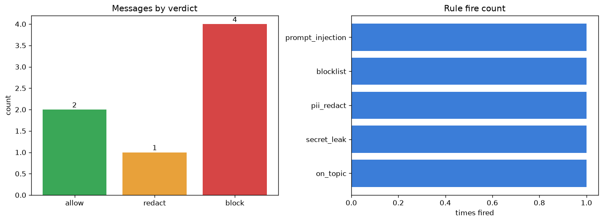

# LLM Guardrail Filter

[](https://colab.research.google.com/github/phoebefu6/phoebe-the-builder/blob/main/llmops-genai-platform/llm-guardrails/demo.ipynb)
[](https://mybinder.org/v2/gh/phoebefu6/phoebe-the-builder/main?labpath=llmops-genai-platform/llm-guardrails/demo.ipynb)

> Model outputs unsafe / off-topic text? Put cheap deterministic checks around it.

An LLM will happily ingest a prompt-injection attempt or emit PII, secrets, or off-topic text. Guardrails run *around* the model - on the way **in** (before you spend tokens) and on the way **out** (before the user sees it). This is a small, dependency-free rule engine: each rule returns **ALLOW**, **REDACT**, or **BLOCK** with a reason, and the engine reports the strongest action that fired.



## Business Impact
- **Before:** unsafe outputs and injection attempts reach users (or the model) with no gate; incidents are found after the fact.
- **After:** a deterministic filter blocks injection at the input and redacts PII / blocks secrets, toxicity, and off-topic replies at the output - a blocked input costs zero tokens.
- **Estimated ROI:** removes the highest-frequency LLM safety failures without a model call or retraining.

## Tech Stack
Python · Streamlit · pandas · matplotlib · regex + keyword rule engine (no API keys, fully offline)

## Rules shipped
**Input:** `max_length`, `prompt_injection`, `blocklist`
**Output:** `secret_leak` (block), `pii_redact` (redact email/phone/SSN), `toxicity`, `on_topic`

Add your own by appending a rule to the engine list - see the "Try your own" cell in the notebook.

## Demo

**[Run the interactive demo notebook →](demo.ipynb)** - pre-rendered with outputs and the verdict chart, or click the Colab/Binder badges above.

Streamlit app (paste text, pick direction, see every rule that fired):
```bash
pip install -r requirements.txt
streamlit run app.py
```

CLI:
```bash
python guardrails.py
```

## Learning Connection
Built while studying LLM safety, prompt injection, and output moderation.
Applies: layered input/output guardrails, REDACT-vs-BLOCK design, and running cheap deterministic checks around an expensive model call. Pairs with **Day 87 - Structured Output Enforcer** and **Day 88 - Hallucination Detector**.

## Impact Note
- **Who benefits:** anyone shipping an LLM feature to real users.
- **Potential risks:** keyword/regex rules catch known patterns, not everything - treat this as a fast first layer, not a complete safety system, and pair it with model-level moderation for adversarial inputs.
