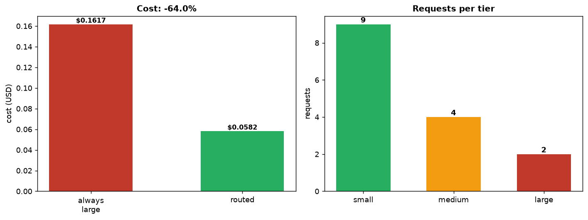

# LLM Model Router

[](https://colab.research.google.com/github/phoebefu6/phoebe-the-builder/blob/main/llmops-genai-platform/llm-router/demo.ipynb)
[](https://mybinder.org/v2/gh/phoebefu6/phoebe-the-builder/main?labpath=llmops-genai-platform/llm-router/demo.ipynb)

> Stop paying frontier-model prices for "what's the capital of France?"

Sending every request to your biggest model is simple and expensive. Most production traffic is easy - short classifications, extractions, formatting - and a small, cheap model handles it fine. Only a minority genuinely needs the frontier model. This router scores each request's complexity from cheap, transparent signals (length, reasoning/code cues, output-structure needs) and sends it to the **smallest tier that clears the bar**, then reports the cost saved versus always-large routing.



## Business Impact
- **Before:** one model (the expensive one) serves all traffic; the bill scales with volume, not difficulty.
- **After:** easy requests go to a cheap tier, hard ones to the frontier model; spend tracks actual complexity.
- **Measured (sample traffic):** routing 15 mixed requests instead of always-large cuts cost by **~64%** (9 small / 4 medium / 2 large).

## Tech Stack
Python · Streamlit · pandas · matplotlib · standard-library `re` only (no API keys, fully offline)

## How it works
1. **Score** each request 0-1 from signals: input length, reasoning/analysis cues, code/technical content, structured-output needs, multi-question, and simple-task cues (which *lower* the score).
2. **Route** to the smallest tier whose ceiling the score clears (`small ≤ 0.34`, `medium ≤ 0.67`, else `large`).
3. **Explain** every decision - the router returns *why* it picked a tier so you can trust and tune it.
4. **Cost** each request on its tier vs the large tier and sum the savings.

Prices in `TIERS` are illustrative per-1M-token rates (Haiku/Sonnet/Opus-class); edit them for your providers and set thresholds to your own quality bar.

## Demo

**[Run the interactive demo notebook ->](demo.ipynb)** - pre-rendered with the routing + cost chart, or click the Colab/Binder badges above.

Streamlit app (route a stream + test any single request):
```bash
pip install -r requirements.txt
streamlit run app.py
```

CLI (routes the sample traffic):
```bash
python router.py
```

## Learning Connection
Built while studying LLMOps cost control + model cascades / routing.
Applies: complexity-based routing, model cascades, transparent rule scoring, and cost accounting - the levers that keep a GenAI feature's unit economics sane at volume.

## Impact Note
- **Who benefits:** anyone running LLM traffic at volume with a mix of easy and hard requests.
- **Potential risks:** an under-routed hard request lands on a too-weak model and quietly degrades quality; keep the thresholds conservative, log routes, and sample outputs for quality - saving money is only a win if the small tier actually clears your bar. This heuristic router is a starting point; a learned router or a confidence-based cascade (escalate on low confidence) is the next step.
