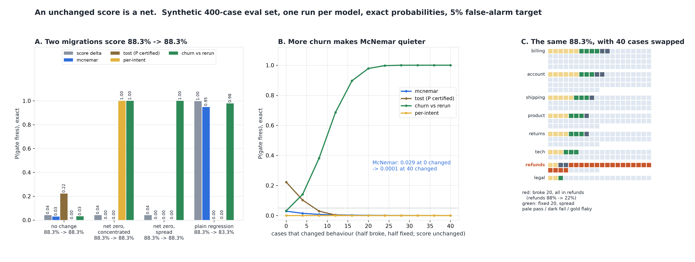

# The Score Didn't Move. What Did?

[](https://colab.research.google.com/github/phoebefu6/phoebe-the-builder/blob/main/llmops-genai-platform/model-migration-diff/demo.ipynb)
[](https://mybinder.org/v2/gh/phoebefu6/phoebe-the-builder/main?labpath=llmops-genai-platform/model-migration-diff/demo.ipynb)

> We upgraded the model, the eval score didn't move, so we shipped it - and the refunds team said it had stopped working.



## The short version

A model migration is usually judged by one number: the eval score under the old model against the new one.
That number is a **net**. It is the cases the new model fixed minus the cases it broke. Their **sum**, the
churn, is what users actually notice. This build computes, exactly, which comparisons can see the churn: the
joint distribution of (broke, fixed) over a declared eval set is a 2D convolution over cases, and every gate
is a sum over that table.

Eval set, synthetic and declared in `migrate.py`: 400 cases in 8 intents (billing 80 ... legal 20), 339 stable
pass, 29 stable fail, 32 flaky (pass probability ~ Beta(2, 2)). One run per model.

| migration | score | cases changed | score delta | McNemar | TOST certifies | per-intent | **churn vs rerun** |
|---|---|---:|---:|---:|---:|---:|---:|
| no change | 88.3% -> 88.3% | 0 | 0.041 | 0.029 | 0.222 | 0.000 | 0.032 |
| net zero, concentrated (20 refunds cases broke) | 88.3% -> 88.3% | 40 | 0.041 | 0.000 | 0.000 | **1.000** | **1.000** |
| net zero, spread | 88.3% -> 88.3% | 40 | 0.041 | 0.000 | 0.000 | 0.000 | **1.000** |
| plain regression (20 broke, spread) | 88.3% -> 83.3% | 20 | 0.997 | 0.949 | 0.000 | 0.002 | 0.978 |

## What the numbers say

1. **Two very different migrations post the identical 88.3%.** In one of them refunds goes from 88% to 22%.
   A score-delta gate fires 4.1% of the time on both, which is exactly its rate when nothing changed.
2. **McNemar gets quieter as churn grows.** It is a test of *net* change, broke against fixed. On a net-zero
   swap of 40 cases it fires 0.0001 of the time, which is lower than its 0.029 on no change at all. More
   churn, balanced, makes a balanced split more likely, not less.
3. **Run the old model twice.** Given A, the new model B and a rerun A' are exchangeable when nothing
   changed. So among cases where B and A' disagree, "B is the odd one out" is Binom(m, 1/2): an exact sign
   test with no noise model. It catches both net-zero swaps every time at a 3.2% false-alarm rate, for 1.5x
   the calls. Power is 0.38 at 8 changed cases and 0.98 at 20 (5% of the set).
4. **TOST is not fooled, but it is not informative either.** The paired variance *is* churn / N, so churn
   widens the interval and equivalence is never certified. But on 400 cases TOST certifies an unchanged
   model only 22% of the time, so "not certified" is the normal outcome.
5. **Negative result: slicing by intent does not detect a spread regression.** Per-intent McNemar with
   Bonferroni finds the concentrated swap (1.000) but catches the plain spread regression 0.2% of the time.
   The whole-set test catches that same regression 94.9% of the time. Each intent sees 2-3 breaks, and an
   exact test at 0.05/8 needs about 8. Slice to diagnose, not to detect. This is the same finding as
   [`golden-set-builder`](../golden-set-builder), from the other side.

**Recommendation:** before a model swap, run the old model on the eval set twice and the new one once. Report
the score, then broke and fixed separately, then the churn sign test, then a per-intent table. Read every
flipped case in any intent the table flags. "Score unchanged" is not evidence of "behaviour unchanged".

## Calibration

- 2D convolution against `scipy.stats.binom` where the margin has a closed form: max gap **2.9e-16**.
- Exact gate rates against raw simulated runs (5 gates x 4 migrations, 20,000 reps each): all 20 inside their
  99% Wilson interval (see `evidence.txt`).
- The McNemar table is checked against `scipy.stats.binomtest`. A test shows the simulation check *can* fail: a
  6-case swap must land outside the no-change interval.

## Business Impact
- **Before:** a model upgrade ships on "the score held". The intents that broke get discovered by the teams
  who own them, weeks later.
- **After:** paste `intent,A,B,A_rerun` per case. You get broke and fixed separately, a per-intent table with an
  exact test, and the churn compared with the old model's own noise. The verdict is one of: hidden regression
  in a named intent, score moved, behaviour changed while the score did not, or no detectable change.
- **Estimated ROI:** one extra eval run of the old model per migration, against a silent regression in a
  low-volume intent.

## Tech Stack
Python, NumPy, SciPy (exact 2D convolution, `binom`, exact McNemar and sign tests), Matplotlib, Streamlit, pytest

## Demo

**[Run the interactive demo notebook →](demo.ipynb)**. It is pre-rendered with outputs, or use the
Colab/Binder badges above to run it live. Every gate number is exact, and the notebook reproduces them to the
digit.

```bash
pip install -r requirements.txt
python evidence.py      # ~10 seconds, writes evidence.txt + results.json
python make_chart.py    # the audit figure; fails if any label overlaps another or leaves its panel
streamlit run app.py    # paste your own per-case results
pytest -q               # 22 tests
```

## Learning Connection
Built while studying behavioural regression testing for LLM upgrades (paired tests, equivalence testing,
eval slicing). Applies: net versus gross change, McNemar as a test of marginal homogeneity only,
exchangeability as a noise model that needs no parameters, and the power cost of Bonferroni slicing.

## Impact Note
- **Who benefits:** teams migrating between model versions or providers, and the owners of low-volume intents
  that an aggregate hides
- **Potential risks:** the eval set and migrations are synthetic. The sign test assumes runs are independent,
  and cached or seeded responses make A and A' identical, which turns any churn into a false alarm. It flags
  behaviour change, not regression: a migration that only fixes cases also fires it. The per-intent table is
  only as good as the intent labels.
