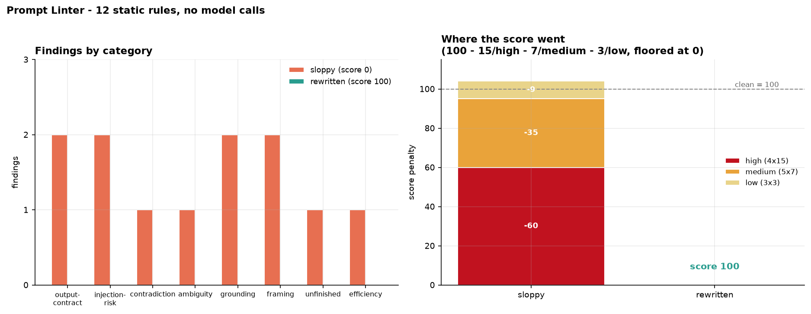

# Prompt Linter

[](https://colab.research.google.com/github/phoebefu6/phoebe-the-builder/blob/main/llmops-genai-platform/prompt-linter/demo.ipynb)
[](https://mybinder.org/v2/gh/phoebefu6/phoebe-the-builder/main?labpath=llmops-genai-platform/prompt-linter/demo.ipynb)

> Prompts are the only part of an LLM system that ships with no review gate.

Code gets linted. SQL gets reviewed. Migrations get a rollback plan. Prompts get pasted into a string literal and shipped. This tool applies **12 static rules** to prompt text - ambiguity, contradictions, missing output contract, injection risk, unfilled TODOs - and returns a severity, the offending snippet, and a concrete fix for each. Then it gates on the result, so a sloppy prompt fails CI instead of failing in production.

No model calls, no tokenizer, no network. That is deliberate: a linter that costs money per run never gets wired into CI.



## Business Impact
- **Before:** prompt quality is whatever the author remembered that day. Nobody reviews the diff, so a missing output contract or an unguarded interpolation slot reaches production and gets debugged later as "the model is flaky."
- **After:** every prompt change gets a score, a severity breakdown, and a pass/fail verdict in CI - with the fix named, not just the problem.
- **Estimated ROI:** on the sample prompt, 12 failure modes caught in one pass for the cost of 464 characters. The injection rule alone (PL004) is the difference between untrusted text being *data* and being *instructions*.

## Tech Stack
Python · Streamlit · pandas · matplotlib · regex-based static analysis (fully offline, model-free)

## Key insight
**Brevity is not a virtue when the missing words are the contract.** The rewritten prompt is 464 characters *longer* than the sloppy one and removes all 12 findings. What those characters buy: an enumerated output format, a real data boundary, boundary-case examples, a length cap, and a named fallback for the unanswerable case.

**The rule worth stealing first is PL004** - and it's the one that taught me the actual lesson here. My first version checked for known delimiter tag names (`<document`, `<context`, `<input`), and it flagged a perfectly well-delimited prompt as a vulnerability because that prompt used `<ticket>`. Blessed-name lists always lose to the next domain. The working version is structural: find every **matched** tag pair, fence, or triple-quoted block, record their character ranges, and flag only the slots outside all of them. `<ticket>` passes, `<email>` passes, and an *unclosed* `<doc>` correctly still fails - because the regex backreference never matches. That's also precisely why hand-review misses this class of bug: it needs parsing, not reading.

## The 12 rules

| Rule | Severity | Category | Catches |
|---|---|---|---|
| PL001 | 🔴 high | output-contract | No output format - response shape left to the model |
| PL002 | 🟠 medium | ambiguity | Undecidable wording ("a few", "appropriate", "as needed") |
| PL003 | 🔴 high | contradiction | Instructions that cannot both be satisfied ("brief" + "comprehensive") |
| PL004 | 🔴 high | injection-risk | Interpolated input with no data boundary |
| PL005 | 🟠 medium | injection-risk | Delimiters present but no data-not-instructions guard |
| PL006 | 🔴 high | unfinished | TODO / FIXME / placeholder left in the prompt |
| PL007 | 🟡 low | framing | No role or task framing up front |
| PL008 | 🟠 medium | framing | Mostly prohibitions, no positive instruction |
| PL009 | 🟡 low | output-contract | No length bound - cost and latency vary per call |
| PL010 | 🟠 medium | grounding | Classification/extraction task with no examples |
| PL011 | 🟠 medium | grounding | No fallback for the unanswerable case → invention |
| PL012 | 🟡 low | efficiency | Politeness padding billed on every call |

Scoring: `100 - 15×high - 7×medium - 3×low`, floored at 0. Grades A-F.

**Edge case handled:** an empty or whitespace-only prompt would otherwise trip ten rules at once and report a misleading pile of findings. `lint()` short-circuits to a single honest one (`PL000: Prompt is empty`).

## Results on the bundled samples

| | Sloppy | Rewritten |
|---|---|---|
| Score | **0**/100 (F) | **100**/100 (A) |
| Findings | 12 (4 high, 5 medium, 3 low) | 0 |
| CI gate | FAIL | PASS |

## Demo

**[Run the interactive demo notebook →](demo.ipynb)** - pre-rendered with all findings and charts, or click the Colab/Binder badges above.

Streamlit app (paste a prompt, get findings with fixes, tune the gate thresholds):
```bash
pip install -r requirements.txt
streamlit run app.py
```

CLI (lints the bundled sloppy vs clean prompts and shows the gate verdict):
```bash
python lint.py
```

Wire it into CI:
```bash
python -c "import sys; from lint import gate; sys.exit(0 if gate(open('prompts/classify.txt').read())['passed'] else 1)"
```

## Learning Connection
Built while studying prompt engineering discipline and LLMOps quality gates.
Applies: static analysis design, rule severity weighting, structural (not keyword) pattern matching, and CI gate design.

Companions in this product line:
- **Day 81** [`prompt-registry`](../prompt-registry) - version the prompt this lints
- **Day 84** [`llm-guardrails`](../llm-guardrails) - runtime filtering, after this passes
- **Day 125** [`token-cost-estimator`](../token-cost-estimator) - what PL012's padding actually costs at volume

## Impact Note
- **Who benefits:** anyone shipping prompts to production without a review step; teams whose LLM output is "mysteriously inconsistent."
- **Potential risks:** this is a linter, not a judge - it checks whether a prompt *states* its contract, not whether the contract is the right one. A 100/100 prompt can still be wrong about the task. PL004 catches the missing-delimiter pattern, but delimiters are mitigation, not immunity: pair it with runtime input filtering (Day 84) and never treat a lint pass as a security sign-off. Rules are heuristics tuned on English prompts; expect to add domain terms to `VAGUE_TERMS` and `CONFLICT_PAIRS`.
