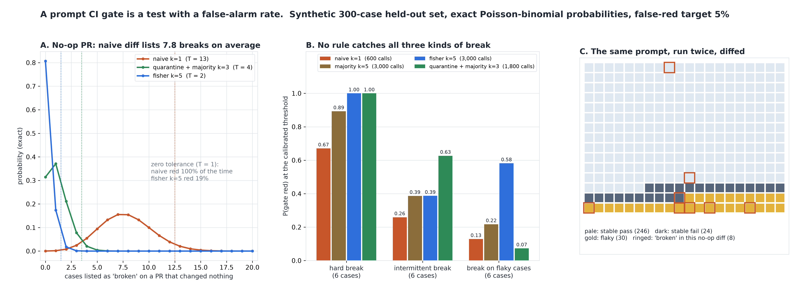

# Did the Prompt Change Break Something, or Is That the Noise?

[](https://colab.research.google.com/github/phoebefu6/phoebe-the-builder/blob/main/llmops-genai-platform/prompt-regression-ci/demo.ipynb)
[](https://mybinder.org/v2/gh/phoebefu6/phoebe-the-builder/main?labpath=llmops-genai-platform/prompt-regression-ci/demo.ipynb)

> Our prompt CI said eight cases broke on a change that fixed a typo, so we stopped reading it - and then a real regression shipped.



## The short version

A prompt PR runs a held-out set under the old and new prompt and posts a behavioural diff: the cases
that passed before and fail now. An LLM does not return the same answer twice, so that list is never
empty. This build treats the gate as what it is, a statistical test, and computes its false-alarm rate
and power **exactly**: each case's chance of being listed is a sum of binomial pmf products, and the
number listed is a Poisson-binomial, convolved exactly.

Held-out set, synthetic and declared in `gate.py`: 300 cases, 246 stable pass (a stable case still
fails 1 run in 200), 24 stable fail, 30 flaky with per-run pass probability drawn from Beta(2, 2). A
real side effect breaks 6 cases.

| a PR that changed NOTHING, one run per prompt | |
|---|---:|
| cases the diff lists as broken, on average | **7.8** |
| P(gate red) with "zero regressions allowed" | **100%** |
| threshold needed to keep false reds under 5% | 13 cases |
| months (40 PRs) with at least one false red, even at that threshold | 78% |

## What the numbers say

**A no-op PR**, and each rule at the threshold T that holds its false-red rate at or under 5%:

| rule | calls / PR | phantom breaks | red at T = 1 | T | red at T |
|---|---:|---:|---:|---:|---:|
| naive k=1 | 600 | 7.79 | 1.000 | 13 | 0.037 |
| majority k=3 | 1,800 | 5.57 | 0.998 | 10 | 0.038 |
| majority k=5 | 3,000 | 4.90 | 0.996 | 9 | 0.042 |
| Fisher exact, k=5 | 3,000 | 0.21 | 0.193 | 2 | 0.019 |
| quarantine + naive k=1 | 600 | 2.71 | 0.936 | 7 | 0.019 |
| quarantine + majority k=3 | 1,800 | 1.14 | 0.686 | 4 | 0.026 |

**P(red) on a real 6-case break**, each rule at its calibrated T (diff-report precision in brackets):

| rule | hard break (pass -> fail) | intermittent (pass -> 50%) | hard break on flaky cases |
|---|---:|---:|---:|
| naive k=1 | 0.67 (43%) | 0.26 (28%) | 0.13 |
| majority k=5 | 0.89 (55%) | 0.39 (38%) | 0.22 |
| Fisher exact, k=5 | **1.00 (97%)** | 0.39 (84%) | **0.58** |
| quarantine + majority k=3 | **1.00 (84%)** | **0.63 (72%)** | 0.07 |

The findings:

1. **"Zero regressions allowed" is a gate that is always red.** The one-run diff lists 7.8 broken cases on a
   no-op PR. About 6.5 of them come from the 30 flaky cases, but the 270 stable ones still add 1.3, so even a
   set with no flaky cases would go red most of the time on one run.
2. **The diff report is mostly noise even when something did break.** On a real hard break of 6 cases the
   naive list averages 13.7 cases, of which 43% are real. Re-running helps slowly: majority-of-5 costs 5x the
   calls and reaches 55%.
3. **No rule catches all three kinds of break.** Fisher on 5 runs each is near-perfect on hard breaks (1.00,
   97% precise) but catches only 0.18 of the cases that turned intermittent, because 5/5 against 2/5 has
   p = 0.083. Majority-of-k has the opposite profile. Pick the rule for the failure you most fear, and report
   which rule you picked.
4. **Negative result: quarantine buys a quiet gate by going blind.** Quarantining every case whose 4 baseline
   runs disagree cuts phantom breaks from 5.6 to 1.1 and lifts power on stable breaks to 1.00, but a break
   among the quarantined cases is caught **7%** of the time (18% without quarantine). The gate is quiet
   because it has stopped testing 28 of the 300 cases.
5. **Side result: Fisher cannot fire at k = 3.** The most extreme one-sided table, 3/3 vs 0/3, has p = 0.05
   exactly, not below. A gate configured "Fisher, 3 runs" is silently a gate that never goes red.

**Recommendation:** never gate on "any case broke". Run k >= 3 (k >= 4 for Fisher), calibrate the threshold on
no-op PRs (re-run the baseline against itself), post the noise floor next to the diff, and if you quarantine
flaky cases, give them their own lane with more runs rather than dropping them.

## Calibration

- Poisson-binomial convolution vs `scipy.stats.binom` on 50 equal cases: max gap **1.5e-16**.
- Exact red rate vs raw simulated runs (all 6 rules x no-op and intermittent break, 20,000 reps each): see
  `evidence.txt`; each lands inside its 99% Wilson interval.
- Fisher reject table checked cell by cell against `scipy.stats.fisher_exact`; naive flag probability equals
  the closed form pi(1 - pi).
- Tests also show the checks *can* fail: simulating a hard break must land outside the no-op's exact interval.

## Business Impact
- **Before:** a prompt PR's CI posts a list of "broken" cases, is red on almost every PR, and gets merged over
  anyway. The real regression looks exactly like the noise.
- **After:** paste baseline and candidate results (k runs each). You get the naive diff, the majority and
  Fisher lists, the flaky cases, the expected noise floor at these pass rates, and a verdict: real break,
  noise, one run is not enough, or clean.
- **Estimated ROI:** a CI signal people read again, and threshold choices made from a false-red rate instead of
  from how annoying last week's red build was.

## Tech Stack
Python, NumPy, SciPy (`stats.binom`, `fisher_exact`, exact Poisson-binomial by convolution), Matplotlib,
Streamlit, pytest

## Demo

**[Run the interactive demo notebook →](demo.ipynb)**. It is pre-rendered with outputs, or use the
Colab/Binder badges above to run it live. Every gate number is exact, so the notebook reproduces them to the
digit; only its calibration simulation runs at 4,000 reps.

```bash
pip install -r requirements.txt
python evidence.py      # ~2 seconds, writes evidence.txt + results.json
python make_chart.py    # the audit figure; fails if any label overlaps another or leaves its panel
streamlit run app.py    # paste your own baseline and candidate runs
pytest -q               # 22 tests
```

## Learning Connection
Built while studying CI for LLM applications (behavioural regression testing, flaky-test management).
Applies: a gate as a hypothesis test with a size and a power, the Poisson-binomial distribution, exact
per-case tests on repeated runs, and the cost of quarantine as a loss of coverage.

## Impact Note
- **Who benefits:** teams shipping prompt changes through CI, and reviewers deciding whether a red build is real
- **Potential risks:** the held-out set is synthetic; real flakiness depends on temperature, provider and grader.
  Runs are assumed independent - cached or seeded responses make repeated runs identical and hide flakiness
  entirely. The noise floor in the app is estimated from your own baseline runs, so it is only as good as k.
