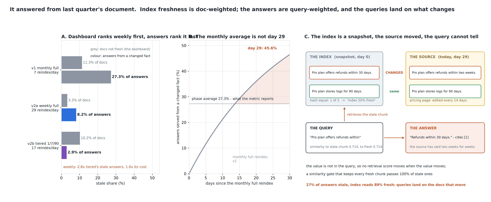

# It Answered From Last Quarter's Document

[](https://colab.research.google.com/github/phoebefu6/phoebe-the-builder/blob/main/llmops-genai-platform/rag-staleness/demo.ipynb)
[](https://mybinder.org/v2/gh/phoebefu6/phoebe-the-builder/main?labpath=llmops-genai-platform/rag-staleness/demo.ipynb)

> The dashboard said the index was 89% fresh, and 27% of the answers it served quoted a fact the source had already changed.



## The short version

A RAG index is a snapshot. The source documents keep changing, and a reindex policy decides how long a stale
chunk is served. Freshness monitors (`data-freshness-monitor`, Day 4) ask whether a *table* is late. This build
asks what the user receives: the share of served answers whose chunk carries a fact that has since changed. It
is a different weighting of a different quantity, and the two move in opposite directions:

- a declared corpus of three document classes: **hot** (10 pricing/limits/policy pages, edited every 14 days,
  60% of edits change a fact, 50% of answers), **warm** (40 guides, every 45 days, 50%, 35% of answers),
  **cold** (150 archive/legal pages, yearly, 30%, 15% of answers)
- edits arrive as a Poisson process; a document reindexed every T days is served at a uniform phase, so
  `stale(mu, T) = 1 - (1 - e^(-mu T)) / (mu T)` with mu the fact-bearing edit rate - closed form, checked by a
  raw simulation
- three numbers per policy: **hash freshness** (doc-weighted, any edit - the dashboard), **fact freshness**
  (doc-weighted, fact edits), **answer staleness** (query-weighted, fact edits - the user)

| policy | index freshness (hash) | fact freshness | answers stale | reindex / day |
|---|---:|---:|---:|---:|
| v1 monthly full | 88.7% | 93.9% | **27.3%** | 6.7 |
| v2a weekly full | **96.7%** | 98.3% | 8.2% | 28.6 |
| v2b tiered 1 / 7 / 90 days | 89.8% | 96.4% | **2.9%** | 17.4 |

## What the numbers say

1. **Three numbers, none of them the same.** Under monthly reindexing 11% of documents have changed bytes, 6%
   have changed facts, and 27% of answers carry one. The queries land on the 5% of documents that move: a hot
   document reindexed monthly serves a changed fact 44% of the time, and it answers half the questions.
2. **The dashboard ranks the fixes in the wrong order.** Weekly full reindexing moves index freshness +8.1 points
   and answer staleness -19.1. The tiered schedule (hot daily, warm weekly, cold quarterly) moves index freshness
   +1.2 points and answer staleness -24.4. Sorted by the dashboard, weekly wins. Sorted by what the user
   receives, tiered serves 2.8x fewer stale answers at 0.6x the reindex cost. The dashboard's number barely sees
   the tiered fix because it reindexes few documents; it rewards the weekly fix for re-reading 150 archive pages
   that nobody asked about.
3. **The monthly number is not any day's number.** Answer staleness is 2.5% on day 1 of the cycle and 45.6% on
   day 29; the phase average the metric reports is 27.3%. The user who asks the day before the reindex is served
   a stale answer nearly half the time.
4. **Adding documents improves the metric and changes no answer.** 1,000 archive documents with zero query share
   raise index freshness from 88.7% to 94.8%. Answer staleness stays at 27.3% exactly. An audit that samples
   documents uniformly is an unbiased estimate of the dashboard's number (6.1%); only a sample drawn from the
   query log estimates the user's (27.3%).
5. **Negative result: retrieval similarity cannot see staleness.** The query names the attribute ("Pro plan
   offers refunds within") and never the value. The stale chunk and the fresh chunk differ only in the value, so
   their similarity to the query is identical on all 12 declared facts (max gap 0.000). A confidence gate that
   keeps every fresh chunk passes 100% of stale ones. The confidently out-of-date answer is confident by
   construction.

**Recommendation:** report answer staleness, not index freshness - weight each document's stale probability by
its share of served answers, which the query log already gives you. Set reindex periods per class from the edit
rate and the query share, not one period for the corpus. Audit by sampling the query log, not the index. And do
not expect the retriever's score to flag it: the fix is a fresher chunk, not a threshold.

## Calibration

- Closed form against raw simulation (2 policies x 7 quantities, 200,000 reps per cell): **14 of 14** inside
  their 99% Wilson interval at seed 191. All of it is in `evidence.txt`.
- A test shows the simulation check *can* fail: the tiered policy's simulated answer staleness must land outside
  v1's exact value.
- A numeric integration of `1 - e^(-mu t)` over the phase reproduces the closed form to 1e-6 at three (mu, T) pairs.
- **Defect caught during the build:** `1 - (1 - e^(-x)) / x` cancels catastrophically as x -> 0, so a cold
  document on a daily schedule was computed with no correct digits; `expm1` keeps them, and a test holds the
  series `x/2 - x^2/6` at x down to 1e-10.

## Business Impact
- **Before:** the RAG dashboard reports index freshness. It goes up when the archive is reindexed and when more
  documents are added. It ranks a cheaper, better reindex schedule below a dearer, worse one.
- **After:** describe your document classes and up to three reindex policies. You get the dashboard's number,
  the fact-level number and the user's number for each, the reindex cost, and a banner when the dashboard
  ranks the policies in the opposite order from the answers.
- **Estimated ROI:** one eval column (answer staleness) in place of one that cannot rank the fixes, and a
  reindex schedule that serves 2.8x fewer stale answers for 60% of the compute.

## Tech Stack
Python, NumPy (raw simulation), Matplotlib, Streamlit, pytest

## Demo

**[Run the interactive demo notebook →](demo.ipynb)**. It is pre-rendered with outputs, or use the
Colab/Binder badges above to run it live. Every policy number is closed-form, and the notebook reproduces them
to the digit.

```bash
pip install -r requirements.txt
python evidence.py      # <2 seconds, writes evidence.txt + results.json
python make_chart.py    # the audit figure; fails if any label overlaps another or leaves its panel
streamlit run app.py    # your own classes and policies
pytest -q               # 28 tests
```

## Learning Connection
Built while studying RAG freshness and incremental indexing (change-data-capture into vector stores, per-source
refresh schedules, the renewal-process view of a cache). Applies: the inspection paradox for a periodically
refreshed snapshot, doc-weighted vs query-weighted averages, and why a metric a team can move by adding
documents is not a metric about answers.

## Impact Note
- **Who benefits:** teams running a RAG index over documents that change, and the owners of the dashboard
  that reports index freshness as if it were answer freshness
- **Potential risks:** the corpus, the edit rates, the fact-bearing shares and the query shares are declared, and
  every number depends on them; real edit processes are burstier than Poisson (a pricing change lands with a
  release, not at random), which makes the within-cycle picture worse, not better. The similarity result holds
  for lexical similarity on templates where the query carries no value; an embedding model may move a little,
  and the direction is not guaranteed.

Sibling builds: [`data-freshness-monitor`](../../data-infra-toolkit/data-freshness-monitor) (is the table
late - a different quantity), [`citation-verifier`](../citation-verifier) (the previous day: a metric that rose
24 points for an 8-point fall).
