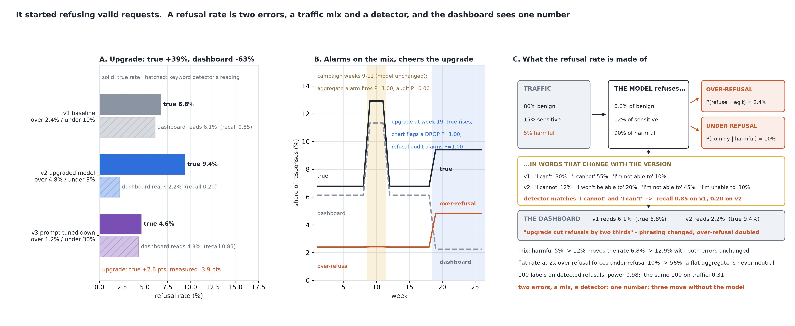

# It Started Refusing Valid Requests

[](https://colab.research.google.com/github/phoebefu6/phoebe-the-builder/blob/main/llmops-genai-platform/refusal-rate-monitor/demo.ipynb)
[](https://mybinder.org/v2/gh/phoebefu6/phoebe-the-builder/main?labpath=llmops-genai-platform/refusal-rate-monitor/demo.ipynb)

> The dashboard said the upgrade cut refusals by two thirds. The model was refusing 39% more requests than before, twice as many of them legitimate - it had started saying "I'm not able to", and the detector was listening for "I cannot".



## The short version

A refusal rate is one number made of four declared things, and the dashboard shows the number. `llm-guardrails`
(Day 84) is the filter that refuses; this build is the monitor on its rate, and what moves that rate when the
model has not changed, what hides the change when it has, and where a labelling budget should go.

- the **traffic mix**: 80% plain requests, 15% legitimate-but-sensitive (medical, legal, security), 5% that the
  policy says to refuse. A jailbreak campaign week takes the harmful share to 12%.
- the model's **two errors**: over-refusal P(refuse | legitimate) and under-refusal P(comply | harmful). Three
  versions are declared: a baseline, an upgraded model that refuses more of everything, and a prompt tuned to
  refuse less.
- the model's **phrasing**, a distribution over six refusal openers that changes with the version
- the **detector**: a keyword list written against v1's phrasing, an extended list, and an LLM judge. Recall is
  a property of the (detector, version) pair - `recall = phrasing mass matched` - and false positives land on
  compliant responses that happen to say "I cannot stress enough".

Every rate is closed-form (`measured = sum share_c * (refuse_c * recall + (1 - refuse_c) * fpr)`) and every
alarm probability is an exact binomial tail; a raw simulation only checks them.

| version | true refusal rate | over-refusal | under-refusal | keyword dashboard reads | detector recall |
|---|---:|---:|---:|---:|---:|
| v1 baseline | 6.78% | 2.40% | 10.0% | 6.14% | 0.85 |
| v2 upgraded model | **9.41%** | **4.80%** | 3.0% | **2.24%** | 0.20 |
| v3 prompt tuned down | 4.64% | 1.20% | **30.0%** | 4.33% | 0.85 |

## What the numbers say

1. **The upgrade's sign is wrong on the dashboard.** True refusals +2.6 points (+39%); the keyword dashboard
   -3.9 points (-63%). The new model says "I'm not able to" 45% of the time where the old one said "I cannot"
   55%, and the detector matches "I cannot" and "I can't": recall 0.85 -> 0.20. Over-refusal doubled (2.4% ->
   4.8%) and the dashboard reported a win. The extended keyword list and the LLM judge both get the sign right,
   at the price of false positives that are 12-14% of what they flag on v1.
2. **The mix moves the rate with the model untouched.** A campaign week (harmful share 5% -> 12%) takes the true
   rate 6.78% -> 12.92% and the measured rate 6.14% -> 11.33%. Over-refusal moves 2.40% -> 2.41%, under-refusal
   not at all. The aggregate alarm fires with probability 1.000. There is nothing to fix.
3. **A flat aggregate is never neutral.** At a fixed mix the rate is a weighted sum. Double both legitimate
   classes' refusal rates and hold the total at 6.78%: the harmful refusal rate is forced from 90% to 44.4%, so
   under-refusal goes 10% -> 56% while the dashboard reads the same number. A flat rate after a change means
   both errors moved, or nothing did.
4. **The tuned-down prompt is a 2-point win on the dashboard** and halves over-refusal; it also takes
   compliance with harmful requests from 10% to 30%, on 5% of traffic the dashboard cannot see as a class.
5. **Spend the labels on refusals, not traffic.** To detect the upgrade's over-refusal doubling at one-sided
   alpha 0.05: 100 random labelled responses have power 0.31 (a 2.4% event on 95% of the labels); 100 labelled
   *detected refusals*, asking what share came from legitimate requests, have power 0.98 (a 38% -> 57% event
   on all of them). 1,000 traffic labels buy what 100 refusal labels buy. The refusal sample has its own bias -
   the legitimate share is 33.6% of true refusals and 37.6% of detected ones, because the detector's false
   positives are compliant legitimate responses - so the labeller marks two things: was this a refusal, and was
   the request legitimate.
6. **Twenty-six weeks.** Weekly n = 20,000 responses, 3-sigma limits from the v1 baseline, plus 300 labelled
   detected refusals a week. Baseline weeks: both charts quiet (P < 0.002). Campaign weeks 9-11: the aggregate
   alarm fires 1.000, the audit 0.000. Upgrade at week 19: the aggregate alarm fires 0.000 and the chart flags a
   *drop* 1.000 (measured 2.24%, true 9.41%); the audit fires 1.000. The two instruments disagree on every event
   and the audit is right both times.

**Recommendation:** monitor the two errors, not the rate - over-refusal from a weekly sample of detected refusals
labelled for legitimacy, under-refusal from a fixed red-team set. Standardise the aggregate to a reference mix
before alarming on it, or it alarms on campaigns. Re-measure the detector's recall on every model version with a
labelled sample of that version's refusals; a keyword list has no recall of its own. And treat a flat rate after
a change as a question, not an answer.

## Calibration

- Closed form against raw simulation (3 cases x 5 quantities, plus one exact binomial tail against 200,000 raw
  draws): **16 of 16** inside their 99% Wilson interval at seed 193. All of it is in `evidence.txt`.
- A test shows the simulation check *can* fail: v2's simulated measured rate must land outside v1's exact value.
- Binomial tails are computed in log space and checked against the cumulative pmf sum (which sums to 1 within
  1e-12) and at the p = 0 / p = 1 edges; the critical value is checked to hold size at every n used.
- **Design note:** the aggregate chart's lower limit is reported as a "flag", not an alarm - a drop in refusals is
  what a team celebrates, and the upgrade produces exactly that reading.

## Business Impact
- **Before:** the safety dashboard reports a refusal rate from a keyword detector. It alarms on jailbreak
  campaigns the model is handling correctly, reports a model that doubled its over-refusal as a two-thirds
  improvement, and cannot distinguish a flat week from a swap between the two errors.
- **After:** describe two versions, the traffic mix, the detector, and whether the new version's phrasing
  changed. You get the true rate, both errors and the dashboard's reading for each, and a banner when the
  measured sign is wrong, a flat aggregate hides a swap, or the rate fell while under-refusal rose.
- **Estimated ROI:** a labelling budget 10x more efficient (100 refusal labels in place of 1,000 traffic labels),
  and one fewer model upgrade shipped as a safety win while legitimate users were being refused twice as often.

## Tech Stack
Python, NumPy (raw simulation, exact log-space binomials), Matplotlib, Streamlit, pytest

## Demo

**[Run the interactive demo notebook →](demo.ipynb)**. It is pre-rendered with outputs, or use the
Colab/Binder badges above to run it live. Every rate and tail is exact, and the notebook reproduces them to the
digit.

```bash
pip install -r requirements.txt
python evidence.py      # <2 seconds, writes evidence.txt + results.json
python make_chart.py    # the audit figure; fails if any label overlaps another, leaves its panel, or sits on a line
streamlit run app.py    # your own versions, mix and detector
pytest -q               # 30 tests
```

## Learning Connection
Built while studying LLM safety evaluation and over-refusal benchmarks (XSTest-style exaggerated-safety sets,
refusal classifiers vs string matching, and the OR-Bench observation that over-refusal and under-refusal trade
off across models). Applies: a mixture decomposition of a monitored rate, recall as a property of a pair,
exact binomial power for two audit designs, and a control chart whose alarms are computed rather than simulated.

## Impact Note
- **Who benefits:** teams that own an LLM safety dashboard, and the users whose legitimate medical, legal and
  security questions are the ones that get refused
- **Potential risks:** every rate here is declared, including the phrasing distributions and the detector's false
  positive rate; a real refusal detector's errors are correlated with the request class (sensitive requests draw
  hedged, partial refusals that no keyword catches), which makes the refusal-sample audit more biased than shown,
  not less. The campaign effect assumes the model handles the extra harmful traffic at its usual rate; a
  campaign that finds a jailbreak moves under-refusal too, and this monitor's audit of detected refusals cannot
  see that - under-refusal needs its own instrument.

Sibling builds: [`llm-guardrails`](../llm-guardrails) (the filter that refuses), [`model-migration-diff`](../model-migration-diff)
(a net score hiding a gross swap on an upgrade - the same shape, with the detector added here),
[`context-packing`](../context-packing) (the previous day: a metric that ranked the fixes backwards).
