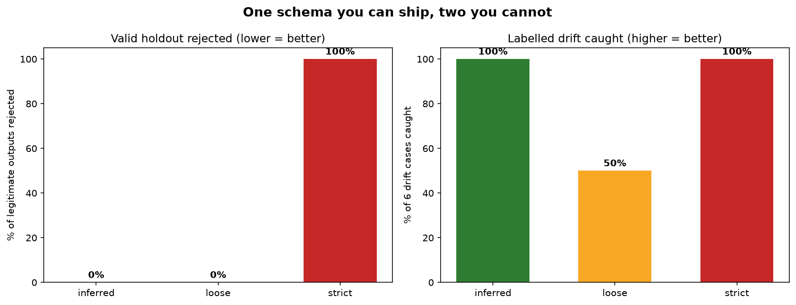

# Schema from Samples

[](https://colab.research.google.com/github/phoebefu6/phoebe-the-builder/blob/main/llmops-genai-platform/schema-from-samples/demo.ipynb)
[](https://mybinder.org/v2/gh/phoebefu6/phoebe-the-builder/main?labpath=llmops-genai-platform/schema-from-samples/demo.ipynb)

> Your LLM pipeline returns JSON. Nothing checks it. `json.loads` is not a contract.

Structured outputs drift: a model update ships and `priority` starts arriving as `"URGENT"`, `sentiment_score` comes back as the string `"0.8"`, a helpful new `confidence_explanation` key appears. Everything still parses, so nothing alerts. The fix is a JSON Schema validated on every response - and this tool **infers that schema from the outputs you already have**, using the one signal your logs are full of: frequency.



## Business Impact
- **Before:** either no output validation at all, or a hand-written schema that is one of two failure modes - *loose* (union every type seen, require nothing: validates the broken outputs it was built to catch) or *strict* (require everything, enumerate every string: rejects legitimate traffic on day two and gets switched off).
- **After:** a frequency-aware contract - fields at 100% presence become `required`, low-support strings become enums, numerics get rounded-out bounds - plus a **findings report** listing every constraint the evidence could *not* support, with the reason, routed to a human instead of guessed.
- **Estimated ROI:** on the benchmark: **0% valid traffic rejected, 6/6 drift cases caught**. Loose caught 3/6. Strict caught 6/6 but rejected 100% of the holdout - a gate that gets disabled by lunchtime, after which nothing is validated at all.

## Tech Stack
Python · jsonschema (draft 2020-12) · Streamlit · pandas · matplotlib (fully offline - the demo corpus is generated, no API key, no model call)

## Key insight

**The information needed to write the schema is already in your logs - it is frequency, and both naive schemas throw it away.**

A field present in 45/45 samples and a field present in 5/45 are *different facts*, but a union-based inferencer encodes them identically (both optional) and a strict one encodes them identically the other way (both required). Three frequency habits separate a shippable contract from those two:

| Habit | Rule | What it catches |
|---|---|---|
| **Presence is a number** | ≥98% → `required`; <20% → optional *and flagged* | dropped required fields, without paging on legitimately optional ones |
| **Enums need support** | ≤8 distinct, each seen ≥2×, distinct/total ≤ 0.30 | `priority` (3 values, dozens of sightings) becomes an enum; `customer.name` (an identifier wearing a string type) does not |
| **Abstain out loud** | always-empty array, always-null field, <5 samples → leave open + emit a finding | constraints that would have been invention, not evidence |

And one deliberate sharp edge: on **mixed types** (`integer` in 80% of samples, `string` in 20%) the inferencer pins the *dominant* type and emits a `block`-severity finding, rather than widening to a union - a union would make the minority form valid forever, which is exactly backwards. The defect is in the generator; the schema should not bless it.

## The findings report

The schema is half the output. The other half is every abstention, with its reason:

```
[WARN ] escalation - rare-key
        Present in 5/45 (11%). Kept optional. Confirm it is a real optional
        field and not intermittent model drift.
[WARN ] related_ids - empty-array-abstain
        Empty in all 45 observations. Item type unknown, so `items` is left
        open. An inferred item type here would be invention, not evidence.
[INFO ] attachments - thin-array-evidence
        Item type inferred from only 6 non-empty array(s) out of 45.
```

**Edge cases handled:** ① fewer than 5 samples → nothing is marked required and no enums are inferred (one sample cannot tell an optional field from a missing one) - the whole inference degrades to typed-but-open, with a finding saying so; ② samples that disagree on the *root* type produce a `block` finding, because no contract is trustworthy until the generator is fixed; ③ numeric bounds are rounded outward to a clean interval - the observed minimum is a sample minimum, not a specification minimum.

## Benchmark

Trained on 45 support-ticket extractions, scored on 15 held-out valid samples + 6 labelled drift cases (new enum value, type drift, dropped field, shape collapse, hallucinated key, container drift):

| Gate | Valid holdout rejected | Drift caught | Verdict |
|---|---|---|---|
| **inferred (this tool)** | **0%** | **6/6** | ship it |
| loose: union-of-everything | 0% | 3/6 | a smoke detector with no battery |
| strict: require + enum all | 100% | 6/6 | disabled by lunchtime |

The three drift cases loose missed - new enum value, dropped required field, hallucinated key - are precisely the ones that motivated building a gate in the first place.

## Demo

**[Run the interactive demo notebook →](demo.ipynb)** - pre-rendered with outputs, or click the Colab/Binder badges above to run it live.

For the Streamlit app:
```bash
pip install -r requirements.txt
streamlit run app.py
```

Paste outputs as JSON Lines (or one JSON array), tune the policy thresholds live in the sidebar, read the findings, download `schema.json`. Or via Docker:

```bash
docker build -t schema-from-samples . && docker run -p 8501:8501 schema-from-samples
```

## Learning Connection
Built while studying structured outputs and tool-use schema design (Anthropic prompt engineering / LLMOps track).
Applies: JSON Schema draft 2020-12, evidence-based inference with explicit abstention, precision/recall framing for validation gates.

## Impact Note
- **Who benefits:** anyone running an LLM extraction or tool-use pipeline in production - the inferred contract turns silent drift into a validation error at the response boundary.
- **Potential risks:** a schema inferred from drifted samples codifies the drift - infer from a window you trust, and read the findings before shipping. Closed objects (`additionalProperties: false`) will reject any *intentionally* new field after a prompt change; re-infer as part of the change.
