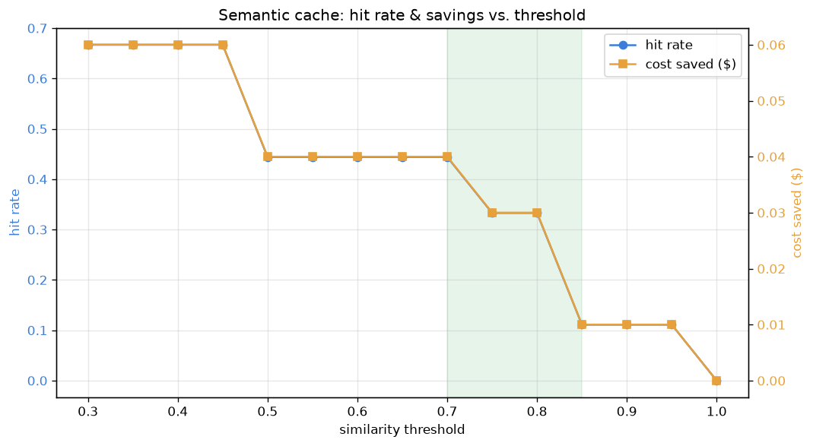

# Semantic Response Cache

[](https://colab.research.google.com/github/phoebefu6/phoebe-the-builder/blob/main/llmops-genai-platform/semantic-cache/demo.ipynb)
[](https://mybinder.org/v2/gh/phoebefu6/phoebe-the-builder/main?labpath=llmops-genai-platform/semantic-cache/demo.ipynb)

> Stop paying for repeated similar queries - reuse an answer when the meaning matches.

Users ask the same thing in different words. An exact-match cache misses "how do I get a refund?" vs "how do I get a refund for my order?" - so you pay the model again for an answer you already have. A semantic cache compares the *meaning* of the new query against past queries and reuses the stored response when they're close enough.



## Business Impact
- **Before:** every paraphrase of a common question triggers a fresh (paid, latent) model call.
- **After:** semantically-similar queries hit the cache and return instantly for free; only novel questions reach the model.
- **Estimated ROI:** on repetitive support/FAQ traffic, a meaningful share of calls become cache hits - direct token savings plus lower latency.

## Tech Stack
Python · Streamlit · pandas · matplotlib · dependency-free lexical embedder + cosine similarity (no API keys, fully offline)

## How it works
1. Embed the query (bag-of-words vector here; swap in real embeddings for production).
2. Find the nearest cached query by cosine similarity.
3. If similarity ≥ **threshold** → cache hit, return the stored answer. Otherwise generate, store, return.

The **threshold** is the key dial: lower = more hits + more savings but a risk of returning a confidently-wrong answer to a near-miss question; higher = every hit is a safe match. The demo sweeps it so you can pick the knee for your own traffic.

## Demo

**[Run the interactive demo notebook →](demo.ipynb)** - pre-rendered with the threshold-tradeoff chart, or click the Colab/Binder badges above.

Streamlit app (live threshold slider + sweep):
```bash
pip install -r requirements.txt
streamlit run app.py
```

CLI:
```bash
python cache.py
```

## Learning Connection
Built while studying LLM cost optimization and vector similarity.
Applies: embedding similarity, cache hit/miss design, and the precision/recall tradeoff behind a similarity threshold. Pairs with **Day 85 - LLM Cost Tracker** (measure the savings) and **Day 90 - LLM Model Router**.

## Impact Note
- **Who benefits:** teams serving repetitive LLM traffic (support, FAQ, autocomplete).
- **Potential risks:** the bundled lexical embedder catches word overlap, not deep meaning - **swap in a real embedding model** before production, tune the threshold on real traffic, and add a TTL/invalidation policy so cached answers don't go stale.
