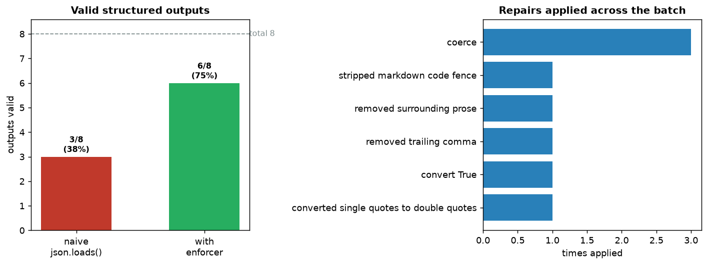

# Structured Output Enforcer

[](https://colab.research.google.com/github/phoebefu6/phoebe-the-builder/blob/main/llmops-genai-platform/structured-extractor/demo.ipynb)
[](https://mybinder.org/v2/gh/phoebefu6/phoebe-the-builder/main?labpath=llmops-genai-platform/structured-extractor/demo.ipynb)

> Stop your pipeline from crashing when the LLM returns almost-JSON.

You ask an LLM for JSON and get back a markdown code fence, a chatty preamble, a trailing comma, Python's `True`/`None` instead of `true`/`null`, string-wrapped numbers, or a missing field. Plain `json.loads()` throws and everything downstream dies. This enforcer wraps the raw model text in a deterministic **extract -> repair -> coerce -> validate** pipeline, and returns *exactly what it fixed* so you can track repair rates and decide when to force a model retry.



## Business Impact
- **Before:** one malformed response takes down a batch job; engineers babysit parsing and hand-fix outputs.
- **After:** the common malformations are repaired automatically; only genuinely-broken outputs (missing required fields, non-JSON) are flagged for retry.
- **Estimated ROI:** on the sample stream, naive `json.loads()` handles 38% of outputs; the enforcer validates 75% - recovering half the "failures" with zero extra model calls.

## Tech Stack
Python · Streamlit · pandas · matplotlib · standard-library `json`/`re` only (no API keys, fully offline)

## How it works
1. **Extract** - strip markdown fences and prose, walk to the first balanced `{...}`.
2. **Repair** - remove trailing commas, convert `True/False/None`, single->double quotes, quote bare keys.
3. **Coerce** - cast values to the declared types (`"1"` -> `1`, `"yes"` -> `true`).
4. **Validate** - check required fields are present and final types match; report every error.

The pipeline is deterministic and offline - swap the sample strings for your real Claude/LLM response text.

## Demo

**[Run the interactive demo notebook ->](demo.ipynb)** - pre-rendered with the repair-breakdown chart, or click the Colab/Binder badges above.

Streamlit app (paste any response + edit the schema live):
```bash
pip install -r requirements.txt
streamlit run app.py
```

CLI (runs the sample stream):
```bash
python enforcer.py
```

## Learning Connection
Built while studying prompt engineering + LLMOps reliability patterns.
Applies: structured-output enforcement, defensive JSON parsing, schema validation, and repair-rate telemetry - the plumbing that keeps LLM features from being flaky.

## Impact Note
- **Who benefits:** anyone shipping an LLM feature that parses model output into structured data (extraction, triage, tagging, tool-calling fallbacks).
- **Potential risks:** repairs are best-effort and could coerce a value into a wrong-but-valid shape; always keep the required-field/type validation strict and log repairs so silent mis-coercions surface. Not a substitute for the model's own structured-output / tool-use mode when available.
