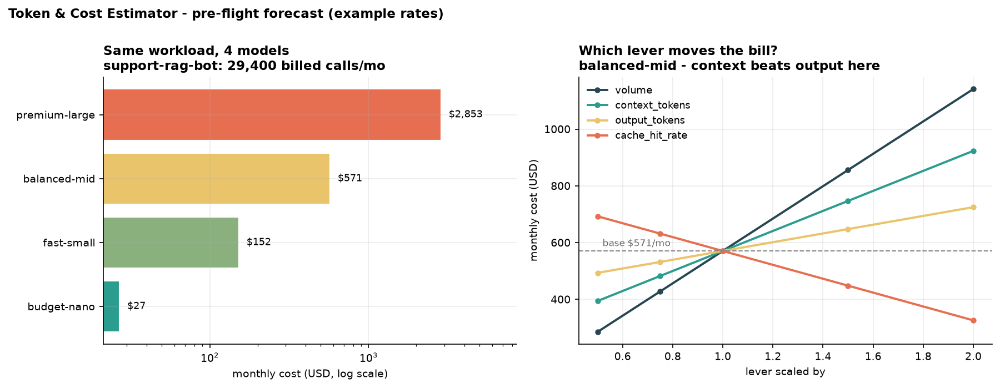

# Token & Cost Estimator

[](https://colab.research.google.com/github/phoebefu6/phoebe-the-builder/blob/main/llmops-genai-platform/token-cost-estimator/demo.ipynb)
[](https://mybinder.org/v2/gh/phoebefu6/phoebe-the-builder/main?labpath=llmops-genai-platform/token-cost-estimator/demo.ipynb)

> Price an LLM feature *before* you build it - not after the invoice lands.

Surprise API bills are a design-time failure, not a billing failure. By the time the invoice arrives, the architecture that produced it is already shipped. This tool takes a workload description - prompt size, retrieved context, expected output, monthly volume, retry rate, cache hit rate - and projects the monthly bill across every candidate model, finds the break-even volume for a fixed budget, and sweeps sensitivity so you know which lever is worth your engineering time.



## Business Impact
- **Before:** the model gets picked in a design review with no number attached; cost shows up as a surprise line item a month after launch, when the retrieval width and model choice are already baked in.
- **After:** a per-feature and whole-product forecast before the integration is written - with the break-even volume that settles the "can't we just use the big model?" argument in one number.
- **Estimated ROI:** on the sample 3-feature product the model choice alone spans **$49/mo to $5,087/mo** (~$61k/yr) on identical traffic. Catching that at design time is the whole return.

## Tech Stack
Python · Streamlit · pandas · matplotlib · an editable in-code pricing table (no tokenizer download, no network calls, fully offline)

## Key insight
**The popular rule of thumb is backwards for RAG.** "Output tokens cost 3-5x input" is true *per token* - but the sample RAG bot sends 4,720 input tokens to get 350 output tokens back, so **73-77% of its bill is prompt, not completion** (depending on the model's in/out ratio). Sensitivity confirms it: halving retrieved context saves $176/mo while halving output length saves $77/mo. Retrieve 4 chunks instead of 8 and you beat any amount of prompting the model to be terse.

Ranked levers on the sample workload: **model choice** (106x spread) → **volume** → **context tokens** → **cache hit rate** → output length. Prompt wordsmithing does not make the list.

## What it does
- **Token estimation without a tokenizer** - chars-per-token by content type (prose 4.0, code 3.0, JSON 2.8, CJK 1.5). Deliberately heuristic: a design-time estimate wants ±10-15%, not exactness.
- **Billed-call math that accounts for reality** - cache hits are free, retries are extra billed attempts on the *misses* only. A 5% retry rate is 5% more spend, not a rounding error.
- **Model comparison** - per-call, monthly, and annual cost on every model, plus `input_cost_share` (how much of the bill is prompt vs completion).
- **Whole-product rollup** - several features on one model, with the dominant line item named. One feature was 56% of the bill on *every* model.
- **Break-even volume** - how much traffic a fixed budget buys on each model.
- **Sensitivity sweep** - scale one lever (volume / context / output / cache), measure the spread, spend your time on the widest.

**Edge case handled:** a rate entered as a percent (`15`) instead of a fraction (`0.15`) would inflate a forecast 100x and still look plausible in a spreadsheet. `Workload` rejects it at construction with a message naming the fix. The `cache_hit_rate` lever also clamps at 1.0 rather than raising, since a fraction can't scale past 100%.

> **Pricing note:** the four models (`premium-large`, `balanced-mid`, `fast-small`, `budget-nano`) are illustrative tiers with example rates. Edit `PRICING` in [estimate.py](estimate.py) to match your actual contract.

## Demo

**[Run the interactive demo notebook →](demo.ipynb)** - pre-rendered with all outputs and charts, or click the Colab/Binder badges above to run it live.

Streamlit app (5 tabs: model comparison, break-even, sensitivity, whole product, token counter):
```bash
pip install -r requirements.txt
streamlit run app.py
```

CLI forecast:
```bash
python estimate.py
```

## Learning Connection
Built while studying LLMOps cost control and capacity planning.
Applies: token accounting, unit-economics forecasting, break-even analysis, and sensitivity analysis on a cost model.

Completes the cost trio in this product line:
- **Day 85** [`llm-cost-tracker`](../llm-cost-tracker) - log the real spend *after* the calls
- **Day 86** [`semantic-cache`](../semantic-cache) - raise the cache hit rate (a lever in this model)
- **Day 90** [`llm-router`](../llm-router) - act on the break-even number per call
- **Day 125** this tool - forecast *before* any of it is built

## Impact Note
- **Who benefits:** engineers and TPMs pricing a GenAI feature at design time; anyone who has to defend an LLM budget to finance.
- **Potential risks:** the token estimate is a heuristic, not a tokenizer - treat it as ±10-15% and get exact counts from the provider at runtime. The bundled rates are illustrative; forecasting on them instead of your own contract will produce a confidently wrong number. And a forecast is not a cap - pair it with real logging (Day 85) and an actual budget alert.
