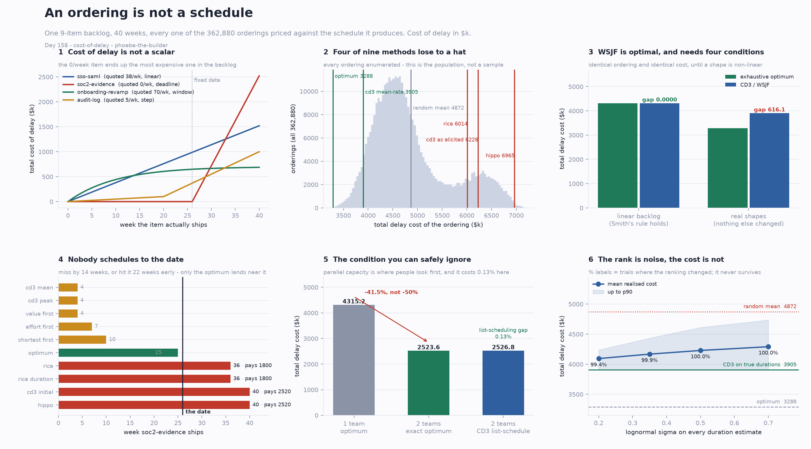

# Cost of Delay

[](https://colab.research.google.com/github/phoebefu6/phoebe-the-builder/blob/main/mini-saas-products/cost-of-delay/demo.ipynb)
[](https://mybinder.org/v2/gh/phoebefu6/phoebe-the-builder/main?labpath=mini-saas-products/cost-of-delay/demo.ipynb)

> Somebody asks what to do first, so you score the backlog - RICE, or WSJF, or cost-of-delay-over-duration - and the meeting ends with a ranked list. But a list is not what you pay. You pay for the schedule it produces. An ordering is not a schedule.

**Day 158 - Mini SaaS Products.** A nine-item backlog, all **362,880** orderings priced against the schedule each one produces, 36 tests, and a notebook that rebuilds every number from the standard library.



> **Four of nine prioritisation methods cost more than shuffling the backlog.** RICE lands in the 86th percentile of all orderings, CD3-as-a-room-actually-elicits-it in the 90th, and the loudest-stakeholder order in the 99.8th - only 0.2% of all orderings are worse than it.
>
> **WSJF is exactly optimal, and it needs four conditions it never gets.** Linearise the cost shapes and CD3 reproduces the exhaustive optimum to a gap of **0.0000**. Put the real shapes back, change nothing else, and it gives up **18.7%**.
>
> **The item quoted at 0/week is the most expensive one in the backlog.** The item quoted at 70/week - twice anything else - belongs last.

## Business Impact

- **Before:** the quarter is planned by scoring items and reading the list top-down. The score has one number per item for cost of delay, so a fixed audit date and a closing market window enter the arithmetic as the same kind of thing. Nobody computes what the resulting sequence costs, so there is no number to compare against a different sequence, against the optimum, or against having shuffled the backlog.
- **After:** cost of delay written as a rate, a date and a shape; the **schedule** scored instead of the list; and three things the ranked list cannot carry - the gap to the achievable optimum, the method's percentile against every ordering, and whether the order survives re-estimation.
- **Estimated ROI:** on this backlog, **1,583 of delay cost** separates the optimum (3,288) from shuffling (4,872), and four named methods sit on the wrong side of that. The largest single avoidable item is **2,520**, paid by two methods for missing one date that was free to hit.

## Where this sits

Fourth of four in the decision-support arc. [`decision-log`](../decision-log/) scores a call afterwards, [`pre-mortem`](../pre-mortem/) prices what could go wrong, [`expected-value-calc`](../expected-value-calc/) chooses between options, and this one sequences work you have already decided to do.

It is **not** a prioritisation tool. [`feature-prioritizer`](../feature-prioritizer/) (Day 53) is the RICE scorer that emits a ranked list; this one takes lists like that one's and prices what they cost.

## What it does

Ten sections in `evidence.py`. Every number below is printed by it and asserted in `test_codelay.py`.

### 1. Cost of delay is a rate over time, not a number

Every method wants one number per item: what does a week of delay cost. That question has an answer only if the cost is constant over time. Four shapes cover most real work:

| shape | rate over time | in the world |
|---|---|---|
| `linear` | constant `r` | revenue not yet being earned |
| `deadline` | 0, then `r2` after a date | an audit, a regulation, a contract |
| `step` | `r`, then `r2` after a date | a clause that bites at renewal |
| `window` | `r` decaying with constant `tau` | a market opening that closes |

What reaches the P&L is the **integral** of that rate up to the week the item ships. The backlog, with both readings side by side:

| | item | dur | person-wks | shape | quoted at wk 0 | total if last |
|---|---|---|---|---|---|---|
| A | sso-saml | 6 | 12 | linear | 38.0 | 1520.0 |
| B | soc2-evidence | 4 | 4 | deadline (wk 26) | **0.0** | **2520.0** |
| C | usage-billing | 8 | 8 | linear | 52.0 | 2080.0 |
| D | onboarding-revamp | 3 | 6 | window | **70.0** | **687.2** |
| E | api-rate-limits | 2 | 2 | linear | 9.0 | 360.0 |
| F | data-export | 1 | 1 | linear | 6.0 | 240.0 |
| G | mobile-push | 5 | 10 | window | 30.0 | 598.6 |
| H | audit-log | 4 | 4 | step (wk 20) | 5.0 | 1000.0 |
| I | search-rebuild | 7 | 7 | linear | 22.0 | 880.0 |

The two bolded rows are the whole problem. `soc2-evidence` is the **least** urgent item in the room's own terms and the **most** expensive item in the backlog. `onboarding-revamp` is quoted at nearly twice everything else and tops out below four other items, because its window saturates: delaying it from week 0 to 10 costs 442.5, and from week 30 to 40 costs **22.0 - twenty times less**.

Urgency is not a property of an item. It is a property of when you are.

### 2. WSJF is optimal, and it needs four conditions

**Smith's rule** (W. E. Smith, 1956): on a single machine, total weighted completion time is minimised exactly by sequencing in decreasing order of `weight / processing time`. No search, no heuristic. That rule *is* CD3 / WSJF, so the method has a theorem behind it - which is more than most planning folklore has.

Linearise the cost shapes (same total value over the window, constant rate) and the theorem reproduces the full enumeration:

| | cost | ordering |
|---|---|---|
| exhaustive optimum of all 362,880 | **4315.2440** | `BCAHFDEIG` |
| CD3 = weight ÷ duration | **4315.2440** | `BCAHFDEIG` |
| gap | **0.0000** | identical |

Now put the real shapes back. Nothing else changes:

| | cost | ordering |
|---|---|---|
| exhaustive optimum | **3288.5** | `CAEHFBIGD` |
| CD3 (mean rate ÷ duration) | **3904.6** | `BCAHFDEIG` |
| gap | **+616.1** | **+18.7%** |

The theorem's four conditions are linear delay cost, one machine, no deadlines, no precedence. This backlog violates all four. Sections 5, 6 and 7 price them one at a time.

### 3. "CD3" does not name an ordering

The formula is cost of delay ÷ duration. "Cost of delay" is one number extracted from a room, and there are at least three honest ways to extract it - all the same named method, applied by people acting in good faith:

| elicitation | ordering | cost | percentile |
|---|---|---|---|
| what a week costs us **right now** | `DCAFGEIHB` | 6227.5 | **90.0%** |
| averaged over the **planning window** | `BCAHFDEIG` | 3904.6 | **5.4%** |
| the **worst week** in the window | `BDHCAFGEI` | 4211.4 | 19.0% |

The first two disagree about **18 of 36 pairs** - exactly half - and the cost spread across the three is **2323.0 (59.5%)**.

The elicitation is the decision. The method name is not.

### 4. Four of nine orderings lose to drawing the backlog out of a hat

Nine items is 362,880 orderings, which is small enough to price all of them. That turns three things from estimates into facts: the optimum is *the* optimum, the mean over all orderings is *exactly* the expected cost of shuffling, and a method's percentile is exact.

| method | cost | vs optimum | percentile | |
|---|---|---|---|---|
| **exhaustive optimum** | **3288.5** | - | 0.0% | |
| cd3_mean | 3904.6 | +18.7% | 5.4% | |
| value_first | 3977.7 | +21.0% | 7.8% | |
| cd3_peak | 4211.4 | +28.1% | 19.0% | |
| shortest_first | 4552.1 | +38.4% | 41.8% | |
| effort_first | 4662.9 | +41.8% | 49.8% | |
| **random (mean of all orderings)** | **4871.7** | +48.1% | - | |
| rice | 6013.5 | +82.9% | 86.3% | ← worse than a hat |
| rice_duration | 6040.3 | +83.7% | 86.7% | ← worse than a hat |
| cd3_initial | 6227.5 | +89.4% | 90.0% | ← worse than a hat |
| hippo | 6965.4 | +111.8% | 99.8% | ← worse than a hat |
| worst possible | 7162.0 | +117.8% | 100.0% | |

`hippo` is the order the loudest stakeholder in the room asked for: the two things a customer complained about last week, then the visible redesign, then the rest. **Only 0.2% of the 362,880 orderings are worse than it.**

**The popular critique of RICE is not the problem with RICE.** The usual complaint is the denominator - effort in person-months, while delay is paid in calendar weeks - and this backlog has three items where the two differ. Swapping the denominator for duration moves **3 of 36 pairs** and costs **+26.8**: the fix is very slightly worse. RICE's problem is upstream. Reach × Impact × Confidence is a *value* estimate, and value is not cost of delay: it says how much the thing is worth, not what each week of not having it costs.

### 5. Nobody schedules to the date

`soc2-evidence` is free until week 26 and 180/week after it. There is exactly one right answer - land it just before the date - and no scoring method can express it, because a score produces a position in a *list* and a date is a position in *time*.

| method | position | ships week | vs date | pays |
|---|---|---|---|---|
| cd3_mean · cd3_peak · value_first | 1 | 4 | −22 | 0 |
| effort_first | 3 | 7 | −19 | 0 |
| shortest_first | 4 | 10 | −16 | 0 |
| **optimum** | **6** | **25** | **−1** | **0** |
| rice · rice_duration | 8 | 36 | +10 | **1800.0** |
| cd3_initial · hippo | 9 | 40 | +14 | **2520.0** |

The optimum holds the date with **one week of slack**. Two methods miss by fourteen weeks and pay 2520. Three hit it twenty-two weeks early and also pay nothing - but four weeks of queue went ahead of everything that *was* bleeding.

How tight that slack is: the highest-cost-of-delay-right-now item (`onboarding-revamp`, 70/week) is **last** in the optimum, and moving it to the front costs **389.6** - because its three weeks push the fixed date past week 26.

### 6. Precedence: the constraint is cheap, the repair is not

Two edges - you cannot evidence an audit trail you have not built (`H → B`), and metering has to hold up before you bill on it (`E → C`). They rule out **272,160 of 362,880** orderings (75%).

| | cost | |
|---|---|---|
| unconstrained optimum | 3288.5 | `CAEHFBIGD` |
| precedence-feasible optimum | 3328.5 | `AECHFBIGD` |
| **cost of the constraint** | **+40.0** | **+1.2%** |
| CD3 order | 3904.6 | `BCAHFDEIG` - **infeasible** |
| after the usual repair | 3956.9 | `AHBFDECIG` |
| **cost of the repair** | **+52.3** | |
| still short of the feasible optimum | **+628.4** | **+18.9%** |

The constraint costs 40. Ranking as if it were absent and then pushing blocked items down the list costs more than the constraint itself, and leaves the same 19% gap.

### 7. The condition you can safely ignore

Adding capacity is the first lever anyone reaches for, and it is the condition of Smith's rule that turns out not to matter. On a linear backlog WSPT *within* a team is optimal, so the exact two-team optimum is a search over the 512 assignments:

| | cost |
|---|---|
| one team, optimum | 4315.2 |
| two teams, exact optimum | **2523.6** |
| two teams, CD3 list-schedule (walk the order, give each item to whoever is free) | **2526.8** |
| list-scheduling gap | **+3.2 (0.13%)** |

A negative result worth having: **do not build the assignment optimiser.** Walking the CD3 order is within 0.13%, and simpler.

What does change: **doubling the teams cuts delay cost by 41.5%, not 50%.** Delay cost is not linear in capacity, so "add a team" has no fixed price.

### 8. The rank is noise. The cost is not.

Durations are estimates, so: rank on the estimate, pay on the truth. Perturb every duration by a lognormal factor, re-rank with CD3 on the noisy numbers, evaluate against the true durations. 2,000 trials per row, seeded.

| sigma | ranking changed | mean cost | p90 | worst | added |
|---|---|---|---|---|---|
| 0.20 | **99.4%** | 4094.0 | 4235.6 | 4592.7 | +189.4 |
| 0.35 | **99.9%** | 4167.8 | 4433.5 | 5270.3 | +263.2 |
| 0.50 | 100.0% | 4228.9 | 4610.6 | 5517.1 | +324.3 |
| 0.70 | 100.0% | 4291.1 | 4735.5 | 6435.3 | +386.5 |

At sigma = 0.35 - an ordinary software estimate, roughly a factor of 1.4 either way - the CD3 **ranking changes in 99.9% of trials**, so the order is essentially never reproducible. The **cost** it delivers moves by 263.2, against a CD3-to-optimum method gap of **616.1** and a RICE-to-CD3 gap of **2108.9**.

So the arithmetic settles an argument teams have every quarter: whether item 4 or item 5 goes first is *inside the estimation noise*. Which method to use is not.

## What survives

1. **An ordering is not a schedule.** Score the schedule. A method that stops at a ranked list has not produced a number you can compare to anything.
2. **Cost of delay is a rate over time.** A scalar throws away the shape, and the shape is where the deadlines and the closing windows live.
3. **WSJF is exactly optimal under Smith's rule** - 0.0000 against a full enumeration - and every one of its four conditions is violated by an ordinary backlog.
4. **"CD3" does not name an ordering.** Three defensible elicitations disagree about half of all pairs and span the 90th to the 5.4th percentile.
5. **Four of nine orderings lose to a shuffle.** RICE by 23%; the loudest voice in the room by 43%.
6. **Nobody schedules to the date.** A date is a constraint, not a high score.
7. **Parallel capacity is the condition you can safely ignore**, and it is the one people reach for first.
8. **The rank is noise. The cost is the number to report.**

## What to actually do on Monday

- Write cost of delay as **a rate, a date and a shape** - not one number per item.
- Score the **schedule** your order implies and publish that number next to the order. It is the only output that survives re-estimation.
- Elicit cost of delay **the same way every time** and write the convention down. The convention is worth more than the method.
- Treat fixed dates as **constraints**, not high scores.
- Do **not** build the parallel-assignment optimiser.

## Tech Stack

Python 3.10+. `codelay.py` and `evidence.py` are **pure standard library** - `itertools`, `math`, `dataclasses`, `random`. No solver, no scipy, nothing to install to reproduce the results. Streamlit, matplotlib, pandas and numpy are for the app, the chart and the notebook only.

## Demo

**[Run the interactive demo notebook →](demo.ipynb)** - pre-rendered with every output, or click the Colab/Binder badges above to run it live.

Reproduce every number in this README:

```bash
python3 evidence.py
python3 -m pytest test_codelay.py -q      # 36 tests, one per claim
python3 make_chart.py                     # regenerates cod_audit.png / .svg
```

For the Streamlit app:

```bash
pip install -r requirements.txt
streamlit run app.py
```

## Files

| file | what it is |
|---|---|
| `codelay.py` | the model: cost-of-delay shapes, the backlog, the schedule, nine orderings, the exhaustive sweep, the noise sweep |
| `evidence.py` | ten sections; prints every number in this README |
| `test_codelay.py` | 36 tests asserting those numbers, not just that the code runs |
| `make_chart.py` | the six-panel audit |
| `demo.ipynb` | the walkthrough, pre-rendered |
| `app.py` | Streamlit: the scoreboard, the elicitation comparison, a live noise slider |

## Learning Connection

Built while working through classical scheduling theory - single-machine weighted completion time (Smith 1956), the NP-hardness of `P||Σw_jC_j`, and precedence-constrained sequencing - against the prioritisation frameworks (WSJF, CD3, RICE) that are the same problem with the theorem filed off.

Applies: verifying a known optimality result by exhaustive enumeration before trusting it, then breaking each of its assumptions separately so the cost of each break is a measured quantity rather than a caveat.

## Impact Note

- **Who benefits:** anyone who has to defend a roadmap order, or has been asked why the audit deadline slipped when the backlog was "prioritised".
- **Potential risks:** the exhaustive sweep is only free up to about ten items - past that, sample orderings for the random baseline rather than pretending to enumerate them. The cost-of-delay rates here are illustrative; the point is the *shape* of the input and the *scoring of the schedule*, not these particular dollar figures. And a defensible optimum on a fabricated backlog is still fabricated: garbage rates in, precisely-optimal garbage out.
