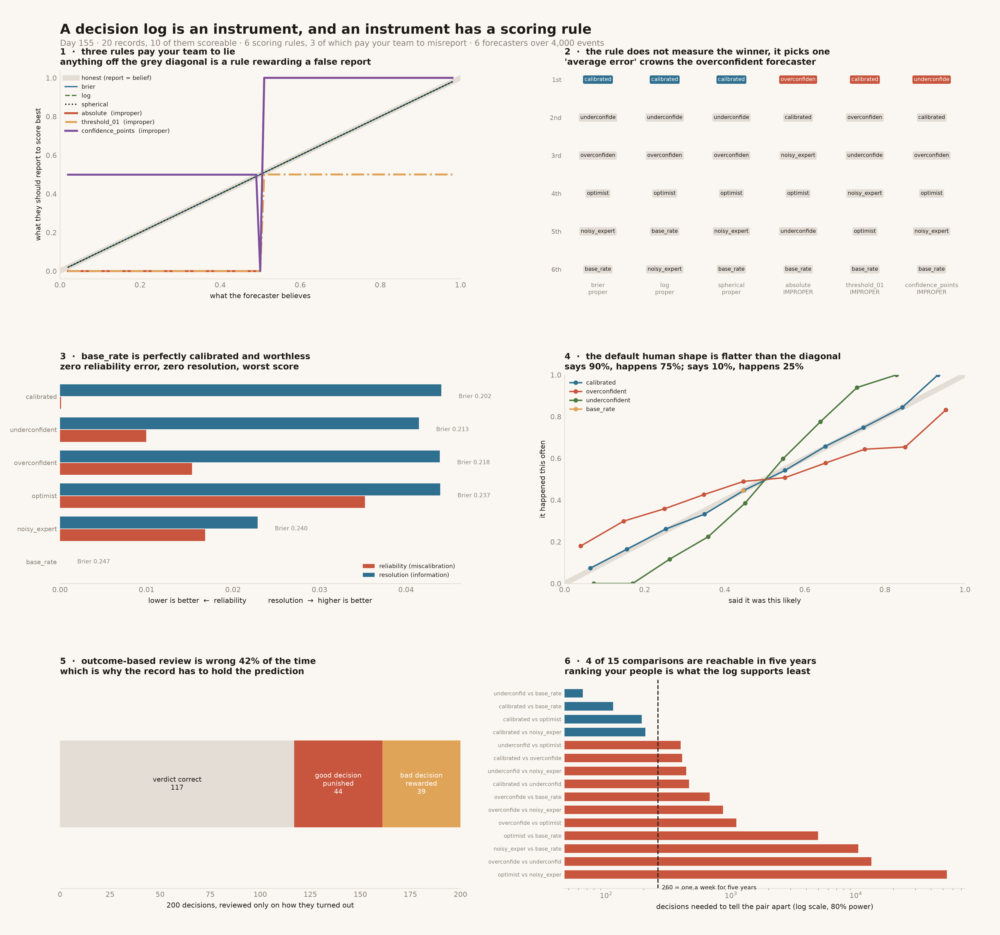

# Decision Log

[](https://colab.research.google.com/github/phoebefu6/phoebe-the-builder/blob/main/mini-saas-products/decision-log/demo.ipynb)
[](https://mybinder.org/v2/gh/phoebefu6/phoebe-the-builder/main?labpath=mini-saas-products/decision-log/demo.ipynb)

> A decision log without a prediction attached is a diary: it records what was chosen and can never say whether choosing it was any good. Attach a probability and it becomes an instrument - and an instrument has a **scoring rule**, which is a choice, and which almost nobody makes deliberately. That choice has a consequence most teams never see: a rule can be **improper**, meaning the forecast that maximises a person's expected score is not the forecast they believe. Under an improper rule, telling you the truth costs your team points.

**Day 155 - Mini SaaS Products.** 20 records, 6 scoring rules, 6 forecasters, 4,000 events, 30 tests, and a notebook that rebuilds every result from numpy alone.



> **Three of the six rules are improper**, and two of them are the ones teams invent for themselves. Under `absolute` - "average error", the rule that ends up in a spreadsheet - a forecaster who believes 55% and reports 55% scores **worse** than one who claims certainty.
>
> **`absolute` crowns the overconfident forecaster. The in-house points game crowns the underconfident one.** Two homebrew rules, two opposite wrong answers, same six forecasters, same 4,000 events.
>
> **Judging a decision by its outcome is wrong 41.5% of the time** on a realistic mixed portfolio - 44 good decisions punished, 39 bad decisions rewarded, out of 200.

## Business Impact

- **Before:** decisions get written down as "we decided to migrate the warehouse - query costs should improve". Two years later nobody can say whether that was a good call, because there is no number to check it against. The retro is run on outcomes, so whoever took the safest bets looks like the best judge, and whoever took correctly-priced risks that happened to lose looks reckless. The people learn the lesson the review actually teaches: commit to less.
- **After:** the record carries a probability, a metric, a threshold and a date, so it can be scored - and it is scored with a **proper** rule, so nobody is paid to hide what they know. **Half the reference corpus (10 of 20) cannot be scored at all**, and the linter catches that at write time rather than at review time.
- **Estimated ROI:** the honest one is not a time saving. It is that an outcome-based decision review reaches the **wrong verdict on 41.5% of decisions**, and that error is not random - it systematically punishes correctly-priced risk. The audit takes about two seconds; the behaviour it changes is who gets promoted.

## Why this one, and why now

The other 154 builds in this portfolio produce *artifacts*: a table, a chart, a config, a verdict. A [mentor-room coverage audit](../../README.md) on 2026-08-25 scored twelve capability domains against the catalog and found decision support at roughly 10% - about 140 of 154 tools emit something, and almost none help anyone decide anything with it. This is the first build against that gap, and it is deliberately the least comfortable one: 21 of the 154 are data-engineering tools and this is not another parser.

## What it does

Nine sections in `evidence.py`. Every number below is printed by it and asserted in `test_declog.py`.

### 1. Half the records cannot be scored at all

Four fields are load-bearing: a probability strictly between 0 and 1, a real ISO resolution date, a named metric, and a threshold. Miss any one and the record can never be scored, however carefully the decision was reasoned.

| field | present in |
|---|---|
| `has_probability` | 12 of 20 |
| `has_resolution_date` | 12 of 20 |
| `has_metric` | 11 of 20 |
| `has_threshold` | 10 of 20 |
| **all four** | **10 of 20** |

`D-007` is the instructive one: *"revenue will improve"*, probability 0.80. It has a number and is still unscoreable - no metric, no threshold, no date, so nothing can ever contradict it.

**The corpus is illustrative - written, not sampled** - so 10-of-20 is a property of these records, not a measurement of the world. The **linter** is the reusable part, and the corpus is built in pairs: every vague record is followed by the same decision written properly.

### 2. Six rules, three of them improper

Propriety is **computed, not quoted**: expected loss is minimised over 1001 candidate reports for each of 99 true beliefs. `test_brier_optimum_matches_its_closed_form` checks the grid search against the analytic answer so it cannot quietly agree with itself.

| rule | proper | bounded | worst gap | where you meet it |
|---|---|---|---|---|
| `brier` | ✅ | yes | 0.000 | `brier_score_loss`, weather verification |
| `log` | ✅ | **no** | 0.000 | cross-entropy, every ML training loop |
| `spherical` | ✅ | yes | 0.000 | forecasting literature, rarely in practice |
| `absolute` | ❌ | yes | 0.500 | "average error" in a spreadsheet |
| `threshold_01` | ❌ | yes | 0.500 | "what was our hit rate?" |
| `confidence_points` | ❌ | yes | 0.500 | the in-house prediction game everybody builds |

The three improper rules misreport **99 of 99** beliefs. Not some. All of them.

### 3. The optimal lie

| believe | `brier` says | `absolute` says | `confidence_points` says |
|---|---|---|---|
| 0.55 | 0.55 | **1.00** | **1.00** |
| 0.70 | 0.70 | **1.00** | **1.00** |
| 0.90 | 0.90 | **1.00** | **1.00** |

Below a coin flip the two improper rules fail by *different mechanisms*: `absolute` collapses to 0.00, while `confidence_points` wagers the number written down and so lands on **0.499** - the largest stake still on the favoured side. Two mechanisms, one outcome: the report is never the belief.

`threshold_01` fails a third way. At p=0.70 **every report in [0.50, 1.00] scores identically** - a plateau half the range wide. It does not punish confidence; it cannot see confidence. "What was our hit rate?" throws away the only number that made the log an instrument.

### 4. The rule does not measure the winner, it picks one

Six forecasters, all fully specified, over the same 4,000 events. Only the rule changes.

| rule | 1st | last |
|---|---|---|
| `brier` | calibrated | base_rate |
| `log` | calibrated | **noisy_expert** |
| `spherical` | calibrated | base_rate |
| `absolute` | **overconfident** | base_rate |
| `threshold_01` | calibrated | base_rate |
| `confidence_points` | **underconfident** | base_rate |

The worst rule pair reorders **6 of the 15** forecaster pairings.

A team scoring its decision log with "average error" will promote whoever is most often confidently wrong. A team running the points game will promote whoever hedges hardest.

### 4b. And a proper rule is still not a complete specification

**Log loss ranks `noisy_expert` last - below the forecaster that knows nothing.**

| | Brier | log |
|---|---|---|
| `noisy_expert` | **0.2403** | 0.6950 |
| `base_rate` | 0.2471 | **0.6872** |

`noisy_expert` is unbiased with real signal and high variance; it makes **141 confident misses in 4,000** events. `base_rate` makes **0**, because it never commits and so can never be caught out. Log loss is unbounded, so those 141 events dominate the mean.

That is not a bug - it is what log loss is *for*. It is the right rule when a confident miss is genuinely catastrophic, and the wrong one when you are trying to find out who in the room is worth listening to.

### 5. Perfect calibration, zero skill

Murphy: **Brier = reliability - resolution + uncertainty.** Reliability is "when you said 70%, did it happen 70% of the time" - the only part a recalibration step can fix. Resolution is "did you separate the cases at all", and it carries the information.

| forecaster | Brier | reliability | resolution |
|---|---|---|---|
| calibrated | 0.2020 | 0.0001 | 0.0441 |
| underconfident | 0.2130 | 0.0100 | 0.0415 |
| overconfident | 0.2177 | 0.0153 | 0.0439 |
| optimist | 0.2372 | 0.0352 | 0.0439 |
| noisy_expert | 0.2403 | 0.0168 | 0.0228 |
| **base_rate** | **0.2471** | **0.0000** | **0.0000** |

`base_rate` is **perfectly calibrated** and has the worst score of the six. "Improve your calibration" would give it full marks.

**6 ordered pairs** have the more reliable forecaster scoring worse overall - including `noisy_expert` over `optimist`, which is not just the degenerate base-rate case. Calibration is necessary and it is not sufficient, and that difference is the entire reason to record a probability rather than a direction.

*(The decomposition residual from 10-bin binning is reported, not hidden - under 0.005 for every forecaster, asserted in the tests.)*

### 7. Judging a decision by its outcome is wrong 4 times in 10

200 decisions, some genuinely good (positive expected value), some genuinely bad, reviewed purely on how they turned out:

| | |
|---|---|
| truly good decisions | 98 of 200 |
| **verdicts that are wrong** | **83 (41.5%)** |
| good decisions punished | 44 |
| bad decisions rewarded | 39 |

The outcome is one noisy draw from a distribution the decision only *shifted*. Without a recorded probability there is nothing to separate a good decision that lost from a bad one that lost - so the review will separate them by outcome, because that is all the record has left.

### 8. Do not try to rank your team with the log

Paired sample size to separate two forecasters by Brier at 80% power:

| A | B | decisions needed |
|---|---|---|
| underconfident | base_rate | 65 |
| calibrated | base_rate | 114 |
| calibrated | optimist | 193 |
| calibrated | noisy_expert | 206 |
| calibrated | overconfident | 406 |
| overconfident | underconfident | 13,304 |
| optimist | noisy_expert | 53,520 |

**Median over all 15 pairings: 461 decisions.** One decision a week for five years is 260 records - at that volume **4 of 15** comparisons are resolvable, and they are mostly "is this person better than saying nothing".

This is not an argument against keeping a log. It relocates the value: the log is worth keeping because it makes the reasoning retrievable and forces the claim to be falsifiable *at the moment of writing*. Both of those pay off at n=1. Ranking people is the one use it supports least, and it is the use most often proposed.

## Tech Stack

Python 3.11 · numpy · scipy · matplotlib · pandas · Streamlit · pytest · ruff

No external services and no LLM. Every result is a computation, which is why every result is asserted.

## Demo

**[Run the interactive demo notebook →](demo.ipynb)** - pre-rendered with outputs, or click the badges above to run it live.

The notebook is a genuinely independent implementation: it imports nothing from `declog.py` and rebuilds the rules, forecasters, decomposition and power calculation from numpy alone. It reproduces every headline figure - 0.2020, 0.2471, 141 confident misses, 83 of 200, 65 decisions - which is a stronger check than a transcript.

```bash
pip install -r requirements.txt

python evidence.py        # all nine sections, ~2 seconds
python -m pytest -q       # 30 tests, every README number asserted
python make_chart.py      # decision_audit.png + .svg
streamlit run app.py      # score your own log; lint a record
```

## Learning Connection

Built against the decision-support gap found in the 2026-08-25 catalog audit. Applies: strictly proper scoring rules and the propriety proof by expected-score optimisation, Murphy's reliability-resolution-uncertainty decomposition, the resulting fallacy, and paired power analysis.

## What to do about it

1. **Lint at write time.** A record without a probability, metric, threshold and date can never be scored. Catching that at review time is too late by exactly the length of the decision.
2. **Pick a proper rule, deliberately.** Brier when humans read the number - bounded, reads as an error rate. Log loss when a confident miss is genuinely catastrophic, knowing it will rank a noisy expert below someone who says nothing. Never "average error", never a hit rate, never the points game, however much fun it is.
3. **Do not stop at calibration.** Reliability near zero with resolution near zero is somebody reporting the base rate and knowing nothing.
4. **Never review a decision on its outcome alone.** That verdict is wrong about 40% of the time and it is biased against correctly-priced risk.
5. **Use the log to remember, not to rank.** It is underpowered for ranking by roughly two orders of magnitude.

## Impact Note

- **Who benefits:** anyone who runs a decision review, a post-mortem or a promotion round - and anyone who has watched a good bet that lost get treated as a bad call.
- **Potential risks:** the six forecasters are simulated, and deliberately so - their true probabilities are known, which is the only way to check whether a scoring rule recovers the right ranking. Real forecasters will not match these shapes, and the *ordering* results are specific to these six. What generalises is the propriety analysis, which is a property of the rules and not of any data. The decision corpus is written rather than sampled and is labelled as such throughout; the 10-of-20 rate should not be quoted as an industry figure. And a scored decision log applied to individuals is a performance-management instrument - §8 is the reason not to use it as one.
