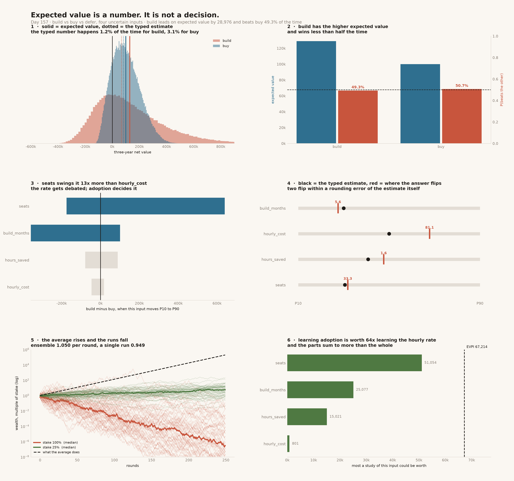

# Expected Value Calculator

[](https://colab.research.google.com/github/phoebefu6/phoebe-the-builder/blob/main/mini-saas-products/expected-value-calc/demo.ipynb)
[](https://mybinder.org/v2/gh/phoebefu6/phoebe-the-builder/main?labpath=mini-saas-products/expected-value-calc/demo.ipynb)

> Somebody asks which option to take, so you build the spreadsheet: probability times payoff, one row per option, pick the biggest. That arithmetic is right and the decision it produces can still be wrong. Expected value is a number. It is not a decision.

**Day 157 - Mini SaaS Products.** A build-versus-buy decision with four uncertain inputs, 200,000 simulations, 26 tests, and a notebook that rebuilds every result from numpy alone.



> **The higher expected value loses more often than it wins.** `build` leads `buy` by 28,976 in expected value and beats it **49.3%** of the time. Both statements are true of the same numbers.
>
> **The recommendation flips at 33.3 seats. The typed estimate is 32.** The decision is balanced within a rounding error of the number somebody guessed, and nobody was asked how confident they were.
>
> **A study of adoption is worth up to 51,054. The same study of the hourly rate is worth 801.** Both would be proposed in the same meeting with the same seriousness.

## Business Impact

- **Before:** the options paper has three rows and one number each. It was built by putting the most-likely value of every input into a formula, so it reports an outcome with roughly a **1.2% chance** of occurring. The meeting then argues about the hourly rate, which swings the answer 13x less than the input nobody was asked to estimate, and picks the higher number. Nothing in the paper says how close the call was, what would have to be true for it to reverse, or whether it would have been cheaper to find out first.
- **After:** ranges instead of points, a simulated distribution instead of a formula, and three outputs the single number cannot carry: the chance each option wins, the value of each input at which the answer flips, and the ceiling on what any investigation could be worth.
- **Estimated ROI:** on this decision, **EVPI is 67,214 - 52% of the whole decision's value.** That is the honest number: not a saving, a measurement that investigation here is not a luxury, and a per-input breakdown saying which investigation.

## Where this sits

Third of three. [`decision-log`](../decision-log/) scores the call afterwards, [`pre-mortem`](../pre-mortem/) prices what could go wrong, and this one chooses between the options in the first place. All three came out of a [coverage audit](../../README.md) that found decision support at roughly 10% of the catalog: about 140 of 155 tools emitted an artifact and almost none helped anyone decide with it.

## What it does

Eight sections in `evidence.py`. Every number below is printed by it and asserted in `test_evcalc.py`.

### 1. The decision

Build a tool, buy the vendor's, or do neither. Three-year horizon.

| input | P10 | typed | P90 | what it is |
|---|---|---|---|---|
| `seats` | 12 | 32 | 90 | how many people actually use it |
| `hours_saved` | 0.4 | 1.4 | 3.0 | hours per seat per week |
| `hourly_cost` | 45 | 70 | 95 | fully loaded |
| `build_months` | 3.0 | 6.0 | 15.0 | engineering time before anything works |

Two nonlinearities, both ordinary: the vendor licenses a fixed pool of 20 seats, so `buy` is flat in adoption above that; and `build` earns nothing until it ships, so an overrun costs twice.

### 2. Two averaging errors, and the famous one is the smaller

**Error one - the number typed in is the mode, not the mean.** A range of 3 / 6 / 15 months has a mean of 7.01.

| input | typed | actual mean | shift |
|---|---|---|---|
| `seats` | 32.00 | 38.36 | **+6.36** |
| `build_months` | 6.00 | 7.01 | **+1.01** |
| `hours_saved` | 1.40 | 1.50 | +0.10 |
| `hourly_cost` | 70.00 | 70.01 | +0.01 |

The symmetric range barely moves. The effect is skew, not noise.

**Error two - the flaw of averages proper**, `f(E[x]) ≠ E[f(x)]`, measured at the true input *means* so error one cannot contaminate it:

| option | typed-mid | at input means | true EV | Jensen gap |
|---|---|---|---|---|
| `build` | 68,140 | 128,937 | 128,909 | **+27** |
| `buy` | 82,480 | 102,012 | 99,933 | +2,079 |

For `build` the whole error is **60,769** and Jensen accounts for **27** of it. **The famous nonlinearity effect is near zero here; typing the mode is the entire problem.** That is worth knowing, because the popular telling of the flaw of averages blames the curvature. `buy` does have curvature - the seat cap is a `min()` - and there Jensen overstates by 2.1%.

And the number in the cell is not an outcome anyone gets: the actual result lands within ±5% of it **1.2%** of the time for `build`, **3.1%** for `buy`.

### 3. The higher expected value loses more often than it wins

| option | expected value | P10 | median | P90 | P(loss) |
|---|---|---|---|---|---|
| `build` | **128,909** | -148,303 | 84,671 | 469,637 | 34.8% |
| `buy` | 99,933 | -26,454 | **90,652** | 238,977 | 17.4% |
| `defer` | 0 | 0 | 0 | 0 | 0.0% |

`build` has 28,976 more expected value and beats `buy` **49.3%** of the time.

Not a paradox. `build` carries a longer right tail that lifts its average while most individual draws land below `buy` - lower median, worse floor, better mean. Expected value ranks the mean, and a mean is an average over futures of which exactly one happens. Which fact matters depends on whether the decision repeats.

### 4. The input everyone argues about is not the one that decides it

| input | at P10 | at P90 | swing |
|---|---|---|---|
| `seats` | -174,748 | +639,320 | **814,068** |
| `build_months` | +100,474 | -358,782 | 459,256 |
| `hours_saved` | -78,740 | +88,700 | 167,440 |
| `hourly_cost` | -46,540 | +17,860 | **64,400** |

Adoption swings the answer **13x** more than the hourly rate. The rate is what gets debated, because everybody has an opinion about it.

**And a tornado is not a distribution.** Adding the single-input swings in quadrature implies a variance of 137.9bn; the joint simulation gives 39.9bn - a ratio of **0.29**. The chart *overstates* the spread by lining up worst cases that rarely co-occur. Read it for ordering, never for range.

### 5. The recommendation is balanced exactly where the estimate sits

| input | typed | flips at | distance |
|---|---|---|---|
| `seats` | 32.00 | **33.27** | +1.27 |
| `build_months` | 6.00 | **5.63** | -0.37 |
| `hours_saved` | 1.40 | 1.62 | +0.22 |
| `hourly_cost` | 70.00 | 81.13 | +11.13 |

Every switching point sits inside the plausible range, and two are within a rounding error of the typed estimate.

The decision is not *"build, by 29,000"*. It is *"build if adoption clears about 33 seats"* - and nobody has been asked how confident they are that it will. A point estimate invites agreement; a switching point invites a check.

### 6. Positive expected value, and you still go broke

A gamble: 50% chance of ×1.5, otherwise ×0.6, staked on the whole bankroll.

| | |
|---|---|
| average multiplier per round | **1.0500** (positive expected value) |
| growth a single run experiences | **0.9487** (it shrinks) |

Those are not in conflict. The first averages across parallel worlds; the second follows one. When payoffs multiply, the second is the one you live in.

| stake | mean | median | lost 99% |
|---|---|---|---|
| **100%** | 507.47x | **1.91e-06x** | **89.0%** |
| 50% | 387.81x | 1.00x | 9.2% |
| 25% (Kelly) | 21.83x | **4.72x** | 0.0% |
| 12.5% | 4.68x | 3.21x | 0.0% |

Staking everything each round is exactly what maximising expected value per round tells you to do. Over 250 rounds the mean ends at **507x** and the median ends at about **two millionths** of the stake. The average is carried by a vanishing set of paths nobody is on.

Maximising expected *log* wealth gives a stake of 25% and a median that grows. Same bet, same probabilities, different question - and the question is set by whether the decision repeats.

### 7. What it is worth to find out first

| | |
|---|---|
| best option without information | 128,909 |
| if the future were known | 196,124 |
| **EVPI** | **67,214** |

EVPI is the ceiling on any study, pilot or spike. At 52% of the decision's value, investigation here is not a luxury - and if a proposed study costs more than this, it cannot pay for itself however good it is.

But perfect information is not on offer. What is *one* input worth?

| learn this | worth up to |
|---|---|
| `seats` | **51,054** |
| `build_months` | 25,077 |
| `hours_saved` | 15,021 |
| `hourly_cost` | **801** |

**Information is not additive:** the parts sum to 91,952 against an EVPI of 67,214. The second study only pays where the first left the decision open.

## Tech Stack

Python 3.11 · numpy · pandas · matplotlib · Streamlit · pytest · ruff

No external services and no LLM. Every result is simulation or closed form, which is why every result is asserted.

## Demo

**[Run the interactive demo notebook →](demo.ipynb)** - pre-rendered with outputs, or click the badges above to run it live.

The notebook is an independent implementation: it imports nothing from `evcalc.py` and rebuilds the payoff, the PERT draws, the switching points, the trajectories and the EVPI from numpy alone. It reproduces every headline figure - 38.36, 7.01, 128,909, 99,933, 49.3%, 34.8%, 1.91e-06, 67,214, 51,054, 801.

```bash
pip install -r requirements.txt

python evidence.py        # all eight sections, under a second
python -m pytest -q       # 26 tests, every README number asserted
python make_chart.py      # ev_audit.png + .svg
streamlit run app.py      # move the ranges, watch the recommendation flip
```

## Learning Connection

Built against the decision-support gap found in the 2026-08-25 catalog audit. Applies: PERT elicitation, Monte Carlo propagation, Jensen's inequality, one-at-a-time sensitivity and its limits, root-finding for switching points, ergodicity and the ensemble/time-average distinction, the Kelly criterion, and expected value of perfect and partial information.

## What to carry out of the meeting

1. **Elicit ranges, not points.** The middle of a range is not its mean.
2. **Simulate the payoff; never evaluate it at the averages.**
3. **Say which comparison you mean.** Highest expected value and most-likely-to-win are different questions.
4. **Publish the switching points, not the winner.**
5. **Ask whether the decision repeats.** If payoffs multiply, maximise expected log.
6. **Price the investigation before commissioning it.**

## Impact Note

- **Who benefits:** anyone who has been handed a one-number options paper, and anyone who has watched a decision turn on an input nobody was asked to estimate.
- **Potential risks:** the worked example is **authored, not sampled** - the four ranges and both payoff formulas are illustrative, so the specific figures (49.3%, 33.27 seats, 67,214) are arithmetic on that example rather than measurements of the world. What generalises is the machinery: Jensen's inequality, the ensemble/time-average distinction and the non-additivity of information are properties of the mathematics, not of this decision. Two further limits worth stating: expected value assumes losses are commensurable and the decider is risk-neutral, which for a bet that could end the team is wrong in a way no amount of simulation fixes; and the PERT draw treats the four inputs as **independent**, which they are not - a project that overruns is usually one that also under-delivers on adoption, and modelling that correlation would widen every distribution here.
