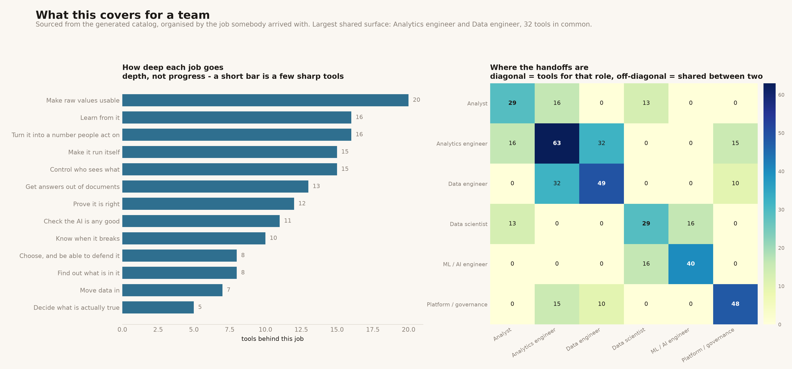

# Capability Map

[](https://colab.research.google.com/github/phoebefu6/phoebe-the-builder/blob/main/mini-saas-products/portfolio-dashboard/demo.ipynb)
[](https://mybinder.org/v2/gh/phoebefu6/phoebe-the-builder/main?labpath=mini-saas-products/portfolio-dashboard/demo.ipynb)

> A catalog is only useful if somebody arriving with a problem can find the thing that solves it. Describe the symptom, or pick the role, or pick the situation - and get the tools that apply, in the order they apply.



## Business Impact

- **Before:** this tool was a portfolio dashboard - builds shipped, builds per calendar day, busiest day, a burn-up against a one-a-day pace line, capped at day 60. It answered *how much of the plan is done*, which is a question only the person doing the plan has. It had also gone stale at 60 while the catalog passed 150, so the one number it existed to show was wrong.
- **After:** it answers what the catalog covers for a team. Three ways in - **by job** (*do you have something for this?*), **by role** (*what does this give my data engineer?*), and **by situation** (*walk me through what you would use, in order*) - plus a search over the problem each tool was built for rather than its name.
- **Estimated ROI:** the honest one is not time saved. It is that a visitor now gets an answer to their own question in one screen instead of a progress bar about somebody else's.

## What it does

### Search on the symptom, not the technology

The catalog is indexed by *what was going wrong*, so the search runs over each tool's own one-line statement of the problem, plus its name, slug and job. Every whitespace token has to appear, so a longer query narrows instead of failing - which is what makes `line ending` resolve to the tool whose slug is `line-ending-detector`.

Matching is plain substring, deliberately: no stemming, so a miss is a real gap in what the catalog *says* rather than a scoring artefact you cannot reason about. `CRLF` returns nothing and the tool exists - its own description never uses the word. The empty state says so and points at the plainer phrase.

### By the job you arrived with

Thirteen jobs, from *Move data in* through *Choose, and be able to defend it*. The technology a tool happens to use is rarely how anyone looks for it.

The depth chart reads **depth, not progress**: a short bar is a job with a few sharp tools, not an unfinished one.

### By role

Which of the thirteen jobs a role spends its week inside:

| role | jobs |
|---|---|
| Analyst | find out what is in it · turn it into a number · decide what is true |
| Analytics engineer | make raw values usable · prove it is right · turn it into a number · control who sees what |
| Data engineer | move data in · make raw values usable · prove it is right · know when it breaks |
| Data scientist | find out what is in it · decide what is true · learn from it |
| ML / AI engineer | learn from it · get answers out of documents · check the AI is any good |
| Platform / governance | control who sees what · know when it breaks · make it run itself · choose and defend it |

The overlap grid shows tools two roles both reach for. The largest shared surface is **analytics engineer and data engineer, 32 tools in common** - which is where the ownership argument actually happens. A zero is a clean handoff: analyst and data engineer touch none of the same jobs.

### By situation

A real afternoon crosses three or four jobs. Seven situations, each an ordered sequence:

> **The nightly job failed** — *It is 8am, the dashboard is empty, and nobody was paged.*
> 1. Know when it breaks → 2. Prove it is right → 3. Move data in

That sequencing is the thing a flat catalog cannot show.

## Two structural changes that came with the rework

**It reads the generated catalog, not the tracker.** It used to run its own regex over `TRACKER.md` alongside `one-data-platform/homepage/build_site.py` - two parsers over one file, which disagree eventually. It now reads `one-data-platform/homepage/catalog.json`, so `build_site.py` is the only thing that parses the tracker. `tracker_parser.py` is a tombstone pointing here.

**It gained tests.** The taxonomy is a contract now: 26 tests assert that every tool is classified, that every job has tools, that the grouping partitions the catalog exactly once, and that every role and situation maps to jobs that exist. If a job is renamed or added upstream, the suite fails rather than a tab rendering empty.

## Tech Stack

Python 3.11 · Streamlit · pandas · matplotlib · pytest · ruff

Reads one generated JSON file. No API keys, no network, runs offline.

## Demo

**[Run the interactive notebook →](demo.ipynb)** - pre-rendered, or click the badges to run it live. It carries a catalog snapshot so it works on Colab with nothing checked out, and prefers the live file when the repo is present - it tells you which one it got.

```bash
pip install -r requirements.txt

python -m pytest -q       # 26 tests
python make_chart.py      # capability_map.png + .svg
streamlit run app.py      # search, then browse by job, role or situation
```

## Impact Note

- **Who benefits:** anyone evaluating whether this catalog covers their team's work, and anyone inside it trying to remember whether a tool for a given problem already exists.
- **Potential risks:** the role and situation mappings are **judgement, not data** - one team's analytics engineer owns ingestion, another's does not, and the seven situations are the common shapes rather than an exhaustive set. Both are declared as literal tables in `capability.py` so they can be argued with and edited. The depth chart invites reading tool count as capability, which it is not: twenty small tools for one job may cover less than five good ones. And search misses are silent by design - the empty state explains why, but a visitor who tries one word and stops will conclude something is absent when it is only described differently.
