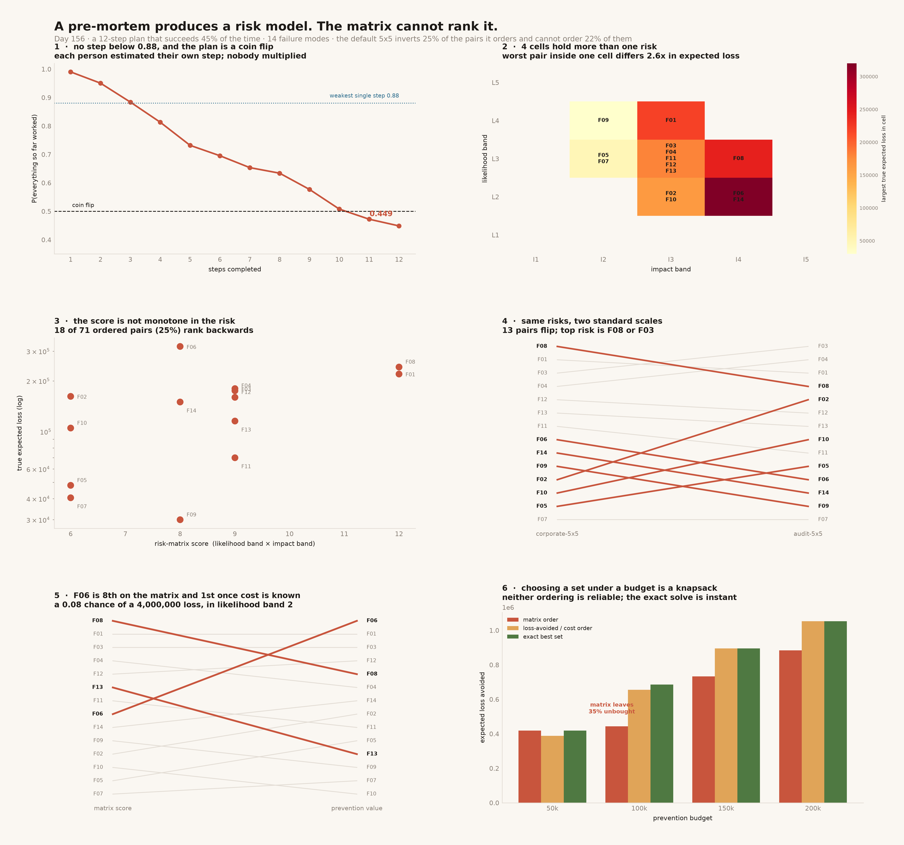

# Pre-mortem

[](https://colab.research.google.com/github/phoebefu6/phoebe-the-builder/blob/main/mini-saas-products/pre-mortem/demo.ipynb)
[](https://mybinder.org/v2/gh/phoebefu6/phoebe-the-builder/main?labpath=mini-saas-products/pre-mortem/demo.ipynb)

> A pre-mortem is cheap and it works: assume the project already failed, then write down why. What happens next is the problem. The output is a list of failure modes, and almost every organisation scores that list on a 5x5 **risk matrix** - likelihood band times impact band. That step is not a convenience, it is a lossy transform, and it cannot rank the risks it summarises.

**Day 156 - Mini SaaS Products.** A 12-step plan that succeeds 45% of the time, 14 failure modes, 2 conventional risk scales, 28 tests, and a notebook that rebuilds every result from numpy alone.



> **No step in the plan is below 0.88, and the plan succeeds 44.9% of the time.** Nobody in the room ever stated 45%, because each person estimated their own step and no one person owned the product.
>
> **The default 5x5 ranks 18 of the 71 pairs it orders backwards** - 25% - and cannot order the other 20 at all. An inversion is not imprecision: it is the matrix calling A the bigger risk when A's expected loss is smaller.
>
> **It puts the largest expected loss in the register in eighth place.** A 0.08 chance of a 4,000,000 loss sits in likelihood band 2, and the band is all the score sees.

## Business Impact

- **Before:** the pre-mortem itself goes well - an hour, a whiteboard, fourteen specific ways the migration dies. Then it gets transcribed onto the corporate 5x5, ranked by likelihood × impact, and the top three go on a slide. The register is reviewed quarterly, the same four entries ("data quality issues", "key person risk", "budget overrun", "scope creep") survive every review untouched because nothing about them can be tested, and the thing that eventually kills the project was on the list in eighth place.
- **After:** the plan's own probability gets computed rather than asserted - **twelve steps at ≥0.88 is a 45% plan** - and the register carries four numbers per cause instead of two, so it can be priced. The matrix is skipped entirely: at a 100,000 budget, working down matrix order buys **443,200** of expected loss avoidance where **685,000** was available.
- **Estimated ROI:** **35% of achievable prevention left unbought** at that budget, from ranking rather than choosing. The exact solve is a 16,384-subset brute force that runs in well under a second on fourteen items, so the alternative costs nothing.

## Why this one

This is the first build against the largest hole in the catalog. A [mentor-room coverage audit](../../README.md) scored twelve capability domains and found decision support at roughly 10%: about 140 of 155 tools emit an artifact, and almost none help anyone decide with it. [`decision-log`](../decision-log/) was the first; this is the second, and the two are a pair - that one scores decisions after the fact, this one prices them before.

It is not [`retro-generator`](../retro-generator/), which runs a sprint retrospective on what already happened.

## What it does

Twelve sections in `evidence.py`. Every number below is printed by it and asserted in `test_premortem.py`.

### 1. The plan is a conjunction, and nobody multiplied

| step | P(works) | P(all so far) |
|---|---|---|
| Stand up the new warehouse | 0.99 | 0.990 |
| Replicate historical data | 0.96 | 0.950 |
| Row counts reconcile | 0.93 | 0.884 |
| … eight more … | | |
| Cost lands inside budget | 0.88 | 0.497 |
| Cutover weekend runs clean | 0.93 | 0.462 |
| Two weeks with no rollback | 0.95 | **0.449** |

**Weakest single step: 0.88. Whole plan: 0.449.** At the average step quality, 11 steps is a coin flip. This is the arithmetic a pre-mortem exists to expose, and it is arithmetic, not psychology - each estimate was defensible and the product was never taken.

### 2. And 45% was the optimistic answer

Independence is not the neutral assumption. Add one common cause - the engineer who knows the old warehouse leaves, the vendor slips - firing with probability 0.12 and tripling each step's failure rate:

| | |
|---|---|
| independent product rule | 0.449 |
| with one common shock | **0.402** |
| gap | 0.047 |

Every shared dependency - one person, one vendor, one weekend - moves it down again.

### 3. What the exercise produces

Fourteen causes, each a mechanism rather than a category, with the four numbers that make one actionable: probability, loss, cost to reduce it, and how much of it the spend removes. Total expected loss across the register: **2,018,000**.

The last two numbers are the ones nobody records, and they are the only two that decide anything.

### 4. The matrix ranks a quarter of the pairs backwards

Cox (2008) proved qualitative risk matrices cannot reproduce the ordering of the quantitative risks they summarise. Measured against expected loss on this register:

| scale | pairs | ordered | tied | inverted | inversion rate | cannot order |
|---|---|---|---|---|---|---|
| `corporate-5x5` | 91 | 71 | 20 | **18** | **25.4%** | 22.0% |
| `audit-5x5` | 91 | 66 | 25 | **20** | **30.3%** | 27.5% |

Worst of them: `F09` scores above `F02` while `F02` carries **5.4x** the expected loss. `F11` scores above `F06` while `F06` carries **4.6x**.

Both scales are the shape found in real corporate templates. Neither is a straw man; the point is that they are equally defensible and equally unable to rank.

### 5. It buries the largest risk

`F06` - *access rules do not survive the move; someone sees the salary table.* P = 0.08, loss = 4,000,000, **expected loss 320,000, the largest in the register.**

| | |
|---|---|
| rank by matrix score | **8 of 14** |
| rank by expected loss | 1 |
| rank by prevention value | 1 |

Its cell is (likelihood band 2, impact band 4), score 8. Low probability drags the band down, and the band is all the score sees.

### 6. Risks that share a cell become the same risk

4 of 7 occupied cells hold more than one risk. In the worst, `F03` and `F11` score identically while `F03` carries **2.57x** the expected loss. Every reader downstream of the matrix - the slide, the committee, the tracker - sees one number and treats them as equivalent.

### 7. Likelihood band × impact band is a number with no unit

Band 4 is not twice band 2. The bands are labels; multiplying two labels produces a score whose indifference curves are an artefact of where the bin edges were drawn.

**25 distinct cells collapse to 14 distinct scores, and 10 of those scores are shared by more than one cell.** Score 12 is produced by (3,4) and (4,3): a 30% chance of a 2,000,000 loss and a 60% chance of a 500,000 loss score identically, and their expected losses differ by a factor of two.

### 8. Two conventional scales, a different top risk

**13 pairs are ordered oppositely by the two scales.** Top risk under `corporate-5x5` is `F08`; under `audit-5x5` it is `F03`. The single most consequential output of the exercise depends on which template the organisation happens to have downloaded.

### 9. Three orderings, and only one can be acted on

| | 1st | 2nd | 3rd |
|---|---|---|---|
| by matrix score | F08 | F01 | F03 |
| by expected loss | F06 | F08 | F01 |
| by prevention value | F06 | F01 | F03 |

`F06` moves from 8th to 1st. Only the last two orderings know what prevention **costs**, which is the only question the meeting was held to answer. The matrix never asked.

### 10. It was never a ranking problem

Prevention is bought under a budget, so the decision is which **set** to buy - and no ordering is guaranteed to find the best set. Exact answer by brute force over all 16,384 subsets:

| budget | matrix order | ratio order | optimal | matrix shortfall |
|---|---|---|---|---|
| 50,000 | 418,000 | 387,800 | 418,000 | 0 |
| 100,000 | 443,200 | 655,550 | **685,000** | **241,800** |
| 150,000 | 732,950 | 895,550 | 895,550 | 162,600 |
| 200,000 | 884,225 | 1,052,525 | 1,052,525 | 168,300 |

At 100,000 the matrix ordering leaves **35% of the achievable benefit unbought**.

And the honest part: **at the tightest budget the ratio heuristic loses to the matrix.** Greedy-by-ratio is a knapsack heuristic, not a solution. Neither ordering is reliable, which is the argument for not ordering at all rather than for a better ranking.

### 11. Half the notes cannot be acted on

Of eight notes as a pre-mortem actually produces them, **4 are actionable**. The other four - *data quality issues, key person risk, budget overrun, scope creep* - each name a category rather than a mechanism. A category cannot take a probability, cannot be priced and cannot be prevented, so it survives every review untouched and reappears on the next project's register.

A note can even have a probability *and* a loss and still not be actionable: without the cost of prevention and how much it removes, nothing can be decided.

## Tech Stack

Python 3.11 · numpy · pandas · matplotlib · Streamlit · pytest · ruff

No external services and no LLM. Every result is arithmetic, which is why every result is asserted.

## Demo

**[Run the interactive demo notebook →](demo.ipynb)** - pre-rendered with outputs, or click the badges above to run it live.

The notebook is an independent implementation: it imports nothing from `premortem.py` and rebuilds the plan arithmetic, the scales, the inversion count and the knapsack from numpy alone. It reproduces every headline figure - 0.449, 0.402, 18 inversions at 25.4%, 20 at 30.3%, F06 at rank 8, 13 flips, the full budget table.

```bash
pip install -r requirements.txt

python evidence.py        # all twelve sections, under a second
python -m pytest -q       # 28 tests, every README number asserted
python make_chart.py      # premortem_audit.png + .svg
streamlit run app.py      # your own register; watch the orderings disagree
```

## Learning Connection

Built against the decision-support gap found in the 2026-08-25 catalog audit. Applies: conjunctive probability and common-cause correlation, Cox's critique of qualitative risk matrices (range compression, rank inversion, centering), ordinal-scale arithmetic, and 0/1 knapsack against greedy heuristics.

## What to do about it

1. **Run the pre-mortem.** Prospective hindsight surfaces more and more specific causes than asking what might go wrong, and it costs an hour.
2. **Compute the plan's own probability.** Twelve steps at 95% is not 95%, and independence is optimistic on top of that.
3. **Demand a mechanism, not a category.** If it cannot take a probability, it is not a finding yet.
4. **Record four numbers per cause** - probability, loss, cost to reduce it, and how much of it the spend removes.
5. **Do not score it on a matrix.**
6. **Then stop ranking.** Name the budget and solve for the best set.

## Impact Note

- **Who benefits:** anyone who has run a good pre-mortem and then watched its output become a quarterly slide - and anyone whose risk register still lists "scope creep".
- **Potential risks:** the plan and the fourteen failure modes are **authored, not sampled** - they are the worked example, and the specific figures (25.4% inversion, 35% shortfall, F06 at rank 8) are arithmetic on that example, not measurements of the world. What generalises is Cox's result, which is a property of the matrices rather than of any register, and the conjunction arithmetic, which is a property of multiplication. The knapsack solve is exact only up to about 18 rows by brute force; a real register of 60 needs dynamic programming, and the app says so rather than silently degrading. Finally, expected-value ranking assumes losses are commensurable and risk-neutral - a 0.08 chance of a 4,000,000 regulatory event may deserve more weight than its expected value, and that is a judgment the arithmetic should inform rather than replace.
