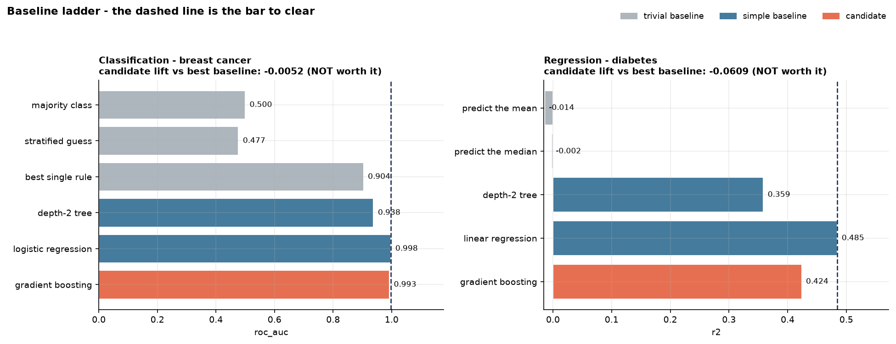

# Baseline Model

[](https://colab.research.google.com/github/phoebefu6/phoebe-the-builder/blob/main/ml-engineering-toolkit/baseline-model/demo.ipynb)
[](https://mybinder.org/v2/gh/phoebefu6/phoebe-the-builder/main?labpath=ml-engineering-toolkit/baseline-model/demo.ipynb)

> "We got 0.87 AUC." Compared to what?

Every model review starts with a number and no context. A dumb baseline is the only thing that turns a metric into a claim - and it's the step teams skip because it feels beneath them. This fits a ladder of deliberately stupid models (majority class, stratified guess, brute-forced single rule, depth-2 tree) plus one honest simple model, then reports the candidate's lift over the **strongest** baseline and refuses to call a model good when a one-line rule matches it.



## Business Impact
- **Before:** a model ships on an absolute metric nobody can contextualize. Complexity gets adopted permanently because "0.99 AUC" sounded like an achievement.
- **After:** every review includes the floor, the one-line rule, and the linear model - so the question becomes "what did the extra complexity buy?" with a number attached.
- **Estimated ROI:** on both bundled datasets the ladder shows the complex model should **not** ship, saving the ongoing cost of serving, monitoring, and explaining a gradient booster that a scaled linear model beats.

## Tech Stack
Python · scikit-learn · Streamlit · pandas · matplotlib (offline, sklearn's bundled datasets)

## Key insight
**Gradient boosting loses on both datasets.** Not dramatically - but it loses, to a scaled linear model that trains in milliseconds and can be read off as coefficients:

| | Classification (AUC) | Regression (R²) |
|---|---|---|
| Best trivial rung | best single rule — **0.904** | predict the median — **-0.002** |
| Best baseline overall | logistic regression — **0.998** | linear regression — **0.485** |
| Gradient boosting | **0.993** | **0.424** |
| Lift vs best baseline | **-0.005** | **-0.061** |
| Verdict | not worth it | not worth it |

Two smaller findings that fall out of the table:

- **The majority-class row scores 0.63 accuracy while learning nothing** - and 0.63 is exactly the test-set prevalence. Anyone reporting "63% accurate" on this data has reported the class balance.
- **One `if` statement gets 0.94 F1.** `if worst perimeter <= 115`, brute-forced over 30 features and a 9-point quantile grid. Without that row in the table, 0.96 sounds impressive.

Lift is deliberately measured against the strongest baseline, not the weakest. Beating "predict the mean" is not an achievement, and a verdict function that lets you claim it is worse than no verdict at all.

## The ladder

| Rung | Kind | What it exposes |
|---|---|---|
| majority class / mean | trivial | the metric's floor - accuracy here *is* the prevalence |
| stratified guess / median | trivial | whether your metric rewards guessing |
| best single rule | trivial | the model most likely to embarrass a pipeline |
| depth-2 tree | simple | how much signal sits in two or three cuts |
| logistic / linear regression | simple | what most projects should actually ship |

The trivial/simple split changes how you read a loss: losing to a **trivial** rung means something is broken; losing to a **simple** rung means you built the wrong thing.

**Edge case handled:** a rung with no ranking to offer (the majority-class predictor emits one constant value) has no meaningful AUC. Worth knowing what sklearn actually does here - with constant scores and both classes present, `roc_auc_score` returns `0.5` rather than raising; it returns `nan` and warns only when `y_true` has a single class. The ladder records 0.5 explicitly for those rungs, so the cell is a deliberate statement ("worth chance") instead of a metric artifact, and every cell in the comparison stays populated.

## Demo

**[Run the interactive demo notebook →](demo.ipynb)** - pre-rendered with both ladders and the chart, or click the Colab/Binder badges above.

Streamlit app (pick task, candidate model, decision metric, and the lift bar):
```bash
pip install -r requirements.txt
streamlit run app.py
```

CLI (both ladders with verdicts):
```bash
python baseline.py
```

Use it on your own data:
```python
from baseline import run_classification, verdict
results = run_classification(X, y, my_model, "my model")
print(verdict(results, metric="roc_auc", min_lift=0.02))
```

## Learning Connection
Built while studying model evaluation discipline and MLOps review practice.
Applies: dummy estimators, held-out evaluation, metric selection under class imbalance, and the difference between a metric and a claim.

Companions in this product line:
- **Day 122** [`threshold-explorer`](../threshold-explorer) - once a model has earned its place, pick its cutoff
- **Day 76** [`train-eval-harness`](../train-eval-harness) - the harness this ladder slots into
- **Day 78** [`model-card-gen`](../model-card-gen) - the ladder belongs in the model card

## Impact Note
- **Who benefits:** anyone presenting a model in review; teams tempted to ship complexity by default.
- **Potential risks:** a single 75/25 split at one seed is not a stable estimate - the lift figures here would move under cross-validation, and a lift near the bar should be re-checked with repeated splits before it decides anything. The bundled `MIN_LIFT = 0.02` is a convention, not a law: the right bar depends on what a point of the metric is worth against the cost of serving and explaining the model. The single-rule search brute-forces thresholds on the training set, so it is optimistic by construction - which is the point, since it makes the baseline harder to beat rather than easier.
