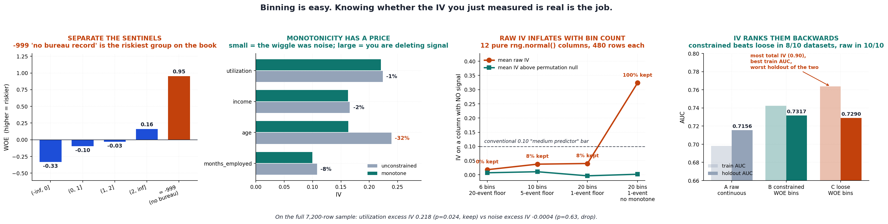

# Feature Binner

[](https://colab.research.google.com/github/phoebefu6/phoebe-the-builder/blob/main/ml-engineering-toolkit/feature-binner/demo.ipynb)
[](https://mybinder.org/v2/gh/phoebefu6/phoebe-the-builder/main?labpath=ml-engineering-toolkit/feature-binner/demo.ipynb)

> Binning a feature and printing its Information Value takes twenty lines. Knowing whether the number you just printed means anything is the actual job - and the conventional 0.02 / 0.1 / 0.3 thresholds cannot tell you, because they do not know how many bins you used to get there.

**Day 135 - ML Engineering Toolkit.** Monotone optimal binning with WOE/IV, a permutation null that makes the IV defensible, and a downstream test that checks whether any of it produces a better model.

## Business Impact

- **Before:** an analyst bins a feature, reads `IV = 0.14`, checks it against the table everyone uses, sees "medium predictor", and puts it in the scorecard. Nothing in that workflow notices that the cut points were chosen on the same rows the 0.14 was measured on, or that dropping the minimum-event floor would have produced 0.31 from a column of pure noise.
- **After:** every IV is quoted as an excess over a permutation null measured **through the same binning procedure**, with a p-value. On the bundled book, `utilization` scores excess IV 0.218 (p=0.024, keep) and a `rng.normal()` column scores **-0.0004** (p=0.63, drop) - despite the raw IV screen keeping that noise column at every setting tested.
- **Estimated ROI:** removes the feature-selection step most likely to ship a false positive. At the loosest settings tested, **100% of pure-noise columns clear the conventional 0.10 "medium predictor" bar** while the permutation screen keeps 0% of them.

## What it does

Five mechanisms, in the order they matter.

### 1. A raw IV is not comparable across bin counts

Twelve independent `rng.normal()` columns, 480 training rows each, zero relationship to the target by construction. Four binner settings:

| settings | mean bins | mean raw IV | mean excess IV | kept by `IV>=0.1` | kept by permutation |
|---|---|---|---|---|---|
| 6 bins, 20-event floor | 2.0 | 0.0300 | 0.0201 | 17% | 8% |
| 10 bins, 5-event floor | 3.0 | 0.0378 | 0.0078 | 17% | 0% |
| 20 bins, 1-event floor | 4.1 | 0.0582 | 0.0218 | 17% | 17% |
| 20 bins, 1-event, no monotone | 18.8 | **0.3171** | 0.0146 | **100%** | **0%** |

Raw IV on noise climbs **10x with the bin count**. Excess IV stays around 0.01-0.02 the whole way, and the permutation screen stays near its nominal 5%, because the null is measured through the same procedure that produced the number. (At 12 columns those keep-rates are themselves noisy to about ±10pp - the code says so too.)

The 0.02 / 0.1 / 0.3 bands are not wrong. They are just quoted without the one parameter that determines them.

### 2. Missing values and sentinel codes are populations, not gaps

`n_inquiries` uses `-999` for "no bureau record". Treated as a number it is the smallest value in the column; treated as a population it is the riskiest group on the book:

```
bin                           n   share  events    rate      WOE  IV part
------------------------------------------------------------------------
(-inf, 0]                  1725  24.0%     140   8.1%   -0.331   0.0231
(0, 1]                     2284  31.7%     230  10.1%   -0.095   0.0028
(1, 2]                     1620  22.5%     173  10.7%   -0.029   0.0002
(2, inf]                   1149  16.0%     145  12.6%    0.160   0.0044
= -999 (special)            422   5.9%     102  24.2%    0.952   0.0758
------------------------------------------------------------------------
IV                       0.1062  (medium)
```

That one bin is **71% of the feature's entire IV**. Impute it to the median and it merges into `(0, 1]`, where its 24.2% event rate is averaged against a 10.1% population and the signal disappears. Missing and special bins are also excluded from the monotonicity check by design - they are not on the numeric scale, so requiring them to sit in order is meaningless.

### 3. Monotonicity has a price, and the price is the diagnostic

Scorecards need monotone WOE to survive review. Forcing it always costs IV. **How much** it costs is the useful part:

| feature | unconstrained IV | monotone IV | cost | reading |
|---|---|---|---|---|
| `utilization` | 0.2238 | 0.2207 | **1%** | the wiggle was noise; cleaning it up cost nothing |
| `income` | 0.1657 | 0.1627 | **2%** | same |
| `months_employed` | 0.1080 | 0.0995 | **8%** | acceptable |
| `age` | 0.2391 | 0.1632 | **32%** | you are deleting real signal |

`age` is planted U-shaped - young and old are both riskier. A 32% cost is the model telling you the relationship is genuinely non-monotone and the constraint is destroying it, which is a signal to split the feature rather than accept the shape. The tool reports the cost instead of silently paying it.

### 4. Smoothed WOE, with the constant declared

An empty or near-empty bin sends log-odds to infinity and turns every downstream sum into `nan`. Additive smoothing fixes the arithmetic, but the constant changes the IV - so it is a named parameter (`smoothing=0.5`), not a hidden `+0.5` buried in a helper. A 3-event bin stops pretending to be a 300-event bin, and a sparse-bin warning fires rather than leaving you to notice.

### 5. And then the question IV cannot answer

Everything above is univariate. IV scores one column against the target and says nothing about six columns in one model. So: three encodings of the same six features, one holdout of 4,800 rows.

| arm | encoding | bins | total IV | AUC train | AUC holdout | gap |
|---|---|---|---|---|---|---|
| **A** | raw continuous, median-imputed, `-999` left as a number | 0 | - | 0.6983 | 0.7156 | -0.0173 |
| **B** | constrained WOE bins | 27 | 0.7536 | 0.7424 | **0.7317** | +0.0107 |
| **C** | loose WOE bins (20 bins, 1-event floor, no monotone) | 108 | **0.9020** | **0.7637** | 0.7290 | **+0.0347** |

**C** carries the most total IV and the best training AUC, and loses the holdout. Its train-to-holdout gap is three times as wide. IV ranks the arms in the opposite order to the thing anyone cares about.

One split is not a finding, though - a 0.003 gap is well inside the noise of a single holdout. Re-run on ten independent datasets:

- Binning beats raw continuous in **10 of 10**, mean **+0.0260 AUC**. That one is solid.
- Constrained beats loose in **8 of 10**, mean **+0.0067** with an sd of 0.0064. Real, and small. Reporting that as "constrained binning is more accurate" full stop would be overreading it.
- The loose arm carried more total IV in **10 of 10** and overfitted **3.1x harder** every time (mean gap +0.0374 vs +0.0121).

That last line is the reliable finding. The constraints are not there to buy accuracy - they buy about half a point of AUC at best. They are there so **the number you report is the number you get.**



## Tech Stack

Python 3.9+, numpy, matplotlib, Streamlit. Logistic regression and AUC in `downstream.py` are written from scratch in numpy, so the whole project needs **no scikit-learn, no database, no network**.

## Demo

**[Run the interactive demo notebook →](demo.ipynb)** - pre-rendered with all outputs, or click the Colab/Binder badges above to run it live.

For the Streamlit app - move the bin count and the event floor, and watch the noise column climb the IV bands while its p-value refuses to move:

```bash
pip install -r requirements.txt
streamlit run app.py
```

Command line:

```bash
python3 binning.py      # the audit table, the bin tables, the noise experiment
python3 downstream.py   # the three-arm AUC comparison and the ten-dataset re-run
```

Tests - 68 checks in total, including the false-positive rate of the permutation screen:

```bash
python3 test_binning.py && python3 test_downstream.py
```

## Learning Connection

Built while working through credit-scorecard feature engineering (Siddiqi, *Credit Risk Scorecards*) alongside the ML engineering track.

Applies: weight of evidence and Information Value, monotone optimal binning under population and event constraints, permutation testing as a calibrated null, PSI for bin-scheme drift, and the discipline of separating the rows that choose a transform from the rows that judge it.

## Impact Note

- **Who benefits:** anyone selecting features for a scorecard or any interpretable model where IV is the screening statistic - credit risk, insurance pricing, churn, fraud.
- **Potential risks:** binned scorecards are used in lending, where the consequence of a bad feature is a declined applicant. Two specific cautions. First, this tool makes IV *honest*, not *fair* - a feature can pass the permutation screen and still be a proxy for a protected attribute, which is a separate review this does not perform. Second, the permutation null costs a refit per permutation: cheap for one feature, expensive across a thousand. Screen with 40 permutations, then re-run survivors at 200+, and do not read a p-value floored at `1/(n_permutations+1)` as stronger than the number of permutations allows.
- **Data:** the bundled book is generated by `build_dataset()` with a fixed seed. No real personal or credit data anywhere in this project.

---

Part of [phoebe-the-builder](https://github.com/phoebefu6/phoebe-the-builder) · [`ml-engineering-toolkit/feature-binner`](https://github.com/phoebefu6/phoebe-the-builder/tree/main/ml-engineering-toolkit/feature-binner)
