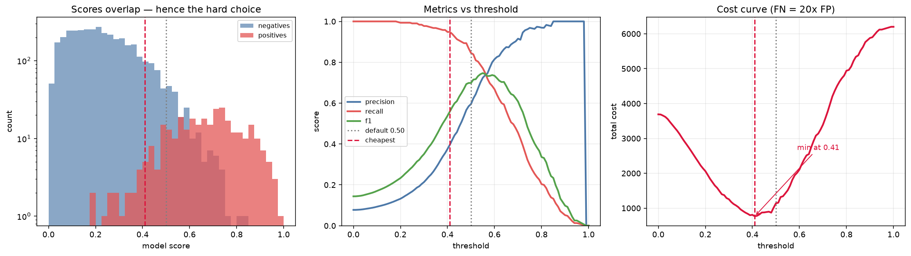

# Threshold Explorer

[](https://colab.research.google.com/github/phoebefu6/phoebe-the-builder/blob/main/ml-engineering-toolkit/threshold-explorer/demo.ipynb)
[](https://mybinder.org/v2/gh/phoebefu6/phoebe-the-builder/main?labpath=ml-engineering-toolkit/threshold-explorer/demo.ipynb)

> A model outputs a probability. A decision needs a cutoff. Almost everyone ships `0.5` — a number nobody chose, which quietly assumes a false positive and a false negative hurt exactly the same. They almost never do.

**Day 122 — ML Engineering Toolkit.** Sweep every threshold, price your two error types, and pick the operating point on purpose.

## Business Impact
- **Before:** The threshold is a library default. Fraud slips through while the review queue fills with false alarms, and nobody can say which cutoff the business actually wants — because nobody ever compared them.
- **After:** One sweep shows the delta between cutoffs in the units that matter: money, review-queue size, and positives caught. On the bundled sample, moving off the 0.50 default saves **32.5%** of the error bill.
- **Estimated ROI:** a one-line change to a config value, worth a third of the cost of being wrong — plus fewer analyst hours spent triaging avoidable false positives.

## What it does

Four defensible cutoffs, each the right answer to a different question — and on the sample data they land in four different places:

| Strategy | Cutoff | Precision | Recall | Cost | The question it answers |
|---|---|---|---|---|---|
| Default 0.50 | 0.50 | 0.60 | 0.85 | 1,138 | "What does the library do?" |
| Best F1 | 0.55 | 0.72 | 0.77 | 1,511 | "What's balanced?" (assumes errors cost the same) |
| **Cheapest** | **0.41** | 0.40 | 0.95 | **768** | "What loses the least money?" (FN priced at 20x FP) |
| Precision ≥ 0.80 | 0.59 | 0.80 | 0.68 | 2,013 | "What keeps the review queue clean?" |

Same model, same predictions, a 0.18 spread in the answer.

Two things it does that a plain precision-recall curve won't:

- **Cost curve.** Price a false negative at 20x a false positive and the optimum moves *below* 0.5 — when misses are expensive you should flag more aggressively, not less.
- **Unreachable SLAs.** Ask for `precision >= 0.80` from a weak model and the answer is `UNREACHABLE at any cutoff`. That is a retrain signal, not a tuning problem, and it takes a second to find here instead of a quarter to find in production. A `min_flags` guard blocks the classic fake win — flag 3 rows, get 3 right, "achieve" precision 1.00.

## Tech Stack
Python · numpy (no scikit-learn needed) · pandas · Streamlit · matplotlib · Docker

## Demo

**[Run the interactive demo notebook →](demo.ipynb)** — pre-rendered with outputs, score-overlap histogram, metrics curve and cost curve. Or click the Colab/Binder badges above to run it live.



For the Streamlit app:
```bash
pip install -r requirements.txt
streamlit run app.py
```
Upload a CSV with `y_true` (0/1) and `y_score` (0-1), set what each error type costs, set your SLA floor, and download the full sweep.

## Learning Connection
Built while studying applied ML evaluation and MLOps (the model-evaluation arc alongside `calibration-checker` and `train-eval-harness`).
Applies: confusion-matrix derivations from first principles, precision/recall/F1 tradeoffs, cost-sensitive decision thresholds, ROC AUC as a ranking-only metric, and Mann-Whitney U as the identity behind AUC.

## Impact Note
- **Who benefits:** ML engineers and data scientists shipping any binary classifier — fraud, churn, lead scoring, triage, content moderation.
- **Potential risks:** Tune the threshold on validation data, never on test — picking the best cutoff on your test set is a subtle leak, and the reported number will not survive production. Cost estimates are assumptions, so treat the "cheapest" cutoff as only as good as the prices you fed it. Re-check the threshold when prevalence shifts: one tuned at 8% fraud misbehaves at 2%. And a cutoff optimised for total cost can still distribute its errors unevenly across groups — check subgroup performance before shipping anything consequential to people.
